# 1강 - JSX

### HTML-IN-JS.

본래 자바스크립트에서는 HTML파일을 작성할 수가 없습니다. 문자열을 통해 HTML을 작성해 HTML에 붙이는 정도의 코드는 작성할 수 있지만, 리액트처럼 모든 HTML을 자바스크립트 안에서 할 수는 없습니다.

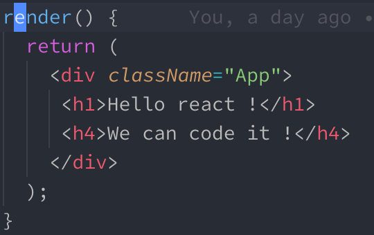

그래서 나온 것이 바로 지금 보고 계시는 분법인 JSX 인데요, 이것은 자바스크립트 안에서 HTML문법을 사용해도 HTML로 잘 변환 됩니다. 그렇다고 이게 HTML이라는 것은 아니고, 엄연한 자바스크립트 입니다. 그런데 이 문법을 해석할 수 있는 엔진은 없기 때문에, [Babel](https://babeljs.io/) 이라는 자바스크립트 코드 변환기를 이용해서 변환을 해야 합니다. Babel은 실험적이고 나온지 얼마 안된 자바스크립트 최신 문법을 변환을 통해 어떤 브라우저에서도 동작 가능한 코드로 변환해 줍니다. 걷보기에는 HTML과 똑같이 생겼지만, Babel을 거친 후에는 처음보는 이상한 함수들로 변하게 됩니다.

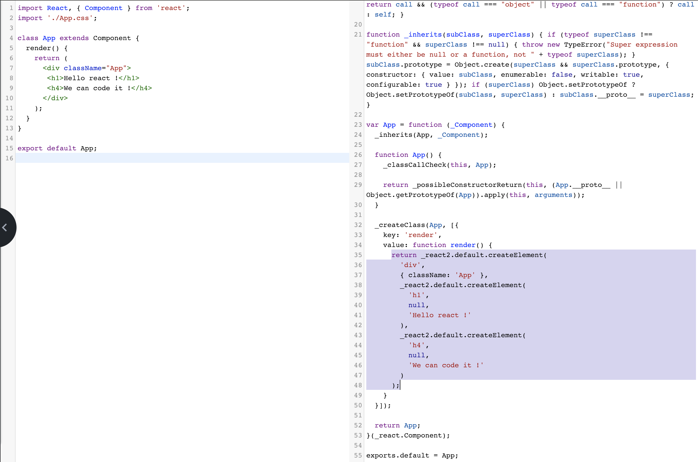

보라색으로 색칠한 부분을 보면 되는데요, 우리가 쉽게 HTML 형태로 작성한 파일이 변환이 되어 있습니다. 저런 형태로 작성을 해야 하는 것을 우리는 시각적인 이점을 위해 JSX의 문법으로 작성하고 있는 것이죠.

### JSX는 꼼꼼합니다.

기존 다른 HTML 파일은 특정 태그의 닫는 태그를 까먹거나 없애도 전부 잘 동작 하였습니다. 물론 오류가 생기는 부분은 있지만 그 오류가 프로그래머에게 직접적으로 알림이 가는 오류는 아니였습니다. 하지만 JSX는 조금 다른데요, JSX는 그래도 자바스크립트이기 때문에 문법을 중요시 합니다. 태그들의 위치가 정확하지 않으면 컴파일되지 않아요.

#### JSX는 닫는 태그를 중요시 합니다.

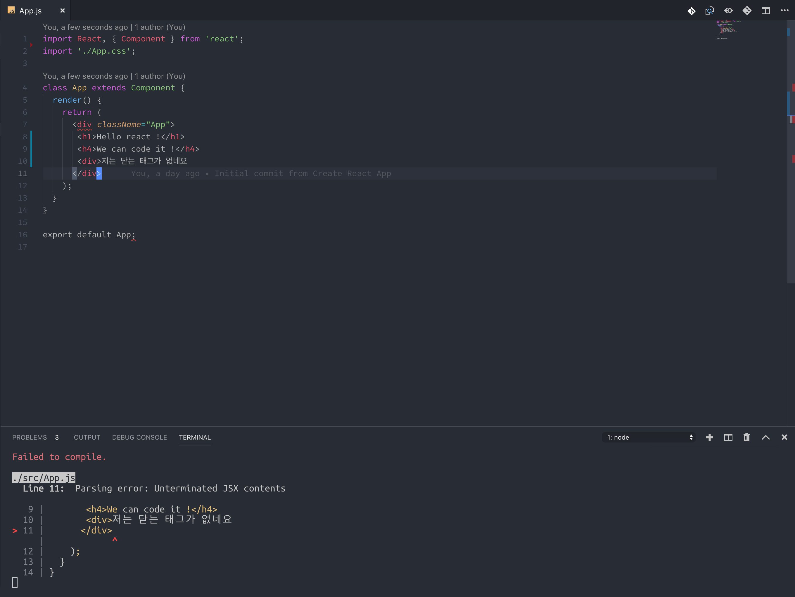

일반 HTML에서는 저런 태그 하나쯤 없어도 UI가 이상해지긴 하지만 동작 했었습니다. 하지만 리액트에서는 컴파일 단계부터 넘어가지 않습니다.

#### + Self close tag

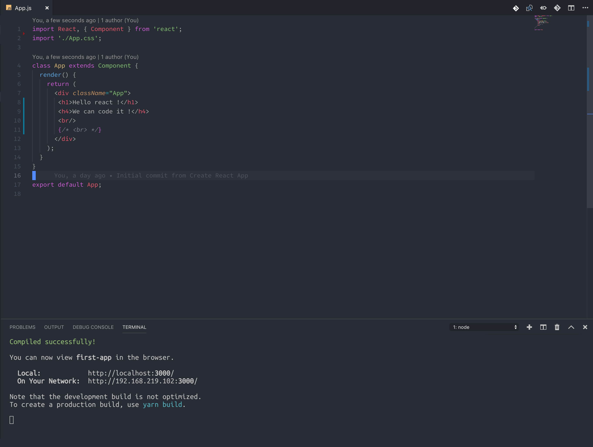

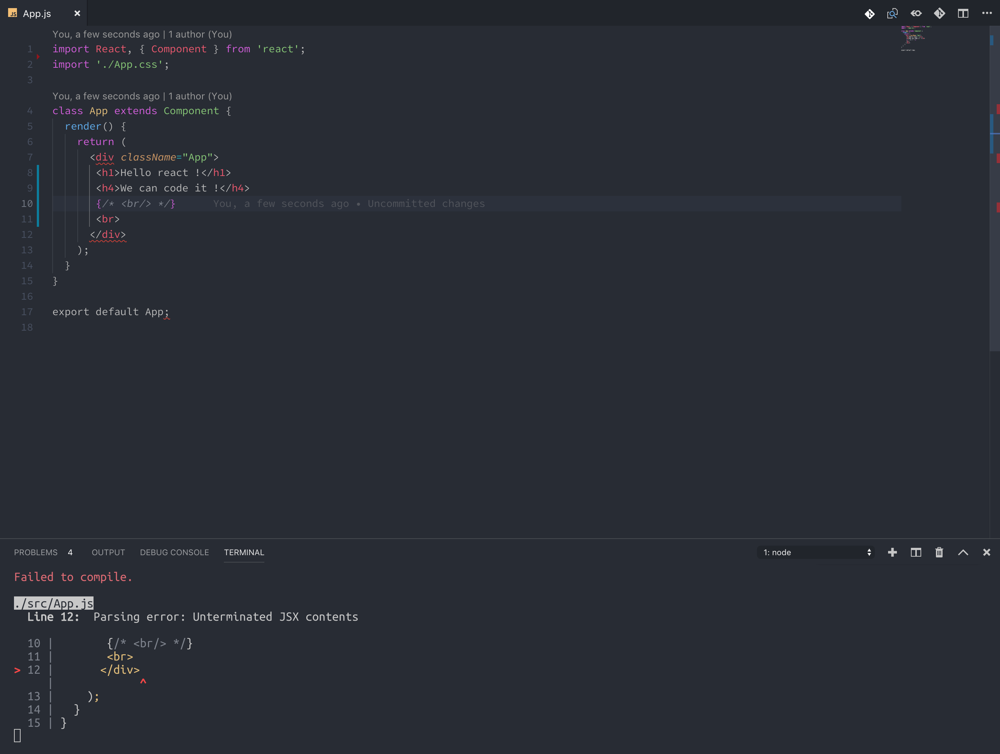

br 태그 같은 경우는 줄바꿈을 위해서 쓰는 경우도 많고 태그가 혼자 있어도 제기능을 하는데, JSX에서는 홀로 기능을 하는 태그라고 할 지라도 닫는 태그를 달아 주어야 합니다. `<br/>`처럼 말이죠.

#### 하나의 컴포넌트, 하나의 루트 JSX Element

JSX는 하나의 태그 안에 감싸져 있는 형태여야 합니다. 그렇지 않으면 컴파일되지 않습니다.

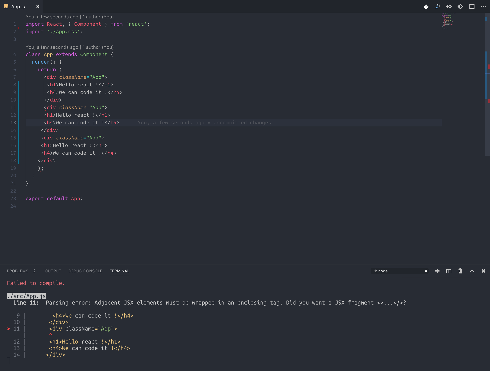

그런데 만약 컴포넌트 내에서 저런 형태의 렌더링이 꼭 필요하다면, 방법이 없는 것은 아닙니다.

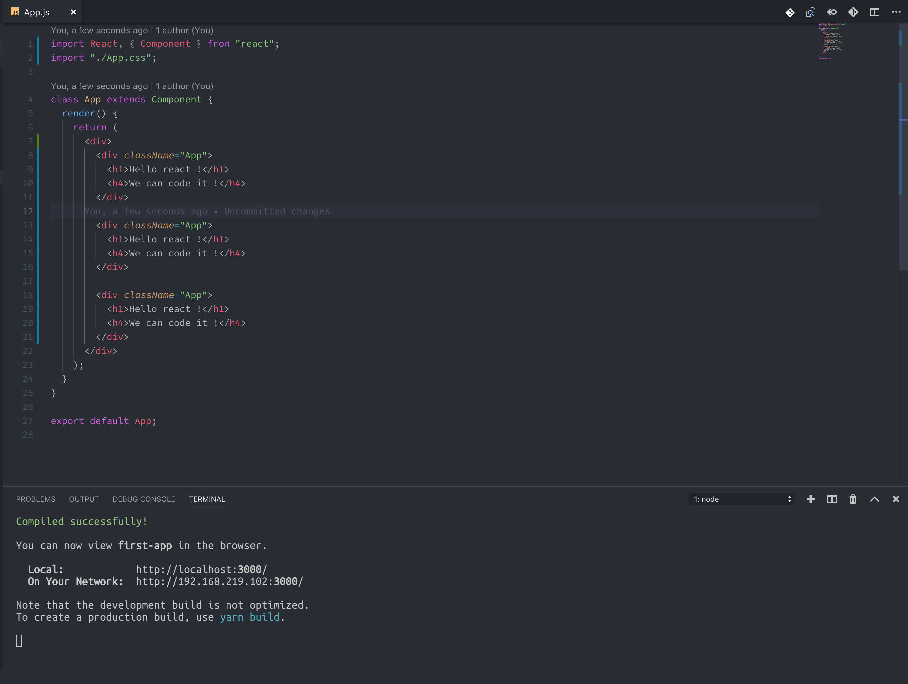

이렇게 하나의 큰 div에 담아서 컴포넌트가 성공적으로 컴파일 될 수 있도록 할 수 있는데요, 그러나 이 방법은 추천하지 않는 방법입니다. JSX문법을 맞추기 위해서 원래 작성하려는 HTML 형태가 아닌 다른 형태로 간다면 그것은 잘못된 일일 것 입니다. 그래서 리액트에서는 `Fragment`라는 것을 제공합니다.

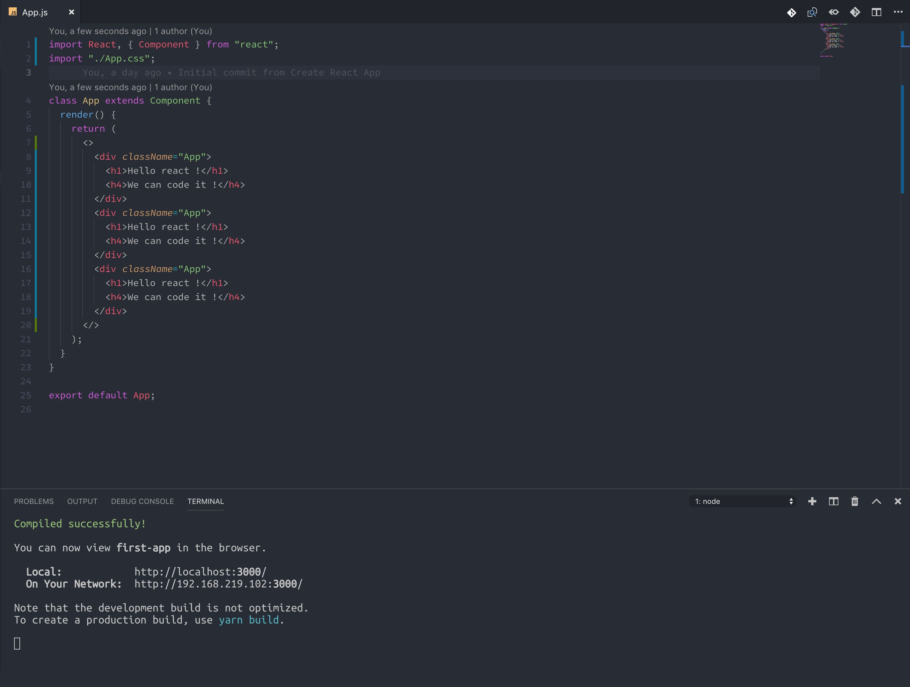

&lt;&gt;&lt;/&gt; 이라느 코드에 모두 감싸져 있는데 리액트는 오류 없이 잘 돌아가고 있죠 ? 사실 저건 React.fragment의 구현체 입니다. 원래는 &lt;Fragment&gt;&lt;/Fragment&gt; 와 같은 태그 형태로 사용이 되었었는데. 리액트 버전이 올라가면서 사용하기 쉬운 형태로 바뀌었습니다. 저 태그는 실제 HTML렌더링은 되지 않고 그저 개발을 편하게 할 수 있게 해주는 도구 입니다.

#### class =&gt; className

```markup
<!-- 일반 HTML 일 때의 작성 -->
<div class="not-react">
    안녕하세요 저는 HTML 입니다
</div>

<!-- 리액트일 때의 JSX 작성 -->
<div className="not-react">
    안녕하세요 저는 JSX 입니다
</div>
```

사실 이렇게 class를 className으로 써야 하는 것은 리액트가 16.\*.\* 버전 대로 올라오면서 class 로만 작성해도 프로그램이 동작하지 않는 일은 없지만, 자바스크립트의 class 문법과 충돌되는 문자열 이기도 하고 이미  많은 사람들이 className으로 작성해 왔기에 className으로 많이 사용합니다.

#### JSX 안에서 자바스크립트 변수 렌더링하기

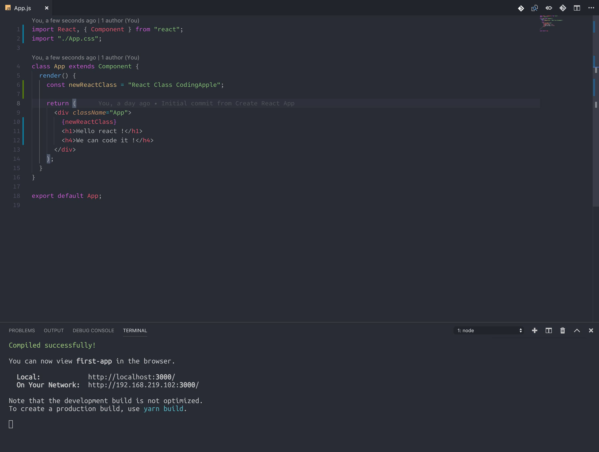

#### JSX 안에서의 스타일링

`<div style="color: red">hello</div>`이렇게만 코딩 해도 HTML에서 저 태그의 색은 빨간색으로 보입니다. 하지만 JSX에서는 스타일링 하는 방법을 바꾸어야 합니다. 바로 객체 형태로 넣어야 하는 방법인데요.

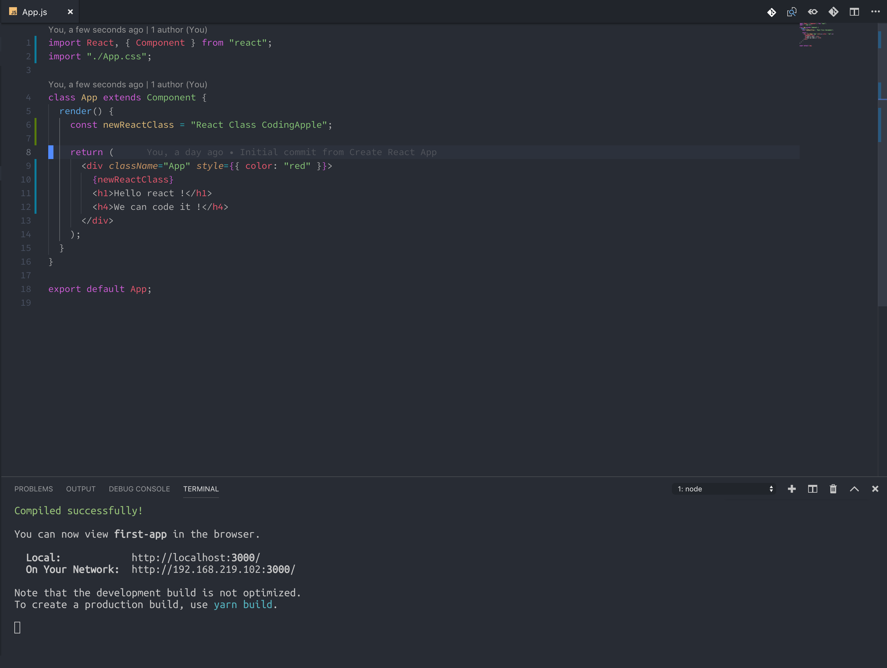

기존 HTML템플릿과는 많이 상이할 것 입니다. ""를 사용하지 않고 중괄호에 객체 형태로 넣는 모습입니다.

#### JSX 안에서 삼항연산자 사용하기

조건부 렌더링을 통해서 우리는 특정 조건에 특정 컴포넌트를 보여줄 수 있게 됩니다.

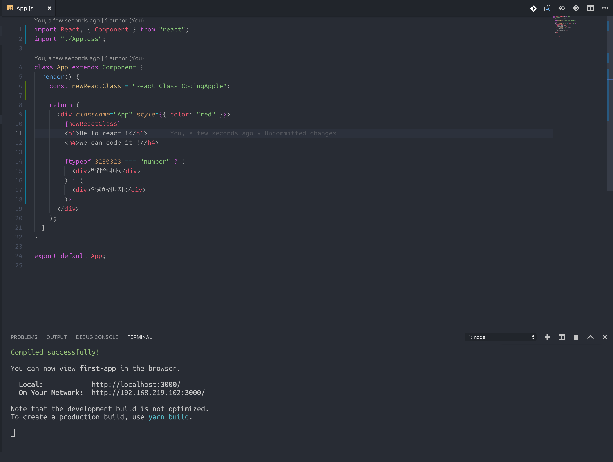

숫자 2330323의 type은 당연히 'number' 일 테니 삼항연산자의 조건은 참이고, 그에 따라서 첫 번째 인자로 등록된 JSX가 출력되게 됩니다.


