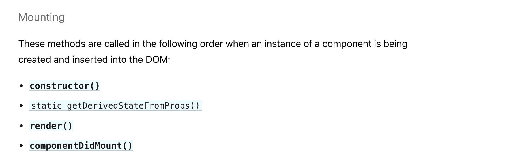

# 1강 - LifeCycle Of React component

### 어떻게 컴포넌트가 생겨나고, 어떻게 컴포넌트가 사라지는가

이번 강의에서는 컴포넌트의 생성 시점과 사라지는 시점, 그리고 어떤 상황에서 컴포넌트가 업데이트 되는지 알아보겠습니다 리액트에서는 이런 상황에 자동으로 트리거 되는 LifeCycle API를 가지고 있습니다. 가령 지금까지 우리가 사용했던 render 메소도는 사실 리액트 컴포넌트의 라이프사이클 메소드 중 하나입니다.

### 컴포넌트가 생겨날 때 실행되는 메소드

constructor도 리액트에서는 라이프 사이클 메소드로 취급됩니다.

