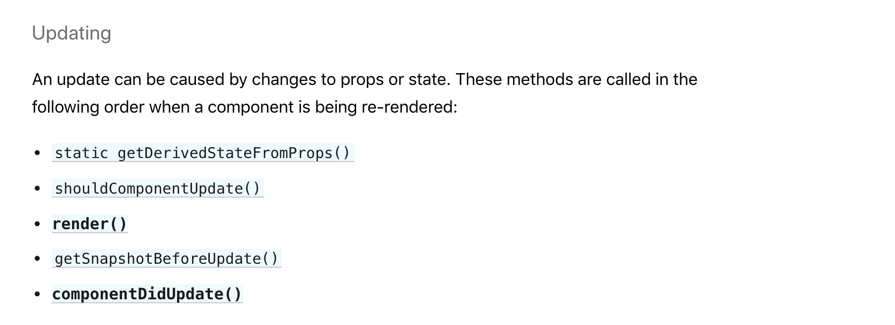

# 1강 - LifeCycle Of React component

### 어떻게 컴포넌트가 생겨나고, 어떻게 컴포넌트가 사라지는가

이번 강의에서는 컴포넌트의 생성 시점과 사라지는 시점, 그리고 어떤 상황에서 컴포넌트가 업데이트 되는지 알아보겠습니다 리액트에서는 이런 상황에 자동으로 트리거 되는 LifeCycle API를 가지고 있습니다. 가령 지금까지 우리가 사용했던 render 메소도는 사실 리액트 컴포넌트의 라이프사이클 메소드 중 하나입니다.

### 컴포넌트가 생겨날 때 실행되는 메소드


저기 나온 순서대로 리액트 컴포넌트가 생겨날 때의 라이프 사이클 메소드가 생겨나게 됩니다.

* constructor\(\) 생성자 메소드 입니다. 
* getDerivedStateFromProps\(\) 부모로부터 받은 Props의 값 변화에 따라 현재 컴포넌트에서의 State를 변화시켜야 할 때 사용합니다.



```text
// 인자는 자동으로 받습니다. 변화할 Props, 이전 State
static getDerivedStateFromProps(nextProps, prevState) {
  // 여기서 특정 if문이나 다른 구문을 통해, Props가 변화했을 때 State를 변화시킬 수 있습니다.
  // 만약 변화시킬 것이 없다면 null을 리턴하면 됩니다.
  // 변화시킬 State가 있다면 객체 형태로 넘겨 주세요.
  // return { b: '15' }
  return null;
}
// static 메소드이기 때문에 this. 와 같은 형태로 호출할 수 없습니다. 사용에 신중해야 합니다.
```



* render\(\) 이것은 JSX를 리턴하게 되면 HTML로 컴파일 되어 보여지게 되는 라이프 사이클 메소드 입니다. render는 state가 변화되었을 때, props가 변화되었을 때 재 렌더링 됩니다.
* componentDidMount\(\) 컴포넌트가 생겨난 후 트리거되는 라이프사이클 메소드입니다. 컴포넌트가 생겼을 때 한번만 실행되고, 변화가 일어나도 다시 실행되지 않습니다.

### 컴포넌트가 변화할 때 실행되는 메소드




* getDerivedStateFromProps\(\) 위 참고
* shouldComponentUpdate\(\) return 값으로 boolean을 받습니다. return 값 유무에 따라 컴포넌트를 재 렌더링 하거나, 렌더링하지 않습니다.



```javascript
// 변화할 다음 Props와, 변화할 다음 State를 받습니다.
shouldComponentUpdate(nextProps, nextState) {
  // 반드시 boolean 형태로 리턴을 해야만 합니다.
  // true를 리턴할 시 컴포넌트가 리 렌더링 됩니다.
  // false는 렌더링을 막습니다.

  // state의 변화가 일어났을 때만 재 렌더링 해주는 모습입니다.
  if (this.state !== nextState) {
    return true;
  }
  return false;
}
```



* render\(\) 위 참고
* getSnapshotBeforeUpdate\(\) 컴포넌트가 업데이트 되기 직전 실행되는 함수입니다. 새로운 데이터를 불러왔을 때 이전 스크롤 값을 참고해서 유지시켜야 하는 경우에 사용할 수 있습니다. 이 라이프사이클 메소드를 통해 리턴하는 값은 componentDidUpdate의 3번째 인자가 되어 사용이 가능합니다. 가령 지금 메소드에서 현재 스크롤 위치를 저장한 후 update가 되었을 때 componentDidUpdate에서 스크롤 값을 다시 되돌리는 등의 활동을 할 수 있습니다.


