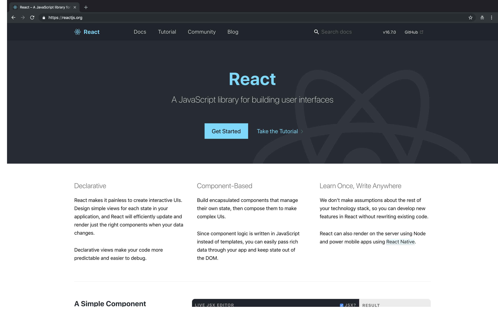

# 1. React 기초와 맛보기 - React가 뭐야?

### 사용자의 View에만 초점을 둔 Facebook이 개발한 라이브러리

기존 프론트엔드 에서 많이 사용되고 있는 프레임워크인 Angular, Aangular JS, Vue 같은 것들은 MVC, NVVM등의 디자인 패턴을 가지고 있고, 자체적으로 ajax, 클라이언트 Routing 모듈을 내장한 패키지 입니다. 하지만 **리액트는 이러한 것들이 없고 오직 사용자에게 view를 어떻게 하면 더 효율적으로 보여줄 수 있을지에서 시작한 라이브러리** 입니다. 리액트에서 Client routing과 ajax를 사용하기 위해서는 따로 라이브러리를 받아서 실행해야 합니다. \(물론 다들 공통적으로 사용하는 라이브러리들이 있습니다.\) 그렇기 때문에 **리액트는 오직 DOM 객체의 생성과 이벤트 응답**에만 관심이 쏠려 있습니다.

더 자세히 말해보자면, 브라우저단 view에서 보여주어야 할 model의 데이터가 변화하는 경우에, 리액트는 **변화를 일으키지 않고 model이 변경되어서 바꿔여야 할 View 부분을 새로운 View로 대체** 합니다. model이 변화하게 되면 변경을 하는 것이 아닌, 그 부분을 날려버리고 새로 생성된 것으로 다시 그리게 되는 것이죠. 그런데 이 DOM을 날려버리고 다시 그린다는 것은 매우 위험한 발상입니다. 브라우저는 우리가 생각하는 것보다 빠르지는 않기 때문입니다. \(매번 다시 DOM을 그리게 된다면 우리는 클릭 한번 할 때마다 1초씩 기다려야 할 지도 모릅니다.\) 물론 리액트는 효율적으로 변경되어야 할 부분만 다시 바꿔줍니다. \(리액트는 이 점을 **Virtual DOM**을 이용해 해결 하였습니다.\)

리액트가 강조하는 특징인데요, 정말 말 그대로 입니다.

곧 리액트 문법에 대해서 설명해 드리겠지만, 리액트 코드들은 눈에 쉽게 읽힙니다. 특히나 나중에 여러분들이 Typescript와 함께 리액트를 사용하신다면 더 쉽게 남이 짜놓은 리액트 코드를 읽고 쉬운 유지보수가 가능할 것 입니다.

### 리액트는 선언적입니다.

나중에 리액트를 깊게 배우게 된다면 그 안에서 View를 어떻게 최적화 하고 디버깅 하는지 알아야 하겠지만, 대부분 리액트에서는 자동적으로 필요한 부분만 업데이트 하도록 최적화를 해 줍니다. 명령형 프로그래밍을 할 필요가 없어요. 이 JSX를 렌더링해 ! 라는 선언을 하면 나머지 로직은 리액트에 맡기면 됩니다.

### 리액트는 컴포넌트 기반 라이브러리 입니다.

웹을 개발할 때, 헤더, 메인 콘텐츠가 들어가는 부분, 버튼, 사이드바 메뉴 같은 것들을 만들고 하는 것을 생각하실 텐데요. 리액트를 만들게 된다면 이 부분들을 하나의 컴포넌트로 묶어서 관리할 수 있습니다. 사이드바 컴포넌트, 헤더 컴포넌트와 같이 말이죠. 그렇기 때문에 리액트를 개발하다가 특정 부분에서 오류가 생겼다고 한다면, 그 컴포넌트만 수정하면 됩니다. 코드를 간결하게 만들 수 있는 것이죠.

### 한번 배워서, 어디에서든 사용하세요

리액트가 매력적인 이유입니다. 현재 APP 개발 시장에서는 React Native가 정말 강세인데, 이 라이브러리 조차도 리액트를 배우게 된다면 거저 얻는 수준입니다. 컴포넌트의 생성 방식과 구조가 React와 동일해서, React Native에서 제공하는 자체적인 태그 \(View, TextInput\) 만 배우면 사용할 수 있을 정도입니다. 그렇기 때문에 현재 프론트엔드 프레임워크와 많은 라이브러리가 넘치는 지금 현재 시장에서, 리액트는 매력적인 선택이 될 수 있습니다.

