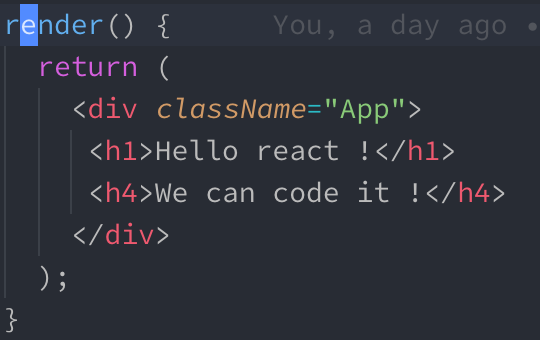

# 1강 - JSX

### HTML-IN-JS.

원래 자바스크립트에서는 아래 보이는 코드처럼 HTML와 비슷해 보이는 문법 자체가 존재하지 않았습니다. 그럼에도 불구하고 우리가 리액트에서 HTML과 매우 유사해 보이는 코딩을 할 수 있는 것은 JSX 덕분입니다.



### JSX가 뭔데 ?

JSX는 자바스크립트의 확장팩 같은 문법입니다. 실제로 JSX같은 문법은 자바스크립트의 표준 문법이 아니기 때문에 컴파일하게 되면 에러를 일으키지만, [Babel](https://babeljs.io)의 도움을 거치게 되면 자바스크립트 안에서 HTML 같은 문법을 사용해도 HTML로 잘 변환 됩니다. 그렇다고 이게 진짜 HTML이라는 것은 아니고, 엄연한 자바스크립트 문법으로 작성된 자바스크립트 코드입니다. 이 문법은 아직 표준이 아니기 때문에, [Babel](https://babeljs.io/) 이라는 자바스크립트 코드 변환기를 이용해서 변환을 해야 합니다. Babel은 실험적이고 나온지 얼마 안된 자바스크립트 최신 문법을 변환을 통해 어떤 브라우저에서도 동작 가능한 코드로 변환해 줍니다. JSX는 걷보기에는 HTML과 똑같이 생겼지만, Babel을 거친 후에는 처음보는 이상한 함수들로 변하게 됩니다.


보라색으로 색칠한 부분을 보면 되는데요, 우리가 쉽게 HTML 형태로 작성한 파일이 변환이 되어 있습니다. 우리가 굳이 Babel까지 사용해 가면서 JSX를 사용하는 이유가 변환된 결과물을 보면 알 수 있습니다. 누가 HTML을 저렇게 작성하고 싶겠어요? 일단 가독성도 떨어지고 작업 속도도 현저히 줄어들 것 입니다. 우리는 오른쪽의 형태로 작성을 해야 하는 것을 우리는 시각적인 이점을 위해 JSX의 문법으로 작성하고 있는 것이죠. 저 형태의 문법들이 ReactDom모듈을 통해서 HTML로 변환이 되어 렌더링 되는 것 입니다.

### JSX는 꼼꼼합니다.

기존 다른 HTML 파일은 특정 태그의 닫는 태그를 까먹거나 없애도 전부 잘 동작 하였습니다. 물론 오류가 생기는 부분은 있지만 그 오류가 프로그래머에게 직접적으로 알림이 가는 오류는 아니었습니다. 하지만 JSX는 조금 다른데요, JSX는 그래도 자바스크립트 문법 중 하나 이기 때문에 JSX태그간의 관계를 중요시 합니다. 태그들의 위치가 정확하지 않으면 컴파일되지 않아요.

#### JSX는 닫는 태그를 중요시 합니다.


일반 HTML에서는 저런 태그 하나쯤 없어도 UI의 문제는 있었지만 동작은 했었습니다. 하지만 리액트에선 컴파일 단계부터 넘어가지 않습니다. 각 태그 간의 관계가 굉장히 중요합니다.

#### + Self close tag


br 태그 같은 경우는 줄바꿈을 위해서 쓰는 경우도 많고 태그가 혼자 있어도 제기능을 하는데, JSX에서는 홀로 기능을 하는 태그라고 할 지라도 닫는 태그를 달아 주어야 합니다. `<br/>`처럼 말이죠. 이런 방식을 self close tag라고 합니다.

#### 하나의 컴포넌트, 하나의 루트 JSX Element

JSX는 하나의 태그 안에 감싸져 있는 형태여야 합니다. 그렇지 않으면 컴파일되지 않습니다.


에러가 발생했습니다. 에러가 발생한 이유는, 하나의 컴포넌트 안에서 렌더링되는 JSX는 무조건 한 개의 루트 태그만 렌더링 해 주기 때문입니다. 여러 개의 독립적인 태그가 있는 형태로 작성하게 되면 에러가 발생합니다.

그런데 만약 컴포넌트 내에서 저런 형태의 렌더링이 꼭 필요하다면, 방법이 없는 것은 아닙니다.


이렇게 하나의 큰 div에 담아서 컴포넌트가 성공적으로 컴파일 될 수 있도록 할 수 있는데요, 그러나 이 방법은 추천하지 않는 방법입니다. JSX문법을 맞추기 위해서 원래 작성하려는 HTML 형태가 아닌 다른 형태로 간다면 그것은 잘못된 일일 것입니다. 이런 JSX문법의 불편함을 해소할 수 있는 것이 있는데, 바로 리액트에서 제공하는 `Fragment`입니다.


&lt;&gt;&lt;/&gt; 이라느 코드에 모두 감싸져 있는데 리액트는 오류 없이 잘 돌아가고 있는 모습을 확인할 수 있습니다. 지금 보이는 저 태그는 실제 HTML렌더링으로는 이어지지 않고, 방금 마주친 JSX문법의 불편함을 해소해 개발을 편하게 할 수 있게 해주는 도구 입니다. _\(리액트 제공\)_

#### class =&gt; className

```markup
<!-- 일반 HTML 일 때의 작성 -->
<div class="not-react">
    안녕하세요 저는 HTML 입니다
</div>

<!-- 리액트일 때의 JSX 작성 -->
<div className="not-react">
    안녕하세요 저는 JSX 입니다
</div>
```

사실 이렇게 class를 className으로 써야 하는 것은 리액트가 16.\*.\* 버전 대로 올라오면서 class 로만 작성해도 프로그램이 동작하지 않는 일은 없지만, 자바스크립트의 class 문법과 충돌되는 문자열 이기도 하고 이미  많은 사람들이 className으로 작성해 왔기에 className으로 많이 사용합니다.

#### JSX 안에서 자바스크립트 변수 렌더링하기


중괄호 안에는 어떤 자바스크립트 문법이든지 사용이 가능합니다. 삼항연산자, 함수, 전부 사용이 가능합니다. 예를 들면 이런 문법도 사용할 수 있습니다.


현재 날짜가 15일 아래일 때는 javascriptVariable이 출력되고, 이후에는 helloCodingApple이 출력됩니다.

#### JSX 안에서의 스타일링

`<div style="color: red">hello</div>`이렇게만 코딩 해도 HTML에서 저 태그의 색은 빨간색으로 보입니다. 하지만 JSX에서는 스타일링 하는 방법을 바꾸어야 합니다. 바로 객체 형태로 넣어야 하는 방법인데요.


기존 HTML템플릿과는 많이 상이할 것 입니다. ""를 사용하지 않고 중괄호에 객체 형태로 넣는 모습입니다.

### JSX와 이벤트

그동안 자바스크립트를 통해 &lt;button&gt; 태그에는 _onsubmit, onclick,_ &lt;input&gt; 태그에는 _onkeypress, onchange_ 같은 메소드들을 이용해서 값을 변화 시켜왔었습니다. 리액트에서도 같은 방식을 통해서 값을 변경합니다. 다만 이벤트 이름이 조금씩 바뀌었는데요. 이벤트를 바인딩 시킬 때에는 `camelCase`를 사용해야 합니다. 한번 예제를 보여드리도록 하겠습니다.


그런데 이상한 점은, **클릭된 시점에서 함수를 실행시키지 않고 함수를 전달만 한다는 점 입니다.** 함수를 전달하는 이유는 JSX의 렌더링 방식에 있습니다. JSX도 일단은 자바스크립트 이기 때문에 HTML로 변환되는 과정에서 한번 스캔을 하게 되는데, **이 과정에서 함수 실행문이 들어가게 되면 함수를 한번 실행시키게 됩니다.** 만약 onClick={this.testEvent\(\)} 와 같은 형태라면 그저 **사이트 접속만 했을 뿐인데 이벤트가 실행되게 됩니다.** 그렇기 때문에 함수를 전달만 하고, onClick함수가 클릭 이벤트가 발생했을 때 함수를 실행 시키도록 해야 합니.

또하나 의문이 들 수 있는 점이 바로 testEvent에 관한 것 인데요, 본래 자바스크립트에서 클래스를 사용해 본 적이 있으신 분들은 다음과 같이 선언을 했을 것 입니다.

```javascript
class App extends Component {
    // 본래 자바스크립트에서 메소드를 선언하는 방법입니다.
    testEvent() {
        console.log('Button Clicked !');
    }
    
    // 위의 예제에서 메소드를 선언하는 방법입니다.
    // Arrow method라고 부릅니다.
    testEvent = () => {
        console.log('Button Clicked !');
    }
}

```

물론 지금의 리액트가 저런 클래스 메소드를 사용하지 못한다는 것은 절대 아니지만, 화살표 함수의 형태가 아닌 메소드를 사용하게 된다면 꼭 this 바인딩을 해주어야 제대로 동작할 수 있습니다. _**\(일반적인 메소드는 this바인딩을 해주지 않으면 이벤트로 전달되었을 때에 this가 없어져 버리는 문제가 있습니다.\)**_ 그렇기에 개발자들이 직접 this 바인딩을 시켜 주어야 한다는 불편함이 조금은 있습니다. 이 현상에 대해서는 [이 글](../this.md)을 참고하시면 도움이 됩니다.

