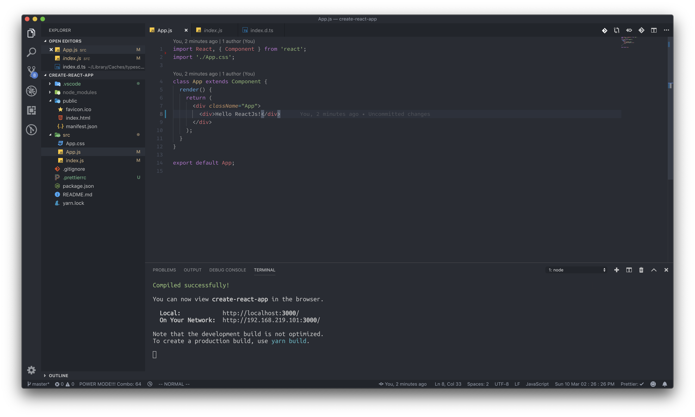
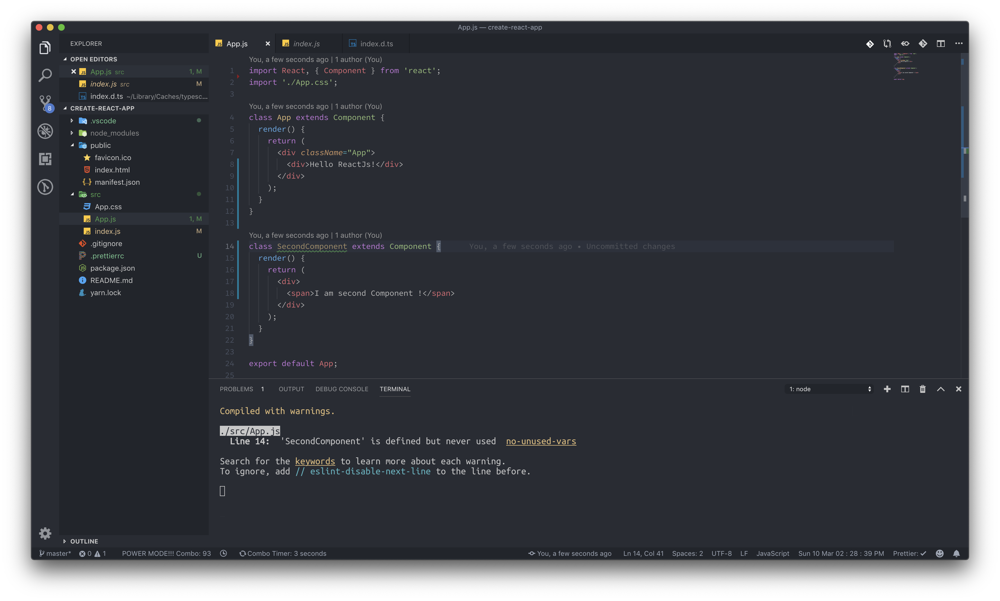
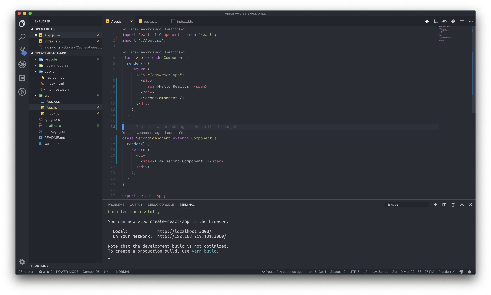
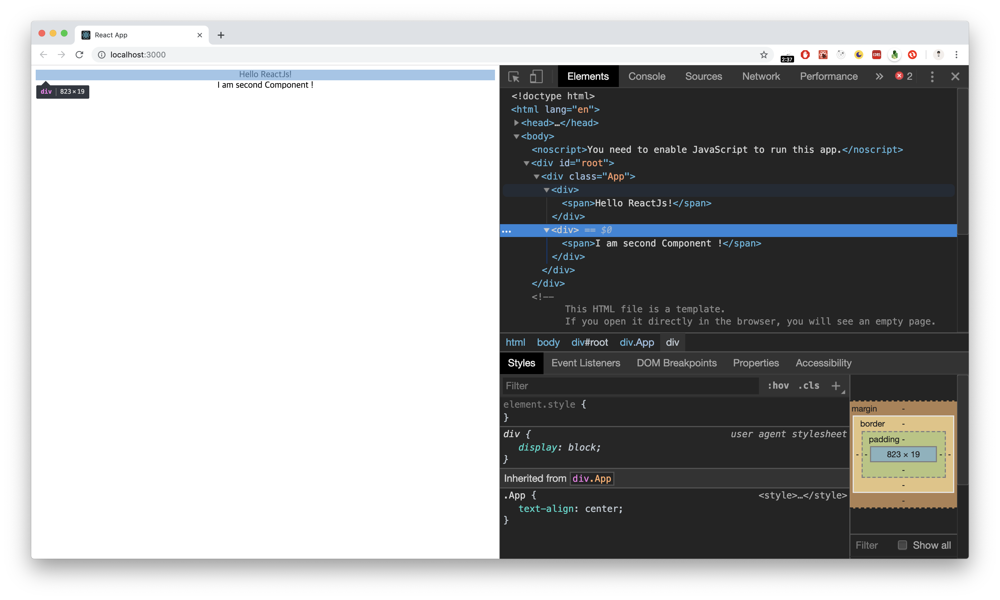

# Component Of React

### 리액트는 여러 개의 컴포넌트 구조로 이루어져 있습니다

일반적인 HTML을 보여드리도록 하겠습니다.



```markup
<html>
    <head></head>
    <body>
        <header>
            ...headerThings...
        </header>
        <main>
            ...mainThings...
        </main>
        <footer>
            ...footerThings...
        </footer>
    </body>
</html>
```



이런식으로 하나의 HTML파일에 header, main, footer부분까지 하나의 파일에 작성하게 됩니다. 그러나 리액트는 컴포넌트 구조로 작성을 할 수 있기 때문에 각각의 부분을 분리해서 작업을 진행할 수 있습니다. 저 부분을 리액트로 작업할 경우, header부분만 프로그래밍하는 header컴포넌트, main부분만 작성하는 main컴포넌트, footer부분만 작성하는 footer컴포넌트를 만들어 작업할 수 있습니다. 그렇게 된다면 저 HTML코드는 이렇게 변경되게 됩니다.



```markup
<html>
    <head></head>
    <body>
        <Header/>
        <Main />
        <Footer />
    </body>
</html> 

```



Header, Main, Footer파일을 불러와 저런 방법으로 작성을 할 수가 있습니다. 이렇게 되면 파일 간 분리가 쉬워지기 때문에 개발자 간 작업 영역을 효율적으로 분리할 수가 있게 됩니다. 한번 간단한 실습을 해 보도록 하겠습니다.

프로젝트 파일에 있는 App.js 파일을 열어 주세요. 어떻게 리액트 컴포넌트를 만들고 HTML코드를 분리 하는지에 대한 방법을 알려드리도록 하겠습니다.



App이라는 클래스를 만들었고, 리액트 모듈로부터 불러온 Component 클래스를 부모 클래스로 받았습니다. 하나의 리액트 컴포넌트를 생성한 것 입니다. 새로운 리액트 컴포넌트를 새로 생성 하여도 다음과 같은 방식으로 리액트 컴포넌트를 생성할 수 있습니다. 클래스 방식을 사용하지 않는 함수형 컴포넌트 방식도 있지만, 지금은 이렇게만 알고 계셔도 됩니다.



새로운 클래스를 만들고, 그 클래스에 리액트 컴포넌트 클래스를 주입해 주었습니다. 이렇게 또다른 리액트 컴포넌트를 생성한 것 입니다. 그런데 저기 보이는 render\(\)라는 메소드가 보이시나요? 이것은 우리가 주입한 리액트에서 불러온 Component 클래스에서 기본적으로 가지고 있는 메소드 입니다. **그래서 저 메소드를 HTML코드 같아 보이는 문법을 리턴하는 형태로 작성하게 되면, 웹 브라우저에서 우리가 작성한 HTML코드를 확인할 수 있습니다.** 

**하지만 이 개념에 대해서 지금 바로 정확하게 체크하고 넘어가려고 할 필요는 없습니다.** 나중에 컴포넌트 라이프사이클을 배울 때 이 메소드에 대해서 더 자세히 짚고 넘어갈 예정입니다.

### 코드 분리

처음 위에서 리액트를 사용하면 HTML 코드를 분리해 효율적으로 작업을 진행할 수 있다고 했었습니다. 지금 한번 그 부분을 실습해 보도록 하죠, App.js 부분을 다음과 같이 변경해 주세요.



다른 컴포넌트를 주입하고 싶을 때는, 저렇게 HTML의 형태로 넣으면 됩니다. 이제 웹 브라우저를 보면 의도했던 데로, SecondComponent의 코드가 App컴포넌트 코드 내부에 들어있는 것을 확인할 수 있습니다.



### 부모-자식 컴포넌트, 어떻게 판단하는가?

우리는 지금 컴포넌트 한개에 다른 컴포넌트를 넣었습니다. 리액트 개발을 할 때에 부모 컴포넌트와 자식 컴포넌트라는 개념을 많이 사용할 텐데, 이 개념은 어떤 컴포넌트를 기준으로 보냐에 따라서 다릅니다.

App컴포넌트 기준으로, SecondComponent는 자식 컴포넌트 입니다. 하지만 SecondComponent기준으로, App컴포넌트는 부모 컴포넌트가 됩니다. 이처럼 부모-자식 컴포넌트를 결정짓는 **기준은 수직적인 구조로 나중에 들어간 컴포넌트가 자식 컴포넌트로 취급됩니다.**

지금까지는 일반적인 컴포넌트를 어떻게 생성하는지에 대해서 알아보았습니다. 다음에는 지금까지 배웠던 내용을 복습해서 영화 소개 프로젝트를 생성하고 컴포넌트를 만들어 보도록 하겠습니다.

