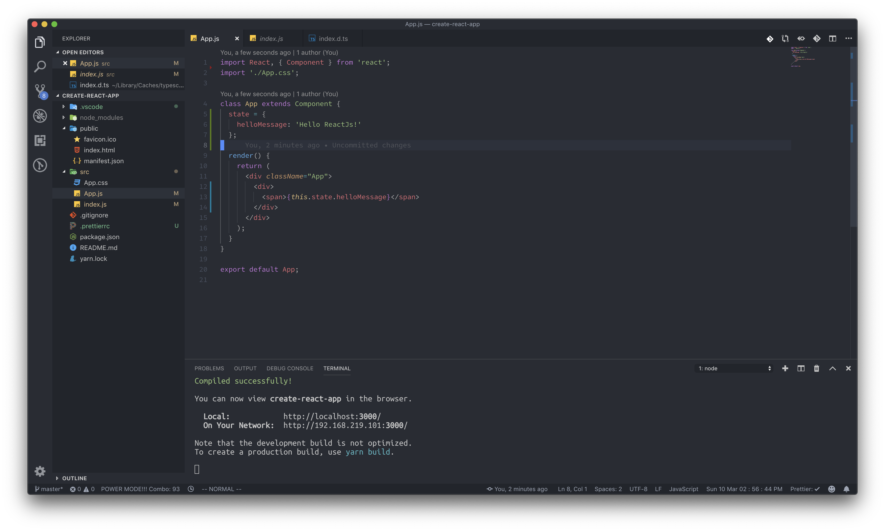
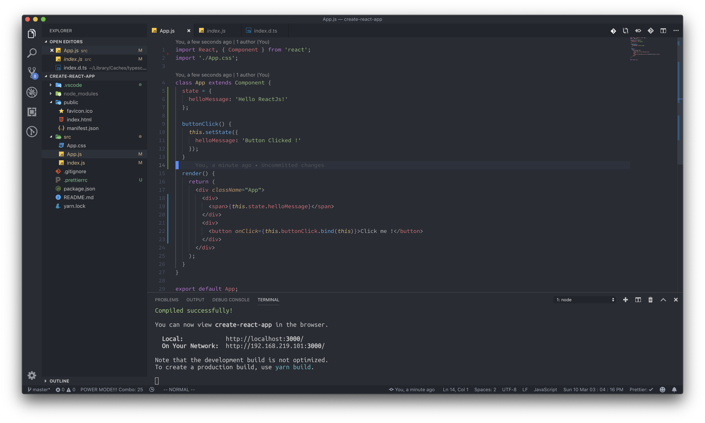
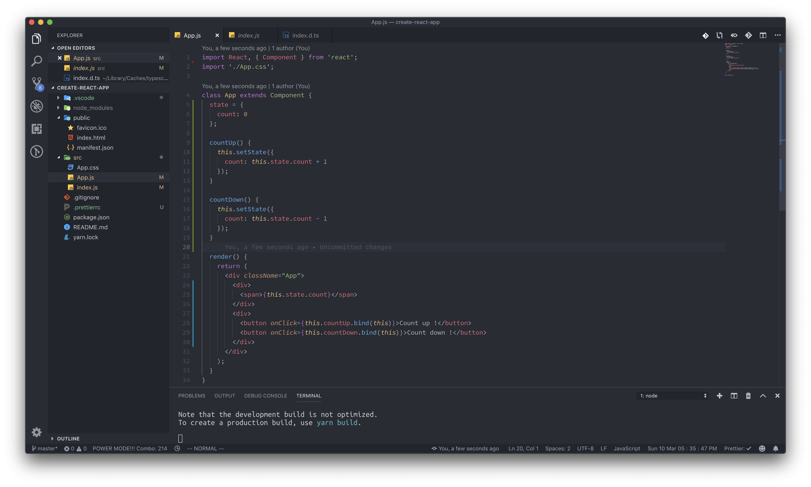
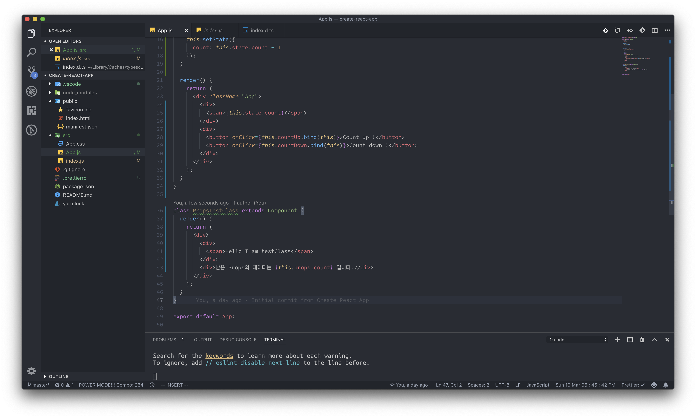
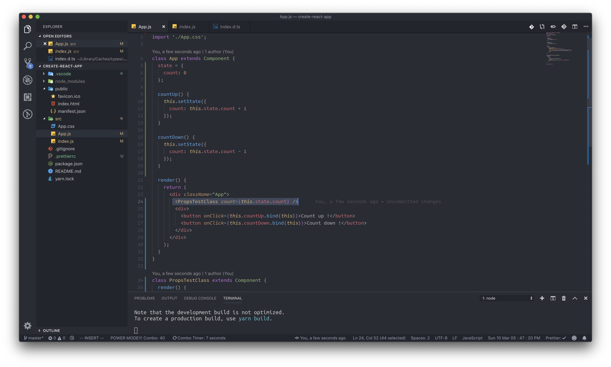
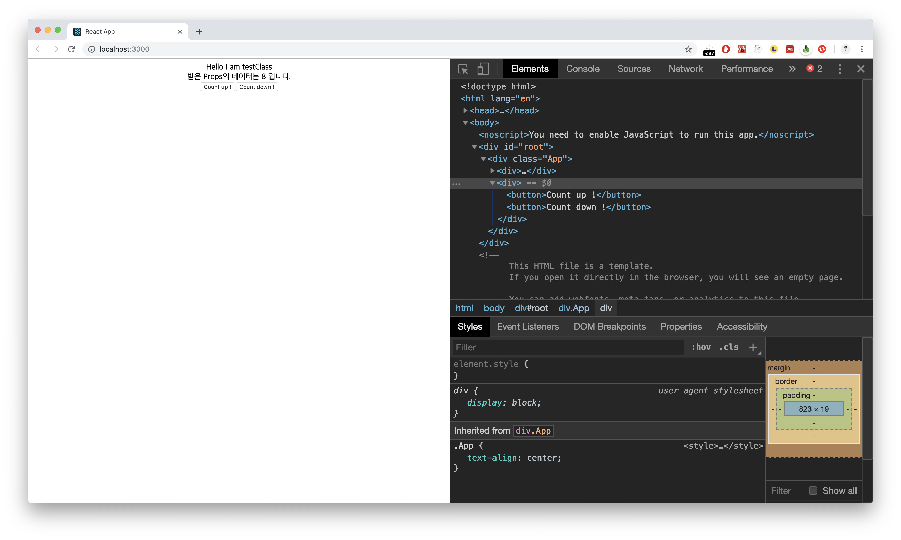

# 1강 - props & state

### props & state의 개념만 이해하면 리액트가 쉬워집니다.

props와 state는 리액트에서 다루는 데이터의 개념입니다. 쉽게 말하자면, props는 받은 데이터 이거나 생성된 데이터, 즉 데이터의 기원이 자기 자신이 아닌 것이고, state는 자신의 컴포넌트에서 만들어진 데이터 입니다. 어떤 컴포넌트 기준에서 얘기하는지에 따라서 같은 데이터 이더라도 state가 될 수 있고 props가 될 수 있습니다.우선 우리는 state에 관해서 먼저 알아본 후, props에 대해 알아보겠습니다.

### state, 현재 컴포넌트의 데이터

**state는 현재 컴포넌트에서 변경, 삭제, 생성할 수 있는 데이터 입니다**. state는 오직 state가 생성된 컴포넌트 내에서만 변경이 가능합니다. _\(이 개념은 나중에 props를 배우게 되면 구체화 되게 됩니다.\)_ state를 선언하는 방법은 간단합니다.



state는 반드시 객체 형태로 생성 되거나 아니면 null \(state를 정의하지 않음\) 타입이여야만 합니다. _\(그런데 한가지 의문이 들 수 있는 점은, 왜 데이터를 보여주기 위해 state를 사용하냐는 것인데, 그 이유는 밑에서 설명해 드리겠습니다.\)_ 지금의 예제는 state를 생성해서 출력까지 하는 예제였습니다. 한번 이번에는 state를 변경하는 예제를 만들어 보도록 하겠습니다.



이제 여기서 리액트 컴포넌트의 업데이트 규칙이 나옵니다. 

**state 업데이트를 하려면 무조건 setState라는 메소드를 사용해야만 합니다.** _\(리액트 컴포넌트에서 제공해주는 메소드\)_ 

만약 setState메소드를 사용하지 않고 그냥 state property에 접근해서 값을 변경하는 경우 그 값이 실제 HTML상으로는 업데이트 되지 않게 됩니다. 앞서 리액트에서는 효율적으로 HTML이 업데이트 되어야 할 부분만을 감지해서 업데이트 한다고 했었습니다. 그렇기 위해서 리액트 개발팀에서 **특정한 작업이 이루어 졌을 때에만 HTML이 업데이트 되도록 만든 규칙 중 하나가 바로 setState실행** 입니다. 다른 방법으로 state를 변경하게 되면 변경된 값을 HTML에서는 볼 수가 없게 됩니다. setState메소드의 사용방법에는 여러 가지가 있지만, 일반적으로 setState\( { 업데이트할 state property: 값 } \) 과 같은 객체 형태로 업데이트 합니다.



```javascript
this.setState({
    helloMessage: 'Change'
})
```



### state, 카운터 예제로 살펴봅시다

state를 더 쉽게 이해할 수 있도록 예제 한 가지를 만들어 보도록 하겠습니다.



_\(이벤트를 등록할 때 마다, bind\(this\)를 하는 이유가 궁금하시다면, 개념 정립에 있는_ [_this_](../this.md) _글을 봐 주시길 부탁드리겠습니다.\)_ 

단순한 예제입니다. countUp메소드는 카운트를 1증가시키고, countDown메소드는 카운트를 1아래로 내려줍니다. 단지 우리가 알아야 할 것은, App컴포넌트에 생성한 state는, App컴포넌트에서만 업데이트 할 수 있다는 겁니다.

### props를 알아봅시다. 정말 간단합니다.

전 컴포넌트 글에서 우리는 컴포넌트를 여러 개 생성해서 App컴포넌트에 렌더링 시키는 예제를 살펴보았습니다. 이번에는 컴포넌트를 렌더링 시키는 것 뿐만 아니라 데이터를 전달하는 예제를 실습해 보도록 하겠습니다. App.js파일에 다른 클래스 컴포넌트를 하나 생성해 주세요.



이제 이 새로 만든 클래스를 App부분에 넣어주도록 하겠습니다.



정말 간단하게 데이터를 전달했습니다. 앞으로 자식 컴포넌트에게 데이터를 전달하고 싶을 때는, 저런 방식을 사용해서 전달하면 됩니다. 꼭 state만을 전달할 필요는 없고, 메소드를 전달하는 것도 가능합니다. 화면을 보면 자식 클래스에 전달한 값이 버튼을 클릭할 때마다 잘 업데이트 됩니다.



이제 props에 개념에 대해서 이해가 가시나요? props와 state를 구분하는 기준은, 어떤 컴포넌트에 입장에서 말하는 지에 따라서 달라집니다. 만약 count를 App컴포넌트에 입장에서 말하게 된다면 그것은 state이겠지만, PropsTestClass컴포넌트에서 count를 논하게 된다면 그것은 props로써 취급되게 됩니다.

### 이 개념이 이해가 되셨다면...

이제 리액트에 관한 대부분을 파악하셨습니다. 다음 강의에서는 리액트 컴포넌트의 생명 주기에 관해서 알아보도록 하겠습니다. 컴포넌트가 언제 생겨나고, 언제 이 코드가 HTML로 변환되는지와 같은 타이밍에 관한 내용입니다.

