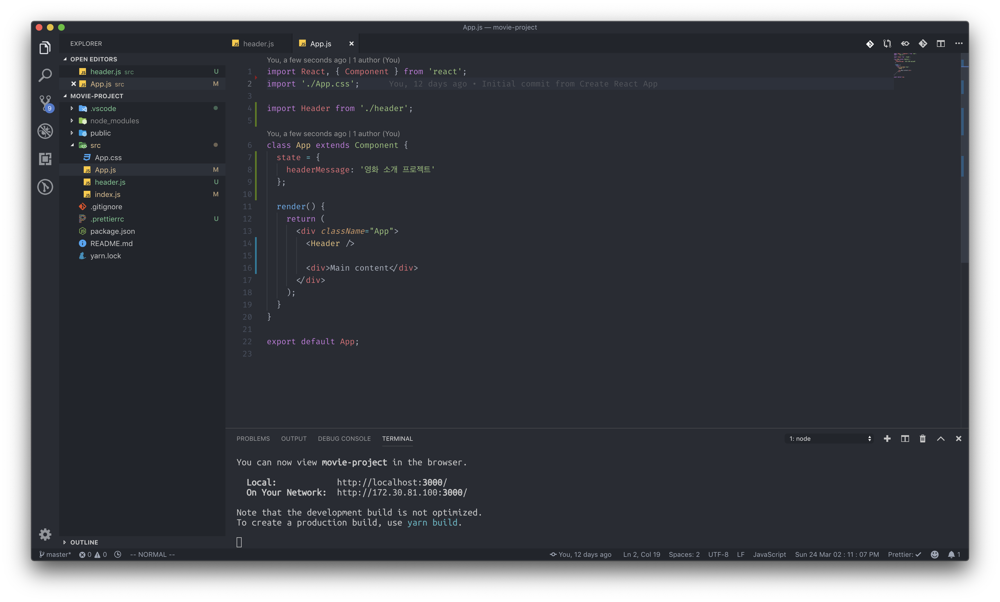
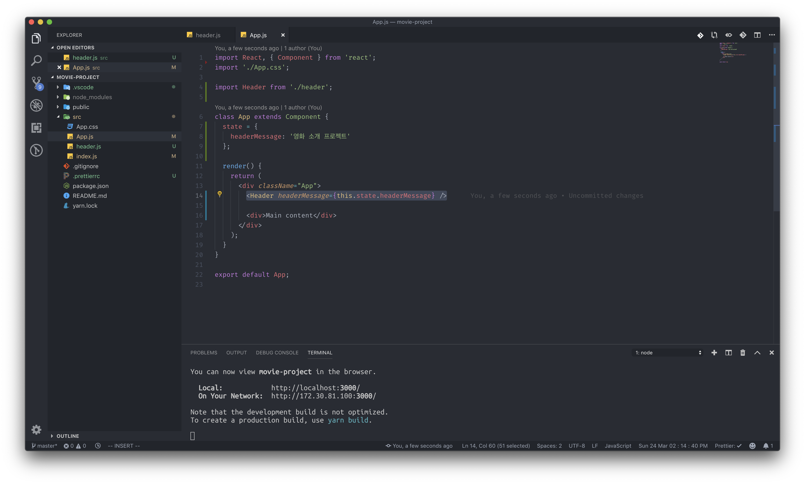
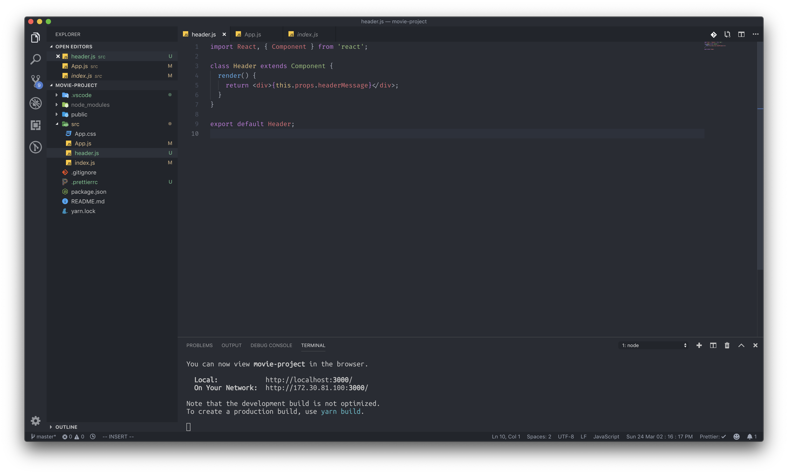
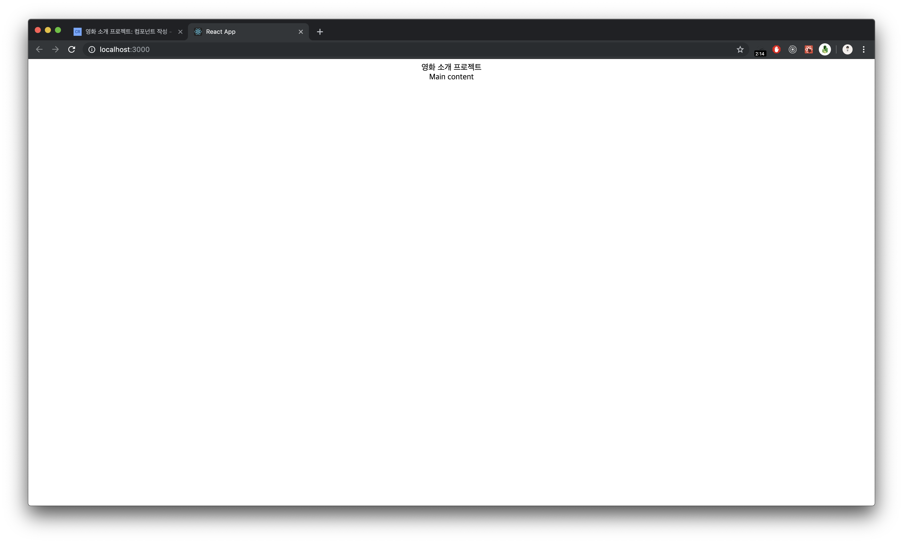
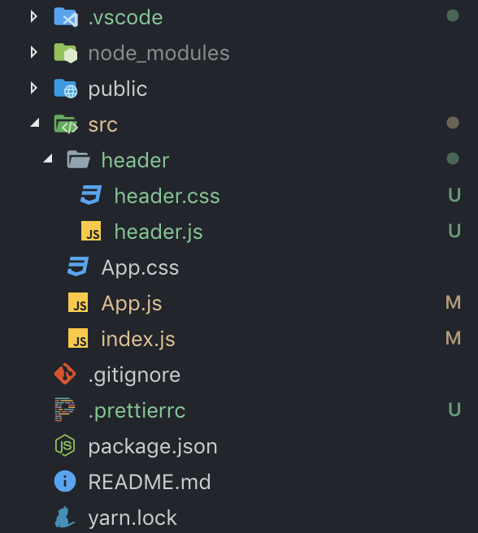
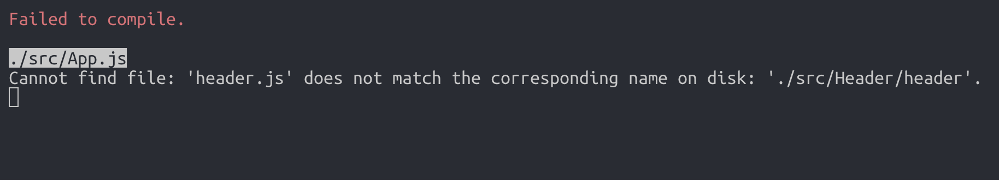
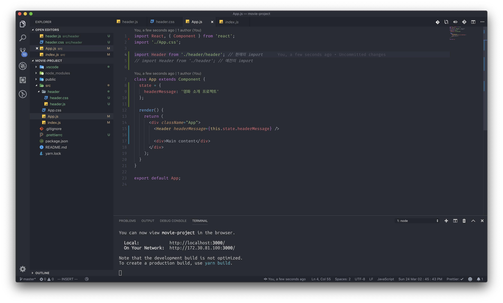
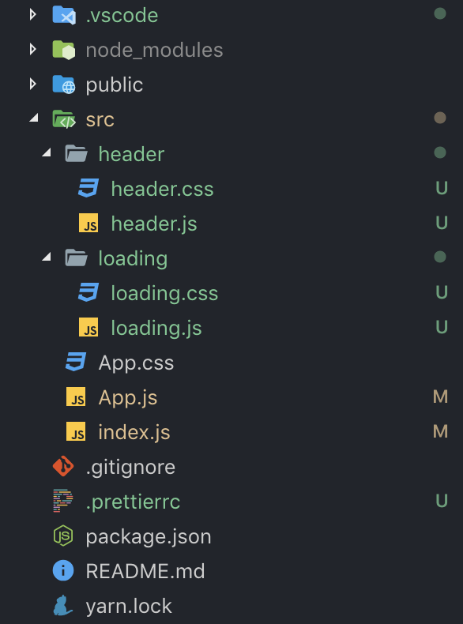
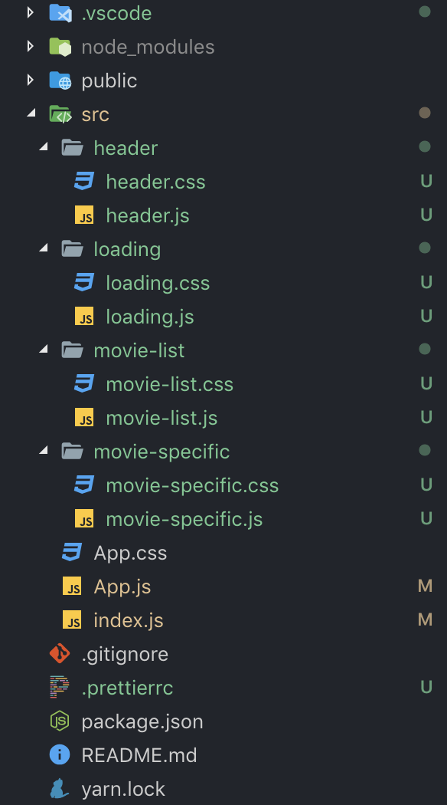

# 영화 소개 프로젝트: 컴포넌트 작성

### props & state를 이용해서 헤더 문구 넣기

방금 전에는 프로젝트를 만들고 간단한 Header 컴포넌트를 생성했었는데, 이번에는 Header에 넣을 문구를 props와 state를 이용해서 만들어 보도록 하겠습니다. Header에 넣을 단순한 문구이기에 state와 props를 꼭 사용할 필요는 없지만, 배운것을 다시 한 번 복습한다고 생각하고 진행하도록 하겠습니다.

지금 생성한 state를 Header 컴포넌트에 넘겨서 Header컴포넌트에 들어갈 문구로써 활용해 보겠습니다.

headerMessage state를 Header컴포넌트에 전달해 주세요.

이제 state를 전달해 주었으니, Header 컴포넌트에서 받는 headerMessage props를 사용해 보도록 하겠습니다.

### 영화 데이터 생성

앞으로 영화 소개 프로젝트에서 다룰 영화들의 데이터를 state로 정의를 해 놓겠습니다.

### 앞으로 작업할 컴포넌트들 미리 만들어놓기

사용할 컴포넌트는 총 5개 입니다.

메인 컴포넌트인 App컴포넌트, 헤더 컴포넌트, 영화 데이터를 로딩중일때만 나오는 로딩 컴포넌트, 영화들의 전체적인 데이터를 볼 수 있는 영화 리스트 컴포넌트, 특정 영화의 정보를 자세히 볼 수 있는 컴포넌트 총 5개 입니다. 우선은 이 컴포넌트들을 미리 생성해 놓도록 하겠습니다. _\(2강에서 진행할 컴포넌트 스타일링을 위함\)_

만들어야할 컴포넌트 개수가 5개나 되니, src폴더에 담길 파일이 꽤 많아지게 됩니다. 각각의 컴포넌트에 적용할 CSS파일도 필요하니까요. 그렇기 때문에 src폴더 안에 컴포넌트 별로 폴더를 만들어서 관리하도록 하겠습니다.

우선 앞서 만들었던 Header컴포넌트 부터 시작해 볼까요?

그러나 이렇게 폴더를 분리했을 때에, 리액트 코드에 한가지 문제가 발생하게 됩니다.

파일이 없다고 나오네요. 왜 이런 문제가 발생했을까요 ? 그것은 바로 App.js컴포넌트에서 발생한 경로 문제입니다. 이번에도 에러 코드를 잘 읽어보면 쉽게 해결할 수 있는 문제입니다. 파일을 찾을 수가 없다고 나오는데요.

App.js에서 import하고 있는 Header컴포넌트의 경로는 src/header.js 입니다. 하지만 우리는 방금 컴포넌트 경로를 변경시켜 주었기 때문에 App 컴포넌트에서 가리키고 있는 파일은 없어진 체로 남게 됩니다.

#### App컴포넌트에서 import하고 있는 경로를 바꾸어주면 오류는 해결이 됩니다.

이제 컴포넌트를 본격적으로 생성해 보도록 하겠습니다. 우선은 로딩 컴포넌트 부터 생성해 보도록 하겠습니다.

같은 방법으로 movie-list, movie-specific 컴포넌트를 생성해 주세요.

_지금 프로젝트의 모습은 흰 화면에 글자가 몇 개 있을 뿐이지만, 2강에서 컴포넌트 스타일링을 통해서 프로젝트를 예쁘게 꾸밀 것 입니다._

