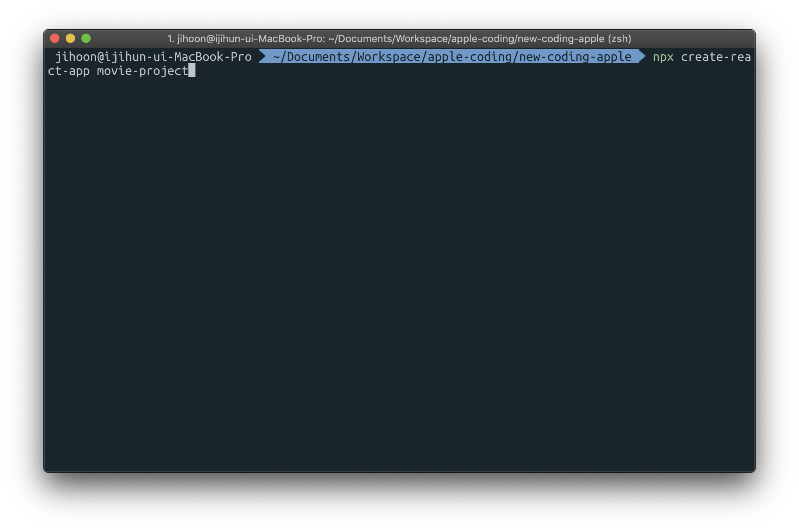
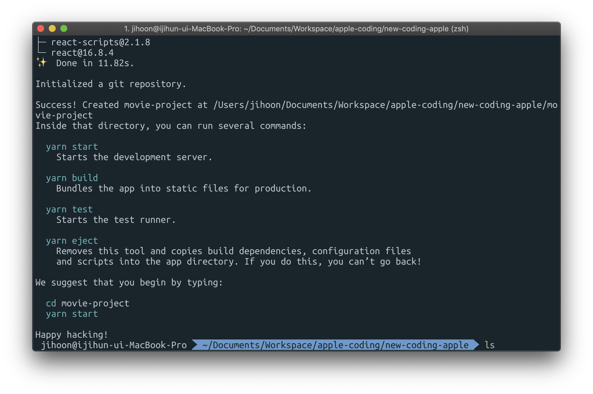
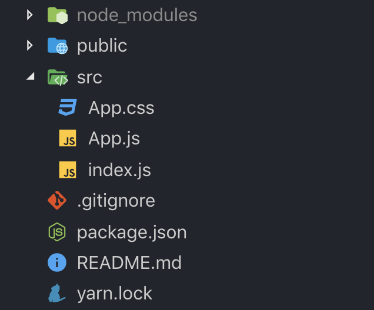
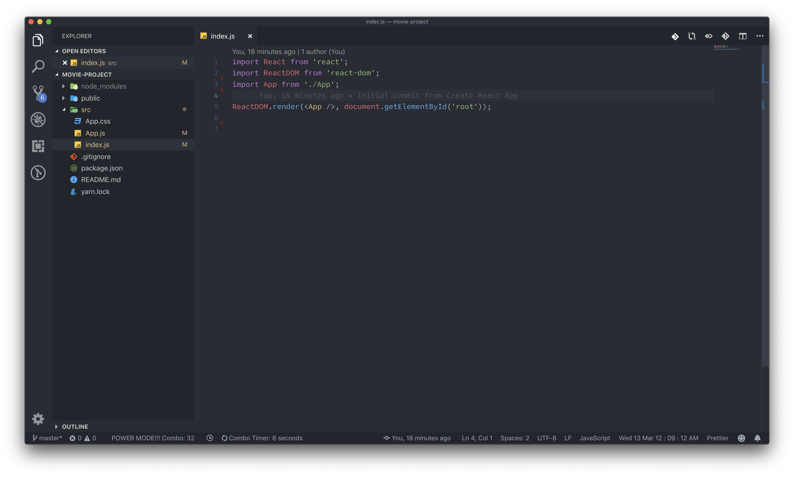
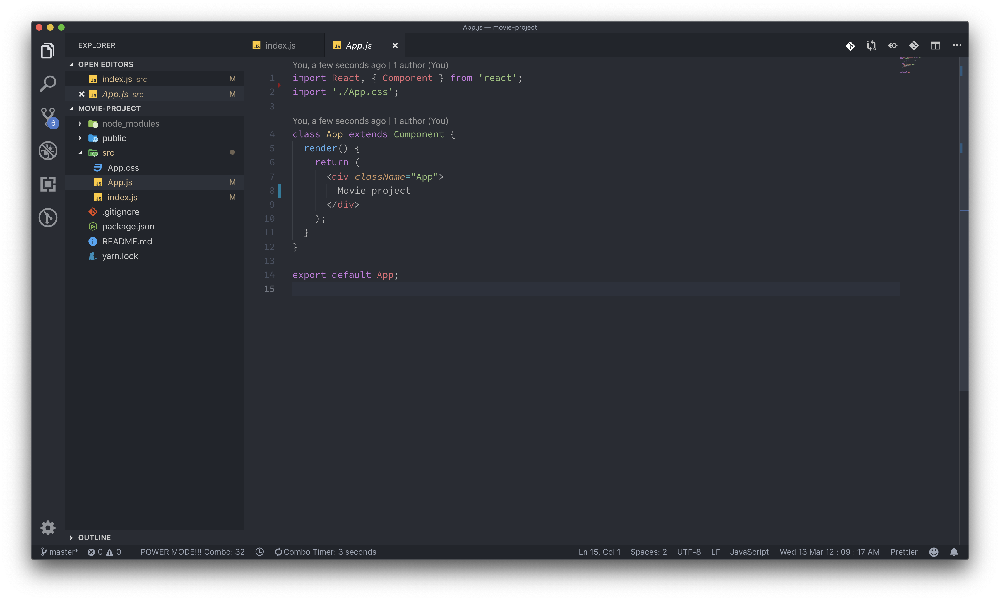
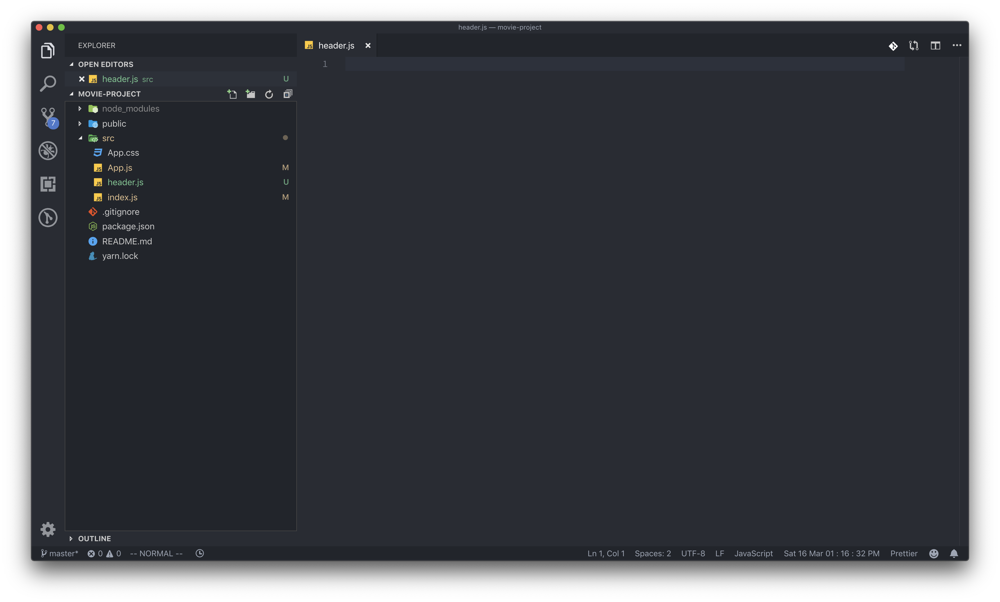
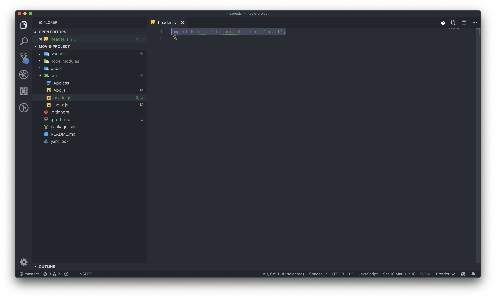
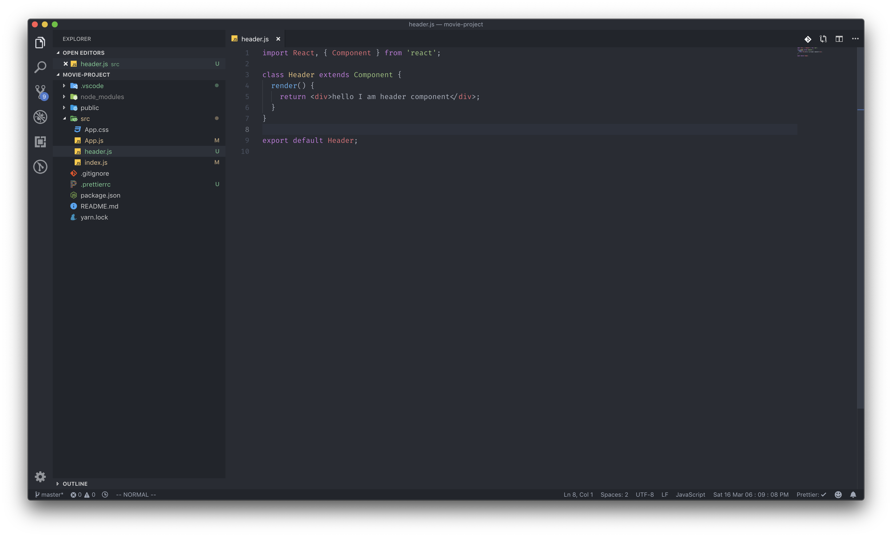
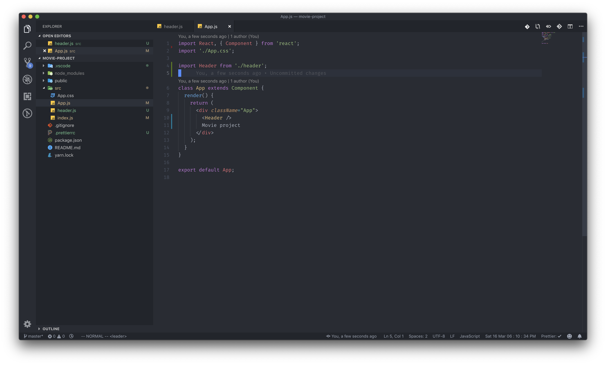

# 영화 소개 프로젝트: 프로젝트 생성

지금까지 배웠던 내용을 바탕으로 프로젝트를 생성하고 컴포넌트를 만들어 보도록 하겠습니다.

먼저, 새로운 터미널을 열어주세요. 처음에 했던 데로 같은 명령어를 사용해서 프로젝트를 생성해 보도록 하겠습니다. 터미널에 다음과 같은 명령어를 입력해 주세요.

`npx create-react-app movie-project` 

### 프로젝트 구조 잡기

우선 처음에 배웠던 데로 사용하지 않을 파일들은 지워주도록 하겠습니다. 폴더 구조를 다음과 같이 잡아 주세요.

그 후, index.js와 App.js에 있는 모듈 간 import 관계도 정리해 주세요. 아직 저 파일들에서는 우리가 삭제한 파일들을 불러와 사용하고 있습니다.

파일의 관계를 정리해 주었습니다. 그럼 우선은 컴포넌트 생성을 해 봐야겠죠? 아직 컴포넌트 안에 있는 문법에 관해서는 생각하지 않으셔도 됩니다. 우선 앞서 배운 컴포넌트를 만들어 보도록 하겠습니다. 그런데 이번에는 App.js라는 파일 하나에 컴포넌트를 만드는 것이 아닌, 다른 자바스크립트 파일을 만들어 그 안에 컴포넌트를 만들어 보는 실습을 해 보도록 하겠습니다. 영화 소개 페이지 홈페이지의 헤더 부분의 컴포넌트를 생성하겠습니다.

헤더 컴포넌트에서는 일반적인 웹 사이트의 헤더 컴포넌트에서 하는 기능과 같이, 메인 소개 문구, 메뉴 정도를 넣도록 하겠습니다.

이제 처음부터 헤더 컴포넌트를 만들어 보도록 해보겠습니다.

어떤 파일을 import 하거나 export 하는 방법에 대해서 아직 감이 잡히지 않는다면 이 [링크](../undefined/import-export.md)를 참조해 주세요.

그냥 단순한 컴포넌트 입니다. 모든 리액트 컴포넌트의 시작은 이렇습니다. 클래스 문법에 관해서 이해를 하고 있다면 정말 쉽게 넘어갈 수 있습니다. \(클래스 문법이 아직 익숙하지 않다면[ 여기](../undefined/class.md)를 참고\)

다음은 만든 Header 컴포넌트를 App.js에 넣어 보겠습니다.

_\(전 파일에서 export default를 해주기 때문에, 꼭 Header라는 이름으로 import를 해줄 필요는 없습니다.\)_

앞으로 영화 프로젝트에서 이와 같은 컴포넌트를 3개 4개 정도를 만들어 볼 예정인데, 다음에 만든 컴포넌트들은 JSX문법을 실습한 뒤에 작성해 보도록 하겠습니다 !

