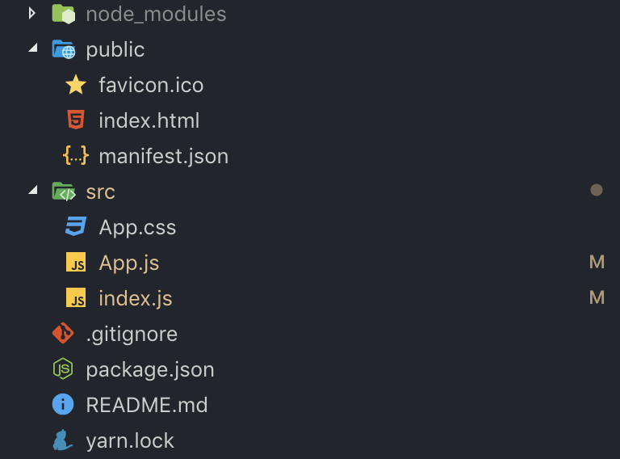
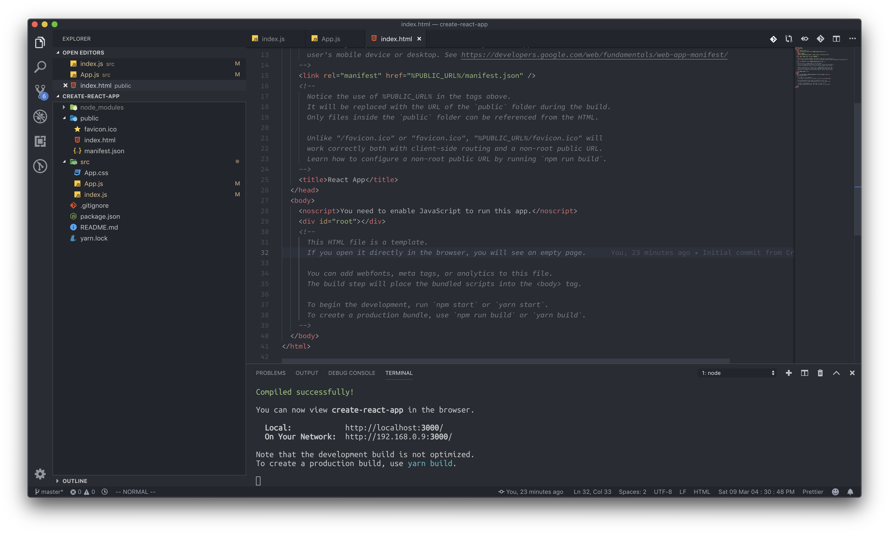
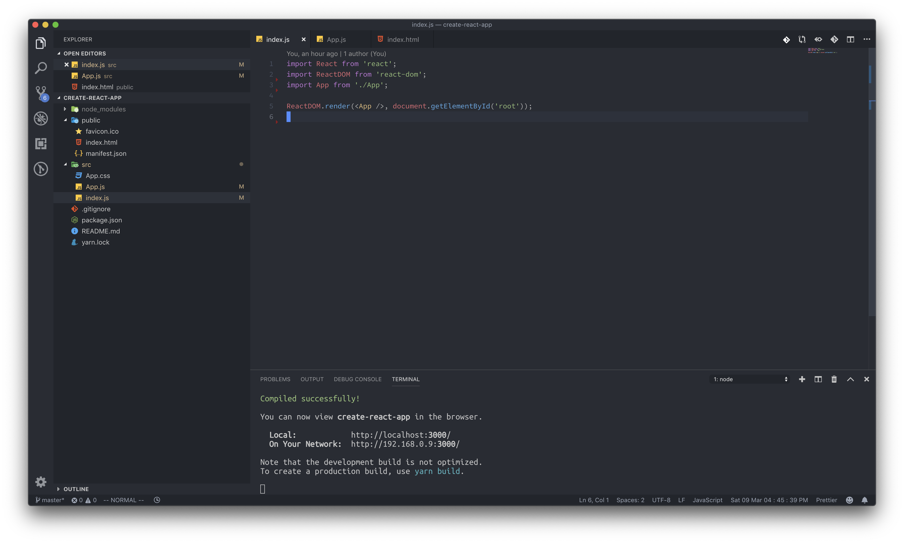
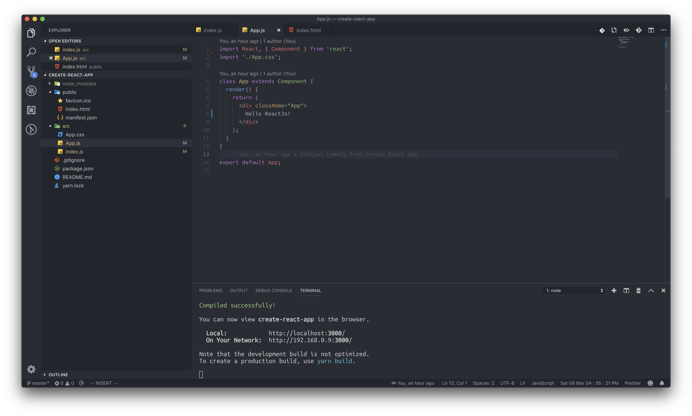

# React에는 HTML이 없나요 ?

### 껍데기 HTML.

CRA의 폴더 구조에 대해서 설명해 드리도록 하겠습니다. create-react-app으로 리액트 프로젝트를 생성하신 분들이라면, 이런 폴더 구조를 보실 수 있습니다.

지금 설명드릴 내용은 어떻게 JS에서 생성한 HTML파일이 작동하는지에 대한 내용입니다.

우선은 public 폴더에 있는 내용에 대해서 보셔야 하는데요, public 폴더에는 3개의 파일이 존재합니다. 먼저 웹 페이지 탭에 상단에 보이는 아이콘인 favicon.ico, index.html, 그리고 manifest.json입니다. 여기서 우리는 index.html에 대해서만 짚고 넘어가면 됩니다. \(manifest에 관한 정보는 [여기](https://developers.google.com/web/fundamentals/web-app-manifest/?hl=ko)로\)

public폴더에 있는 index.html파일을 보면, 아무것도 없습니다. Hello, React! 라는 문구는 찾아볼 수도 없고, 그저 body태그에 id가 'root'인 div 하나가 존재할 뿐 입니다. 이렇게 index.html이 구성되어 있는 이유는, 리액트에서는 직접 HTML을 코딩하는 것이 아닌, src 폴더에서 JSX라는 특별한 문법을 이용해서 HTML뷰를 생성해 내기 때문입니다. 그렇게 생성된 HTML이 id가 root인 div안에 들어가게 되는 것이구요. 결론적으로 리액트는 동적으로 HTML뷰를 생성해 냅니다. 그렇기 때문에 우리가 보는 index.html은 마치 껍데기와 같은 역할을 하는 것 입니다.

동적으로 HTML뷰를 생성해 낸다는 얘기가 아직 생소하신 분들이 많을 겁니다. 동적으로 HTML을 생성하는 부분은 src폴더에 있습니다. src 폴더에 있는 index.js파일을 살펴보도록 하겠습니다.

### 실제 코드는 src안에 들어있습니다.

index.js 파일에서는 3가지의 모듈/파일을 불러오고 있습니다. 한 가지 파일은 react 모듈, 또 하나는 react-dom모듈입니다. 마지막은 App.js파일을 불러오고 있네요. \(reactDOM모듈에 대해서는 자세히 몰라도 되는 부분입니다. 그저 리액트 코드를 실제 HTML로 렌더링 하기 위해 사용하는 도구 정도로 생각하시면 됩니다.\)

**ReactDom.render 라는 메소드가 실행되는 것이 보이시나요?** 이 부분에서 동적으로 리액트 코드를 실제 HTML에 렌더링 합니다. 실행되는 함수의 첫 번째 인자로는 **App.js에서 불러온 파일**을 HTML의 형태로 넣습니다. \(JSX문법입니다\) 두 번째 인자로 담기는 부분은 익숙한 문법인데요. **id 가 root인 element를 가져옵니다.** 여기서 이 함수가 하려는 작업의 의도를 이미 알고 계신 분도 있을지 모르겠네요. render 함수는 첫 번째 인자에 담기는 파일\(App.js\)을 불러와서 두 번째 인자로 담기는 HTML엘리먼트\(id="root"인 div\) 내에 리액트 코드를 렌더링 시키는 동작을 합니다.

### App에는 뭐가 있는데..?

당연히 리액트 코드가 있습니다! \(정확히는 리액트 컴포넌트\) App.js에 있는 코드를 살펴보도록 하겠습니다.

저기 보이는 App Class가 어떤 역할을 하고 있는지는 다음 장에서 알아 보도록 하겠습니다.

