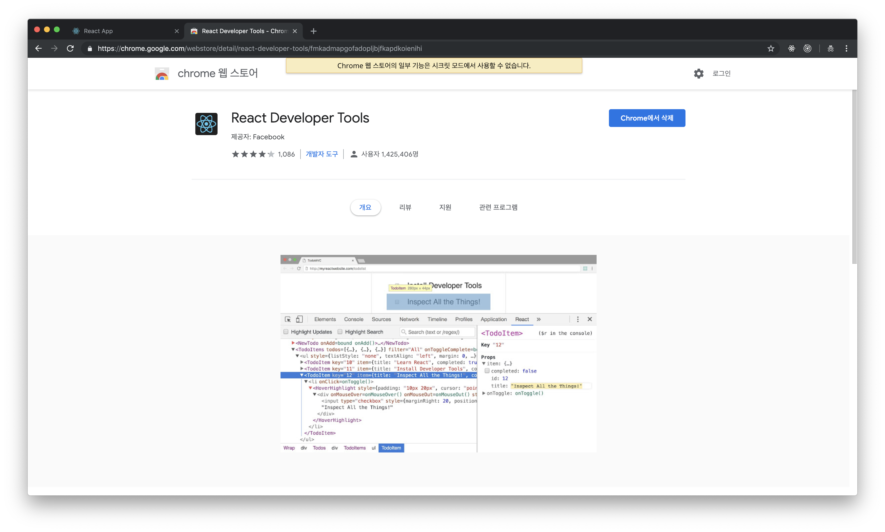
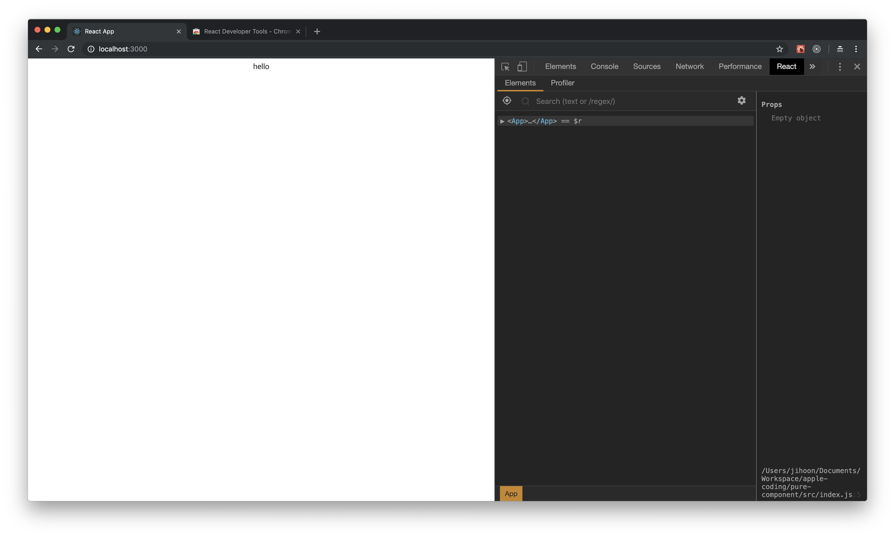
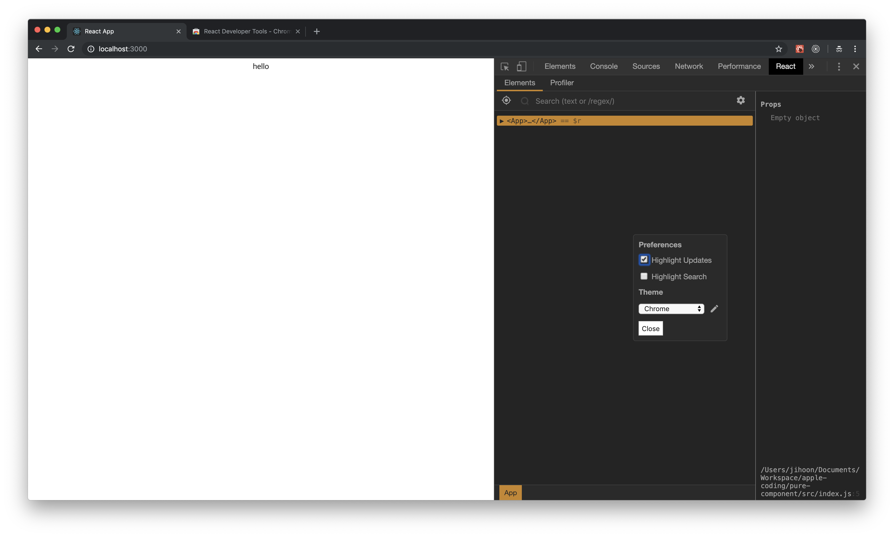
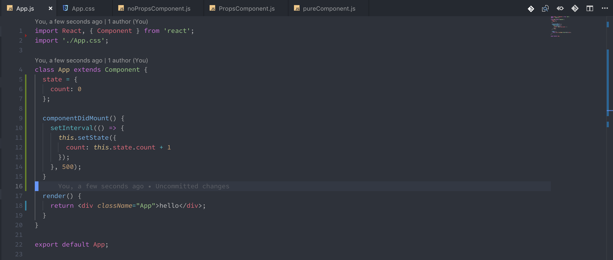
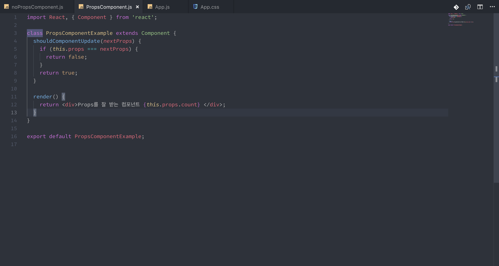
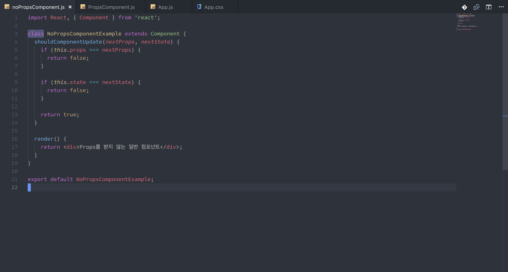

# 2강 - Optimizing of component

### ShouldComponentUpdate의 사용

리액트는 기본적으로 부모로부터 받은 props의 변경, setState, forceUpdate가 있을 때에만 다시 렌더링 하는 작업을 진행합니다. 다시 렌더링이 된다는 뜻은, 현재 컴포넌트의 모든 부분이 리 렌더링 된다는 뜻 입니다. child 컴포넌트를 가지고 있었다고 한다면, 상속해주지 않는 props가 존재해도 child 컴포넌트는 부모의 state가 바뀔 때마다 계속 재 렌더링을 하게 되죠. 이건 최적화를 해야 할 부분입니다. 다행히도 리액트는 좋은 개발자 도구를 제공해 주기 때문에, 우리는 더 쉽게 컴포넌트 최적화를 할 수 있습니다.

### DevTools를 통한 리 렌더링 파악하기

이 [링크](https://chrome.google.com/webstore/detail/react-developer-tools/fmkadmapgofadopljbjfkapdkoienihi)를 클릭해 주세요. 

이 도구를 다운로드 받으신 후, 윈도우\(F12\), 맥\(command + option + i\) 버튼을 누를 시에 관리자 메뉴가 나오게 되는데, 여기서 React라고 있는 메뉴를 클릭하게 되면 리액트 개발자 도구를 사용할 수 있게 됩니다.

컴포넌트가 변경될 때마다 변경되는 부분들을 하이라이팅 할 수 있는 기능이 리액트 개발자 도구에는 존재합니다. 저기 개발자 도구에 있는 톱니바퀴 버튼을 눌러주세요.

이제는 모든 Update가 시각화 되어서 잘 보이게 됩니다. \(개발자 도구를 켜고 있을 시만\)

### 컴포넌트 최적화를 위한 덜 최적화된 컴포넌트 제작하기

우선, state를 일정 시간마다 무조건 변경 시켜 컴포넌트가 재 렌더링 하게 만들 것 입니다. 그렇게 해서 어떤 부분이 업데이트되고 어떤 부분이 업데이트 되지 않는지 한번 파악해 보겠습니다.

우선 cra 프로젝트를 하나 만들어 주세요.

컴포넌트를 3개 만들 것 입니다. 파일 이름은 각각 noPropsComponent, PropsComponent, PureComponent

1. App.js 컴포넌트에 매 1초마다 setState가 일어나게 만들어야 합니다.

Child 컴포넌트 두개를 만들 건데요, 하나는 App.js의 count를 상속받는 컴포넌트, 또 하나는 그냥 텍스트만 보여주는 컴포넌트입니다.

이제 아까 설치했던 크롬 리액트 개발자 도구를 통해서, 리 렌더링이 어떻게 이루어 지는지 살펴 보겠습니다.

최적화 코드가 들어가니까, 바뀌어야 할 부분만 바뀌고 나머지 부분은 바뀌지 않고 있네요. 더 효율적으로 동작하는 코드를 만들었습니다. 만약 두 개의 Child 컴포넌트에 shouldComponentUpdate 메소드를 사용하지 않았다면 두개의 Child 컴포넌트 모두 리 렌더링이 되었을 것 입니다. 사실 지금 예제에서는 너무 간단한 예제라서 최적화도 필요가 없었지만, 나중에 리액트 개발을 할 때 복잡한 로직을 구현하게 되면, 제 아무리 리액트라도 느려 질 수 있기 때문에 이런 로직을 작성해서 최적화를 하시는 것을 추천 드립니다.

