# 2강 - scss note

### 노트 만들기

우리는 이번 시간에 SCSS를 리액트에서 어떻게 사용하는지 간단히 실습하고, 간단한 미니 프로젝트를 진행해보려 합니다.

### 준비

create-react-app을 통해서 프로젝트를 한 개 생성해 주세요. 이번 시간에 우리는 새로운 리액트 라이브러리를 사용해 볼 것 입니다.

create-react-app이 전부 설치되었으면, 이제 프로젝트 폴더로 들어가 주세요. 여기서 다른 모듈을 또 설치해볼 것 입니다. 일단, node-sass를 npm 을 통해서 설치해 주세요.

`npm i node-sass 아니면 yarn add node-sass` 

`npm i styled-components 아니면 yarn add styled-components`

설치가 전부 완료되었다면 이제 프로젝트를 시작해 볼 준비가 되었네요. 우선 프로젝트를 깔끔하게 만들어 주겠습니다. 처음 Create-react-app을 만들고 우리가 사용하지 않는 파일을 지워준 것 처럼 프로젝트 구조를 깔끔하게 만들어 주세요.


### 만들 기능들

노트 검색, 노트 추가, 노트 편집, 노트 삭제를 만들어 보겠습니다. 기능 제작 순서는 노트 리스트 보여주기 -&gt; 노트 추가 -&gt; 노트 편집 -&gt; 노트 삭제 -&gt; 노트 검색 순서입니다.

### 컴포넌트 생성하기

우리가 만들 기능들에 대한 컴포넌트를 미리 생성해 주도록 하겠습니다. 


delete는 노트 삭제 클릭 시 정말 삭제하시겠습니까 ? 와 같은 메시지를 띄워주는 창 입니다. delete는 단독으로 동작할 수 없고, modal 에 담긴 형태로 작동해야 비로소 완전하게 됩니다. modal 그저 modal 효과를 내 주는 컴포넌트 입니다. note-list는 노트들의 리스트를 보여주는 컴포넌트 이고, 그 안에 노트 하나하나가 note입니다. note-raw는 편집이나 새로 노트를 작성할 때 볼 수 있는 화면이고, 이 화면도 모달을 통해서 작성할 것 입니다. search-bar는 검색 기능 구현을 위한 컴포넌트 이구요. 이제 대략적인 기능 설명이 끝났으니, 한번 앱을 만들어 볼까요?

### 기본적인 스타일링

프로젝트 시작 전에 모듈을 두개 설치했었죠? node-sass와 styled-components, 이 두개의 모듈은 각각 프로그래머에게 css작성할 때 많은 도움을 줍니다. node-sass는 말 그대로 리액트에서 scss, sass를 사용할 수 있게 해 주는 역할을 합니다. styled-components는 javascript안에서 css를 작성하는 기법을 훨씬 수월하게 할 수 있게 해주는 역할을 합니다.

우선 scss가 잘 작동하는지 먼저 볼까요? index.css를 scss로 변경한 후에 한번 스타일링 코드를 넣어 보겠습니다.


배경화면만 간단하게 변경해 주었습니다. 최근 create-react-app에서는 sass 컴파일러인 node-sass만 설치해 주어도 scss주입이 아주 간단하게 끝납니다.

이제 배경화면을 설정해 주었으니, App.js로 가서 우리가 만들 노트 앱의 전체적인 스타일을 잡아주겠습니다.

App.js의 jsx를 변경해 주세요.

```text
<div>
  <div id="app">
    <div id="search-bar">Search-Bar</div>
    <div id="note-list">Note-List</div>
  </div>
</div>
```

원래라면 css 파일을 만들어서 스타일링을 하겠지만, 우리는 CSS-IN-JS를 사용해 보겠습니다. 먼저 App.js의 상단에 우리가 설치했던 styled-components를 import 해 주세요.


이제, [styled-components](https://www.styled-components.com/)를 이용한 태그를 만들어 보도록 하겠습니다. 우선 App.js의 윗부분에 저 코드를 작성해 주세요.


지금 저 구문은 styled-components의 문법입니다. styled를 default로 import 한 후, 뒤에 태그 이름을 넣으면 문자열의 스타일이 기본적으로 담긴 태그가 생성이 됩니다. 한번 적용해 보겠습니다.


이 모듈을 사용해서 스타일링을 하게 되면 일단 빠르게 스타일을 작성할 수 있습니다. 만약 퍼블리셔가 팀 내에 있는 상황이라면 이 모듈을 사용하는 것을 피해야 하겠지만, 스타일을 직접 작성해야 할 경우에는 좋은 선택지가 될 수 있습니다.

### 노트 리스트 컴포넌트 만들기

이제 기본 틀을 만들어 보았으니, 노트 리스트를 만들고 노트를 보여주는 것을 해 보도록 하겠습니다.

우선, 거의 모든 state는 App.js에서 작성하도록 하겠습니다. state는 부모로 넘겨줄 수 없고 아래 자식 컴포넌트로만 줄 수 있기 때문에, 최상단인 App.js에서 작성해야만 데이터를 공유할 수 있습니다. _\(리덕스나 Context-API등을 사용하면 이 문제를 해결 할 수 있습니다.\)_


Search 는 검색할 때의 용도로 사용되는 state 입니다. notes는 노트 리스트 입니다. 배열 객체의 형태를 지니고 있고, 하나의 객체는 하나의 노트. date는 생성되거나 수정된 날짜, text는 내용, title은 제목, edited는 글이 편집되었을 때 \(수정됨\) 과 같은 메시지를 표현하기 위해서 만든 state 입니다.

지금은 기본으로 노트 리스트를 보여주기 위해서 더미 데이터를 생성한 것 뿐이고, 나중에 이 데이터들은 지우고 우리가 직접 노트를 생성할 수 있는 형태로 변경할 것 입니다.

components폴더의 note-list 파일을 수정해 주세요.

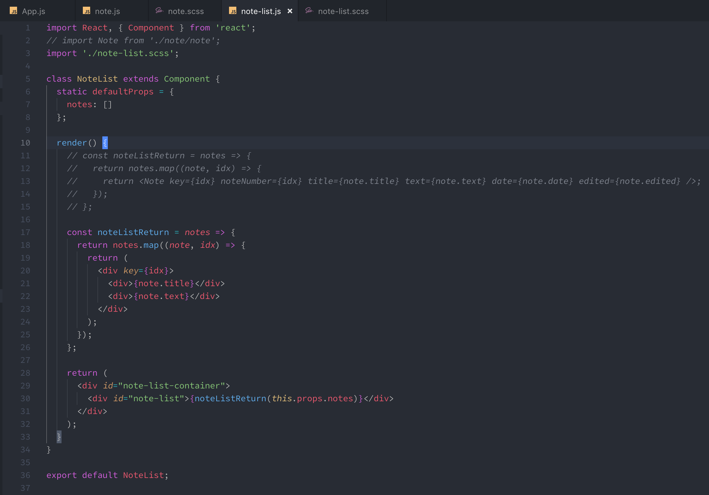

이 파일에 scss 파일을 생성해 import 해준 후, 지정해 두었던 scss 내용도 넣어 주도록 하겠습니다.

```css
#note-list-container {
  height: 100%;
  overflow-y: auto;

  #note-list {
    display: flex;
    flex-wrap: wrap;
    padding: 1rem;
  }
}
```

그 다음에는 App.js에서 note-list 컴포넌트를 불러와 주어야 합니다. 그래야 노트 리스트를 볼 수 있습니다.


검색바는 아직 안만들었다고 쳤으니 상관없고, 노트 리스트가 이렇게 보이는 모습이 저에게는 별로 예뻐 보이지가 않네요. 그래서 제가 처음 컴포넌트를 생성했을 때, note-list와 note 컴포넌트를 제작한 것 입니다. note-list는 각각 note를 전부 관장하는 컴포넌트이고, 각각의 노트들은 note에 의해 관리가 될 수 있도록 구조를 변경해 보겠습니다.

### 노트 컴포넌트 만들기

note-list안에 있는 note 컴포넌트를 변경해 주세요.

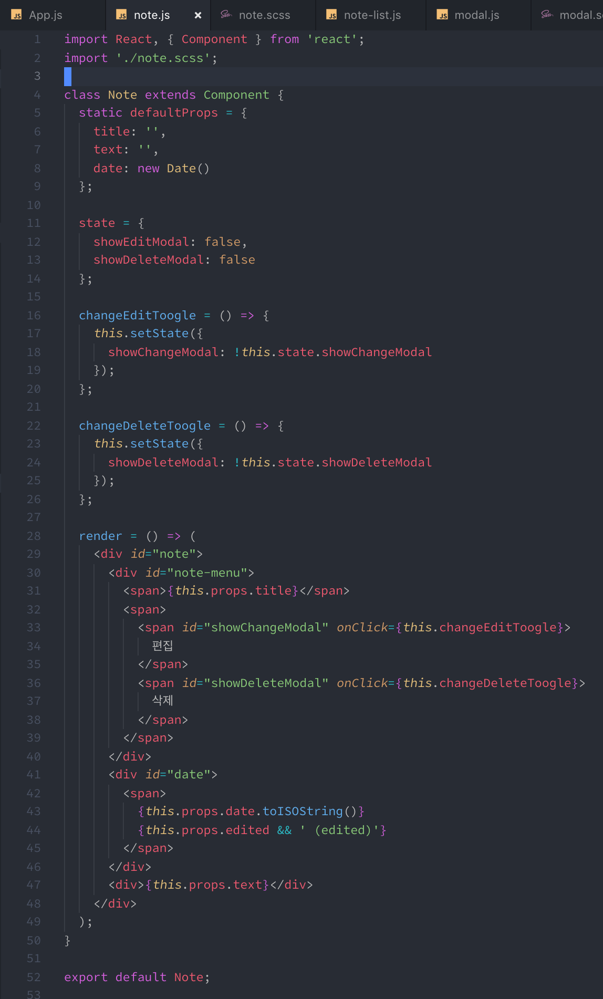

defaultProps를 통해서 타이틀과 텍스트, 날짜가 props로 담겨 오지 않았을 때의 에러 처리를 해 주고, 각각의 노트는 변경을 하고 삭제를 할 수 있어야 하겠죠? 그래서 수정 모드와 삭제 모드를 껏다 켰다 할 수 있는 state를 생성하고 그것을 변경할 수 있는 메소드를 생성해 주었습니다. 나머지 렌더링 부분은 그저 노트를 꾸미는 JSX 이구요.

css 파일도 생성해서 넣어 주세요.

```css
#note {
  height: 250px;
  flex-basis: calc(33% - 2rem);
  margin: 0.5rem;
  padding: 0.5rem;
  border: 1px solid skyblue;
  border-radius: 0.5rem;
  box-shadow: 0 10px 6px -6px #777;
  background-color: #dfe7f2;
  
  span {
    font-size: 1rem;
    margin-bottom: 0.5rem;
    }

  #note-menu {
    display: flex;
    justify-content: space-between;

    > span:nth-last-child(1) {
      > span {
        margin-right: 0.25rem;
        margin-left: 0.25rem;
        transition: 0.25s;
        cursor: pointer;
      }

      > span:nth-child(1) {
        &:hover {
          color: green;
        }
      }

      > span:nth-child(2) {
        &:hover {
          color: red;
        }
      }
    }
  }
  
   #date {
    font-size: 1rem;
    margin-bottom: 0.5rem;
  }
}
```

자, 노트 하나의 컴포넌트를 완성했으니, 이제 아까 note-list에서 보내주던 div 말고 이 컴포넌트로 대체를 해야 합니다.

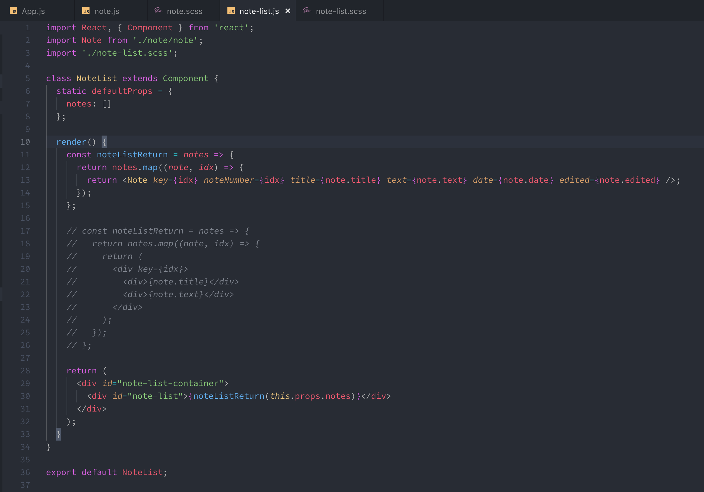

여기까지 잘 따라오셨다면, 이런 모습을 볼 수 있습니다.

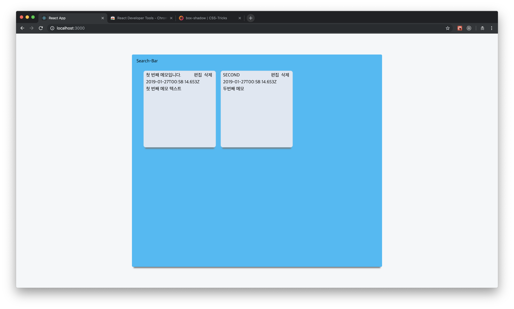

이제 좀 노트같이 보이는 카드 두개가 있네요. 이제 노트 리스트를 봤으니, 노트를 제작해 보는 것을 한 번 해보도록 하겠습니다.

### 노트 생성 컴포넌트 만들기

노트 생성 버튼은 저 헤더위치가 적당할 것 같네요. 그러면, 일단 `id="search-bar"` 인 App.js의 부분을 변경해 보도록 하겠습니다. 저는 이 컴포넌트를 styled-components로 제작하겠습니다. 

```javascript
const SearchBar = styled.div`
  display: flex;
  justify-content: space-between;
  padding: 0.5rem;

  div > span {
    font-size: 2rem;
    font-weight: bold;
  }

  div > button {
    font-size: 1.2rem;
    border-radius: 0.5rem;
    border: 1px solid transparent;
    outline: none;
    padding: 0.5rem;
    transition: 0.25s;
    color: #28bbf7;
    background-color: white;
    cursor: pointer;
    &:hover {
      background-color: #28bbf7;
      color: white;
    }
  }
`;
```

이 styled-component를 App.js의 부분에 넣어 주세요. 이미 만들어져 있는 변수들 밑에 넣는 방식으로 넣으면 간편하겠죠?

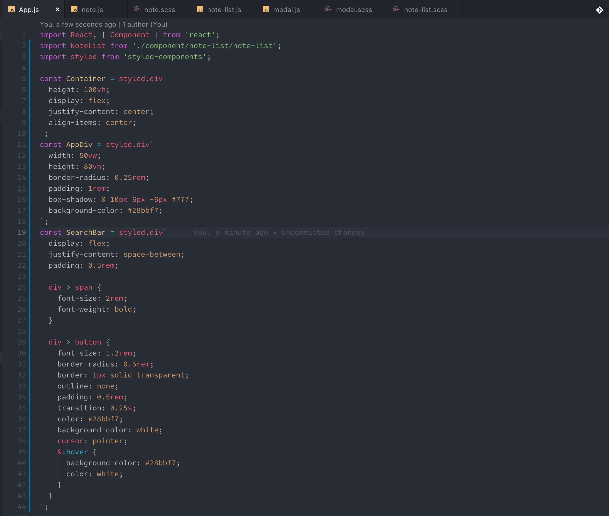

이제, 이 만들어진 styled-component를 이용해 JSX 작업을 시작해 보겠습니다.

`id="search-bar"` 인 부분을 다음과 같이 변경해 주세요.

```markup
<SearchBar>
  <div>
    <span>노트 만들기</span>
  </div>
  <div>
    <button>노트 작성</button>
    <div id="search-bar" />
  </div>
</SearchBar>
```

여기까지 완료하고 나면, 예쁜 버튼을 볼 수 있게 됩니다.

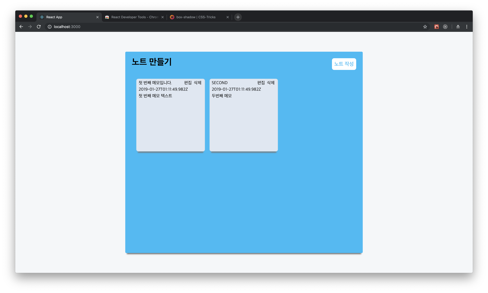

지금은 버튼을 눌러도 아무 반응이 없습니다. 버튼을 누르면 작은 모달이 나오도록 해 보겠습니다. 그러기 위해선 우선 모달 컴포넌트를 제작 해야겠죠? 모달은 삭제할 때나, 수정할 때나, 생성할 때나 공통으로 사용할 것이기 때문에 공통의 스타일을 가진 모달 컴포넌트에 내용만 바꾸어 넣는 방식을 이용해서 제작하도록 하겠습니다.

### 모든 작업을 위한 모달 컴포넌트 제작

modal폴더에 modal.scss를 만든 후, modal에 import 시켜 주세요. 다음과 같이 작성해 주세요.

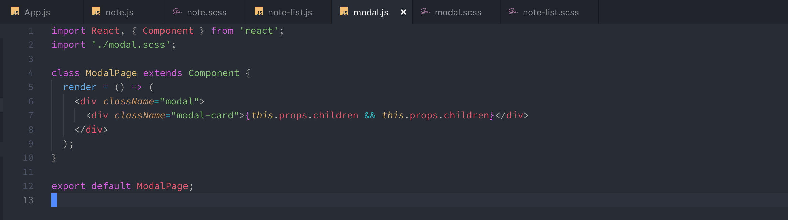

```css
.modal {
  position: fixed; /* Stay in place */
  z-index: 1; /* Sit on top */
  left: 0;
  top: 0;
  width: 100%; /* Full width */
  height: 100%; /* Full height */
  overflow: auto; /* Enable scroll if needed */
  background-color: #0000006e;

  .modal-card {
    background-color: white;
    border-radius: 0.5rem;
    position: static;

    @media screen and (max-width: 768px) {
      width: 300px; /* Could be more or less, depending on screen size */
    }

    @media screen and (min-width: 768px) and (max-width: 1119px) {
      width: 420px; /* Could be more or less, depending on screen size */
    }

    @media screen and (min-width: 1120px) {
      width: 420px; /* Could be more or less, depending on screen size */
    }

    margin: 15% auto; /* 15% from the top and centered */
    padding: 20px;

    .modal-header {
      display: flex;
      justify-content: space-between;
    }

    .modal-footer {
      display: flex;
      justify-content: flex-end;
    }

    > div {
      margin-top: 0.5rem;
      margin-bottom: 0.5rem;
    }

    > div:nth-child(1) {
      margin-top: 0.25rem;
      margin-bottom: 1.5rem;
    }

    > div:nth-last-child(1) {
      margin-top: 2rem;
      margin-bottom: 0.25rem;
    }
  }
}

```

모달에 생성 폼을 children props로 넣어주면, 모달 컴포넌트에서는 그대로 다시 props로 넘긴 컴포넌트를 렌더링 해 주는 방식입니다. 아직은 children에 대해서 감이 안 잡히시더라도 넘어가도 괜찮습니다. 한 번만 저 컴포넌트를 사용 해 보면 알게 될 테니까요.

이제 App.js에 있는 모달 작성 버튼을 누르면 모달이 나오도록 해 보겠습니다. 우선 메소드를 하나 만들어 주세요.

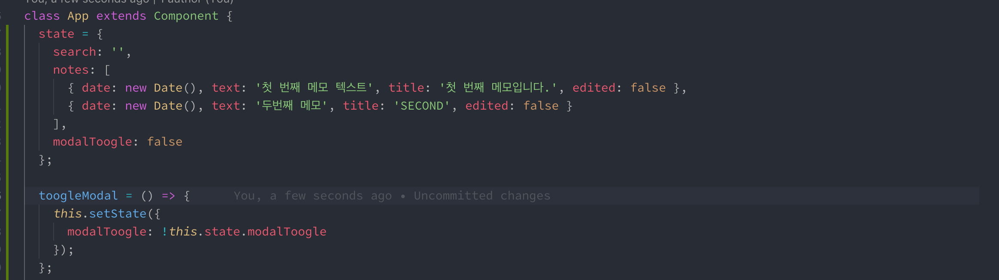

이제 JSX 부분에 있는 버튼에 onClick 이벤트를 붙여 주세요.

```markup
<button onClick={this.toogleModal}>노트 작성</button>
```

이 버튼을 누를 때 마다, modalToogle state는 false와 true를 옮겨 다니게 됩니다. 이제 이 상황에 맞추어서 JSX를 보여주었다 말았다 하는 모달이 필요하겠죠?

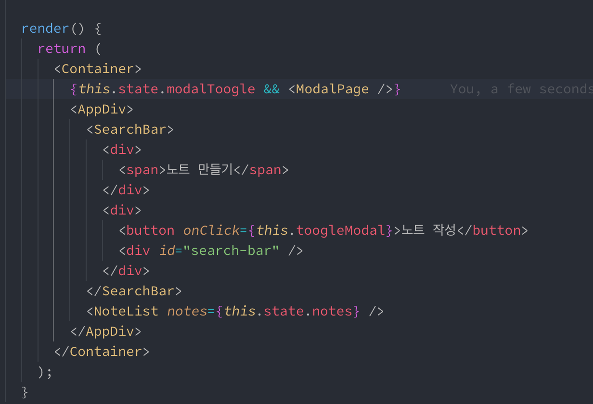

추가된 부분은 단 한줄 modalToogle이 true 일 때의 AND연산을 통해서 ModalPage를 보여주는 부분이 있습니다. 한 번 버튼을 눌러 보세요.


그 전에, 메소드 부터 만들어야 합니다. 노트 추가 메소드, 이건 굉장히 간단하게 만들 수 있습니다.

App.js 부분에 createNote라는 메소드를 만들고 다음과 같이 작성 해 주세요.

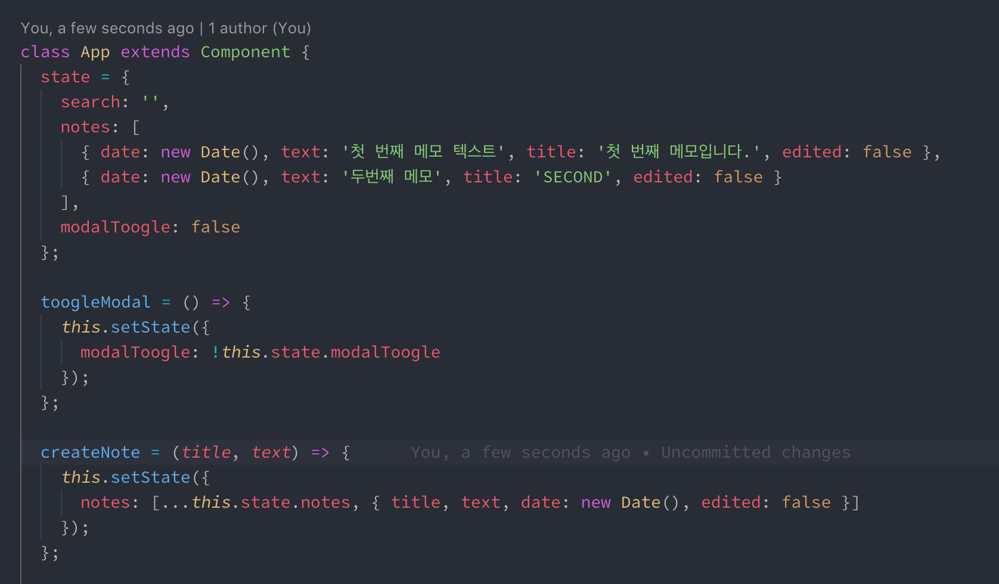

노트 하나를 제작 하는 데에는 타이틀과 텍스트만 필요하기 때문이에요, 날짜는 자동으로 생성된 시점으로 잡으면 됩니다.

이제 메소드도 만들었겠다. 남은건 note-raw 부분이네요, 수정과 생성에 사용할 부분이죠. 이 컴포넌트는 모달 안에 들어가게 되는 컴포넌트 입니다.

note-raw 부분을 만들어 보겠습니다. 이번 컴포넌트는 꽤 길어서 두 개의 사진을 참고하셔야 합니다.

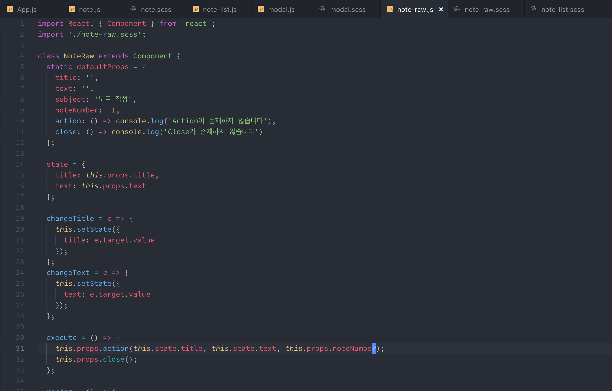

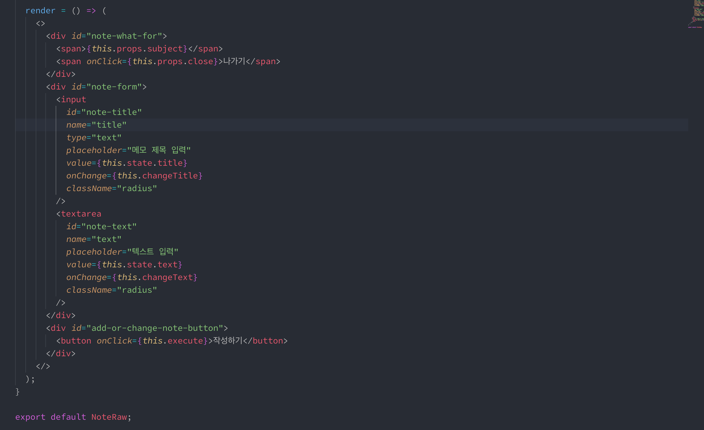

```css
#note-what-for {
  display: flex;
  justify-content: space-between;
  align-items: center;

  font-size: 1.5rem;
  font-weight: normal;

  > span:nth-last-child(1) {
    font-size: 1rem;
    cursor: pointer;
    transition: 0.25s;

    &:hover {
      color: red;
    }
  }
}

#note-form {
  display: flex;
  flex-direction: column;

  #note-title {
    margin-bottom: 1rem;
    border: 1px solid #c2c2c2;
    padding: 0.5rem;
    outline: none;

    font-size: 1.2rem;
    font-weight: 300;
  }

  #note-text {
    border: 1px solid #c2c2c2;
    padding: 0.5rem;
    resize: vertical;
    outline: none;

    font-size: 1rem;
    font-weight: 500;
  }
}

#add-or-change-note-button {
  display: flex;
  justify-content: flex-end;

  > button {
    border: 1px solid black;
    border-radius: 0.5rem;
    padding: 0.5rem;
    color: black;
    outline: none;
    cursor: pointer;
    font-size: 1rem;
    transition: 0.25s;
  }
}
```

이 긴 컴포넌트를 힘들게 작성하는 이유는, 이 컴포넌트는 나중에 수정을 할 때에도 같이 사용할 예정이기 때문입니다.

App.js에 있는 Modal JSX 부분을 다음과 같이 바꾸어 주세요.

```javascript
 {this.state.modalToogle && (
     <ModalPage>
         <NoteRaw />
     </ModalPage>
)}
```

이 상태로 실행을 해 보면 드디어 기다리고 기다리던 노트 생성 장면이 나오게 됩니다.

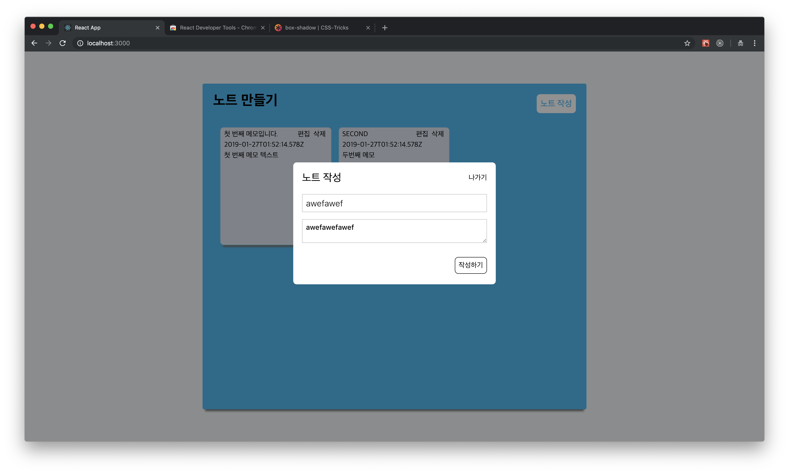

그런데 지금 상태에서는 close나 action과 같은 props 함수들을 넣어주지 않았기 때문에 생성할 수는 없고, 액션 props를 넣어주어야 합니다.

```javascript
static defaultProps = {
    title: '',
    text: '',
    subject: '노트 작성',
    key: -1,
    action: () => console.log('Action이 존재하지 않습니다'),
    close: () => console.log('Close가 존재하지 않습니다')
};
```

지금 현재 raw 컴포넌트에서 사용되는 props는 다음과 같은데, key, title, text는 생성할 때 필요한 것이 아닌 수정할 때 필요한 요소입니다. 그래서 생성을 할 때는 action과 close만 신경을 써 주면 됩니다. action에는 App.js에서 만들어 두었던 모달 생성 메소드를 넣으면 될 것이구요. close는 생성 모달을 true : false 값을 바꾸어 주던 메소드를 넣으면 될 것 같습니다. JSX부분에 메소드를 넣어 작성해 주세요.

```markup
 <NoteRaw action={this.createNote} close={this.toogleModal} />
```

이제 모달을 작성하실 수 있습니다...!

### 노트 편집과 삭제 컴포넌트 만들기 \(1\)

편집과 삭제 부분도 같습니다. Modal 이라는 공통 컴포넌트 안에 보여줄 부분의 컴포넌트를 작성하면 됩니다.

먼저 삭제와 변경도 같습니다. 모든 state는 App.js를 통해서 관리되고 있기 때문에 삭제와 변경 메소드 모두 App.js 컴포넌트 안에서 만들어 져야 합니다.

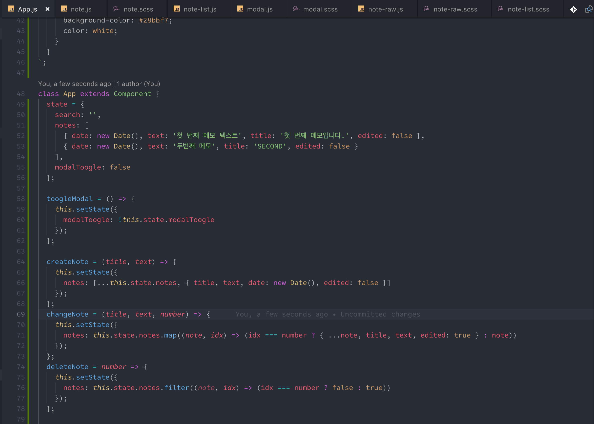

변경과 삭제는, 원래 state에 있는 것을 변경하기 때문에, 몇 번째의 노트인지가 필요하므로, number 라는 것을 받습니다. 우리가 note-raw에서 만들어 두었던 noteNumber가 바로 두 메소드에서의 number 가 되는 것 입니다.

우선 이 만들어진 메소드들을, note-list -&gt; note에서 편집 삭제 버튼을 누를 때 모달과 함께 실행되어야 하기 때문에, 이 메소드를 전달 하도록 하겠습니다.

```markup
<!-- 기존 -->
<NoteList 
    notes={this.state.notes} 
/>
<!-- 변경 -->
<NoteList 
    notes={this.state.notes} 
    changeNote={this.changeNote} 
    deleteNote={this.deleteNote} 
/>
```

그리고, NoteList 컴포넌트에서는 다시 전달받은 이 두개의 props를 note로 전달해 주어야 합니다.

```javascript
const noteListReturn = notes => {
      return notes.map((note, idx) => {
        return (
          <Note
            key={idx}
            noteNumber={idx}
            title={note.title}
            text={note.text}
            date={note.date}
            edited={note.edited}
            changeNote={this.props.changeNote}
            deleteNote={this.props.deleteNote}
          />
        );
      });
    };
```

changeNote와 deleteNote를 추가 했습니다.

### 노트 편집과 삭제 컴포넌트 만들기 \(2\)

전달해 준 이 메소드를 모달과 함께 보여주어야 합니다.

우리는 Note 메소드를 제작했을 때, edit토글과 delete토글을 제작했었죠? 그리고 이 메소드들이 실행됨에 따라서 edit과 delete state를 변화시켜 주었습니다. 이 메소드를 그대로 전달해 주겠습니다 .

Note 컴포넌트의 render 부분을 다음과 같이 변경해 주세요.

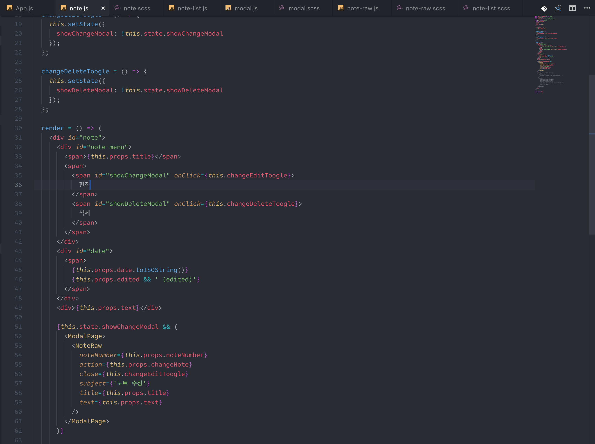


