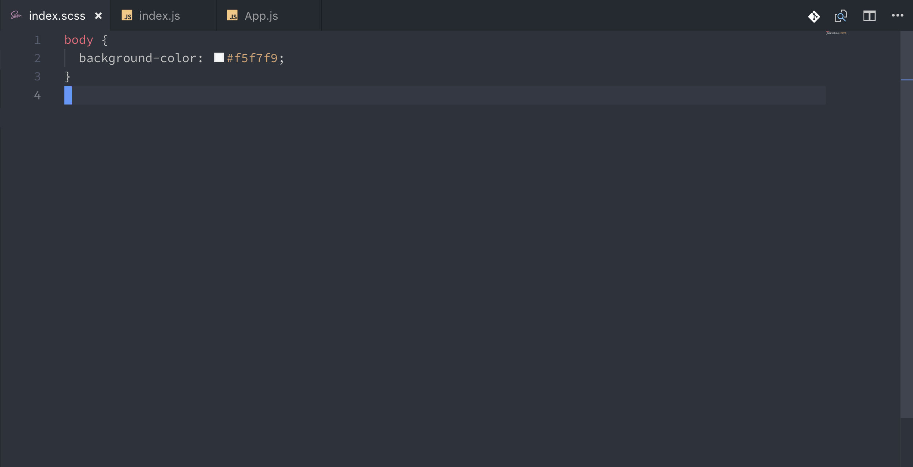

# 2강 - scss note

### 노트 만들기

우리는 이번 시간에 SCSS를 리액트에서 어떻게 사용하는지 간단히 실습하고, 간단한 미니 프로젝트를 진행해보려 합니다.

### 준비

create-react-app을 통해서 프로젝트를 한 개 생성해 주세요. 이번 시간에 우리는 새로운 리액트 라이브러리를 사용해 볼 것 입니다.

create-react-app이 전부 설치되었으면, 이제 프로젝트 폴더로 들어가 주세요. 여기서 다른 모듈을 또 설치해볼 것 입니다. 일단, node-sass를 npm 을 통해서 설치해 주세요.

`npm i node-sass 아니면 yarn add node-sass` 

`npm i styled-components 아니면 yarn add styled-components`

설치가 전부 완료되었다면 이제 프로젝트를 시작해 볼 준비가 되었네요. 우선 프로젝트를 깔끔하게 만들어 주겠습니다. 처음 Create-react-app을 만들고 우리가 사용하지 않는 파일을 지워준 것 처럼 프로젝트 구조를 깔끔하게 만들어 주세요.


### 만들 기능들

노트 검색, 노트 추가, 노트 편집, 노트 삭제를 만들어 보겠습니다. 기능 제작 순서는 노트 리스트 보여주기 -&gt; 노트 추가 -&gt; 노트 편집 -&gt; 노트 삭제 -&gt; 노트 검색 순서입니다.

### 컴포넌트 생성하기

우리가 만들 기능들에 대한 컴포넌트를 미리 생성해 주도록 하겠습니다. 


delete는 노트 삭제 클릭 시 정말 삭제하시겠습니까 ? 와 같은 메시지를 띄워주는 창 입니다. delete는 단독으로 동작할 수 없고, modal 에 담긴 형태로 작동해야 비로소 완전하게 됩니다. modal 그저 modal 효과를 내 주는 컴포넌트 입니다. note-list는 노트들의 리스트를 보여주는 컴포넌트 이고, 그 안에 노트 하나하나가 note입니다. note-raw는 편집이나 새로 노트를 작성할 때 볼 수 있는 화면이고, 이 화면도 모달을 통해서 작성할 것 입니다. search-bar는 검색 기능 구현을 위한 컴포넌트 이구요. 이제 대략적인 기능 설명이 끝났으니, 한번 앱을 만들어 볼까요?

### 기본적인 스타일링

프로젝트 시작 전에 모듈을 두개 설치했었죠? node-sass와 styled-components, 이 두개의 모듈은 각각 프로그래머에게 css작성할 때 많은 도움을 줍니다. node-sass는 말 그대로 리액트에서 scss, sass를 사용할 수 있게 해 주는 역할을 합니다. styled-components는 javascript안에서 css를 작성하는 기법을 훨씬 수월하게 할 수 있게 해주는 역할을 합니다.

우선 scss가 잘 작동하는지 먼저 볼까요? index.css를 scss로 변경한 후에 한번 스타일링 코드를 넣어 보겠습니다.



배경화면만 간단하게 변경해 주었습니다. 최근 create-react-app에서는 sass 컴파일러인 node-sass만 설치해 주어도 scss주입이 아주 간단하게 끝납니다.

이제 배경화면을 설정해 주었으니, App.js로 가서 우리가 만들 노트 앱의 전체적인 스타일을 잡아주겠습니다.

App.js의 jsx를 변경해 주세요.

```text
<div>
  <div id="app">
    <div id="search-bar">Search-Bar</div>
    <div id="note-list">Note-List</div>
  </div>
</div>
```

원래라면 css 파일을 만들어서 스타일링을 하겠지만, 우리는 CSS-IN-JS를 사용해 보겠습니다. 먼저 App.js의 상단에 우리가 설치했던 styled-components를 import 해 주세요.


이제, [styled-components](https://www.styled-components.com/)를 이용한 태그를 만들어 보도록 하겠습니다. 우선 App.js의 윗부분에 저 코드를 작성해 주세요.


지금 저 구문은 styled-components의 문법입니다. styled를 default로 import 한 후, 뒤에 태그 이름을 넣으면 문자열의 스타일이 기본적으로 담긴 태그가 생성이 됩니다. 한번 적용해 보겠습니다.


이 모듈을 사용해서 스타일링을 하게 되면 일단 빠르게 스타일을 작성할 수 있습니다. 만약 퍼블리셔가 팀 내에 있는 상황이라면 이 모듈을 사용하는 것을 피해야 하겠지만, 스타일을 직접 작성해야 할 경우에는 좋은 선택지가 될 수 있습니다.

### 노트 리스트 컴포넌트 제작하기

이제 기본 틀을 만들어 보았으니, 노트 리스트를 만들고 노트를 보여주는 것을 해 보도록 하겠습니다.

우선, 거의 모든 state는 App.js에서 작성하도록 하겠습니다. state는 부모로 넘겨줄 수 없고 아래 자식 컴포넌트로만 줄 수 있기 때문에, 최상단인 App.js에서 작성해야만 데이터를 공유할 수 있습니다. _\(리덕스나 Context-API등을 사용하면 이 문제를 해결 할 수 있습니다.\)_


Search 는 검색할 때의 용도로 사용되는 state 입니다. notes는 노트 리스트 입니다. 배열 객체의 형태를 지니고 있고, 하나의 객체는 하나의 노트. date는 생성되거나 수정된 날짜, text는 내용, title은 제목, edited는 글이 편집되었을 때 \(수정됨\) 과 같은 메시지를 표현하기 위해서 만든 state 입니다.

지금은 기본으로 노트 리스트를 보여주기 위해서 더미 데이터를 생성한 것 뿐이고, 나중에 이 데이터들은 지우고 우리가 직접 노트를 생성할 수 있는 형태로 변경할 것 입니다.

components폴더의 note-list 파일을 수정해 주세요 사진과 같이


이 파일에 scss 파일을 생성해 import 해준 후, 지정해 두었던 scss 내용도 넣어 주도록 하겠습니다.

```css
#note-list-container {
  height: 100%;
  overflow-y: auto;

  #note-list {
    display: flex;
    flex-wrap: wrap;
    padding: 1rem;
  }
}
```

그 다음에는 App.js에서 note-list 컴포넌트를 불러와 주어야 합니다. 그래야 노트 리스트를 볼 수 있습니다.


검색바는 아직 안만들었다고 쳤으니 상관없고, 노트 리스트가 이렇게 보이는 모습이 저에게는 별로 예뻐 보이지가 않네요. 그래서 제가 처음 컴포넌트를 생성했을 때, note-list와 note 컴포넌트를 제작한 것 입니다. note-list는 각각 note를 전부 관장하는 컴포넌트이고, 각각의 노트들은 note에 의해 관리가 될 수 있도록 구조를 변경해 보겠습니다.

### 노트 컴포넌트 제작하기

note-list안에 있는 note 컴포넌트를 변경해 주세요.


