# 영화 소개 프로젝트: SCSS, Styled-component

### 예시


### 배경화면과 헤더를 꾸며 봅시다.

styled-components를 이용해 볼 것입니다. 우선 기존에 진행하고 있던 영화 프로젝트에 styled-components 모듈을 설치해 주세요.

`yarn add styled-components`

`npm install styled-components`

또한 이번에는 다른 컴포넌트에는 scss를 사용해서 진행할 것이기 때문에 node-sass도 같이 설치를 해 주도록 하겠습니다.

`yarn add node-sass`

`npm install node-sass`

설치가 완료되셨다면, 프로젝트 폴더를 열어 주세요.

### 기본적인 스타일 주입: Reset css

전체 CSS의 기본 스타일세팅을 리셋해주는 CSS를 사용하겠습니다.



여기에 있는 CSS를 복사해 App.css안에 넣어 주세요.

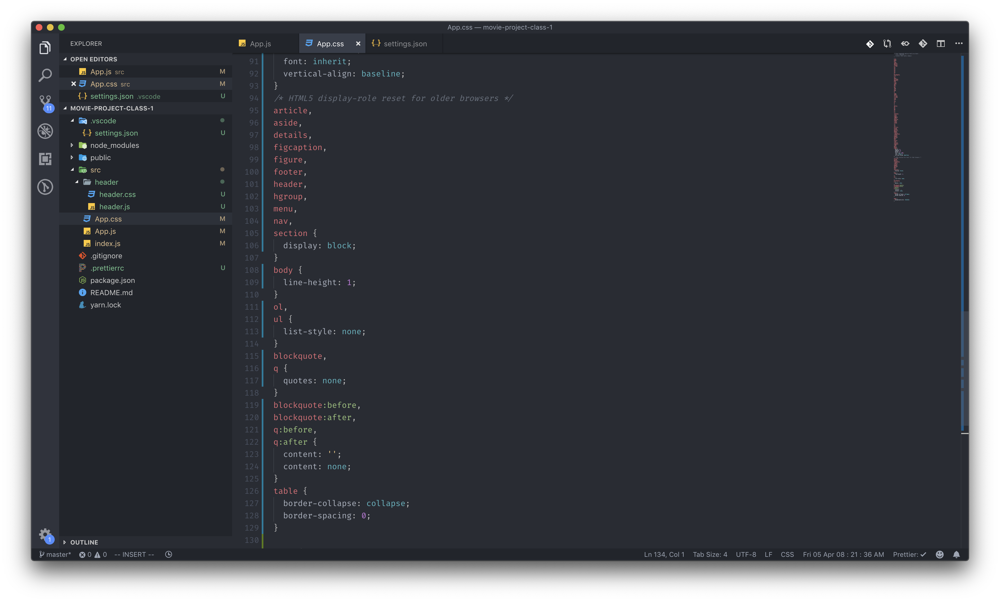

이번 프로젝트에서 사용할 폰트도 같이 넣어주도록 하겠습니다. noto sans kr을 사용하겠습니다.

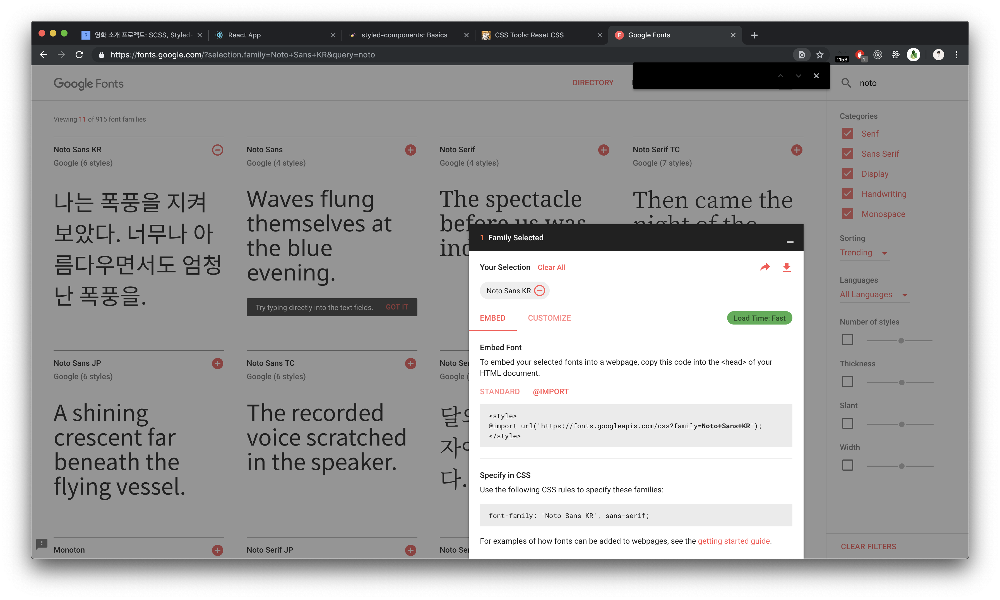

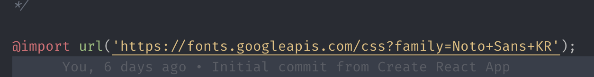

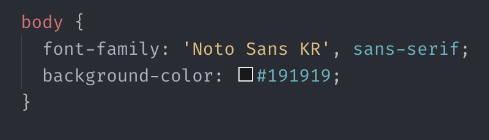

###  Background color 설정

Reset css를 추가한 App.css에 원하는 색깔의 background를 설정해 주세요.

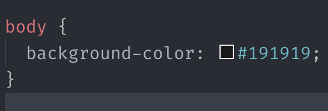

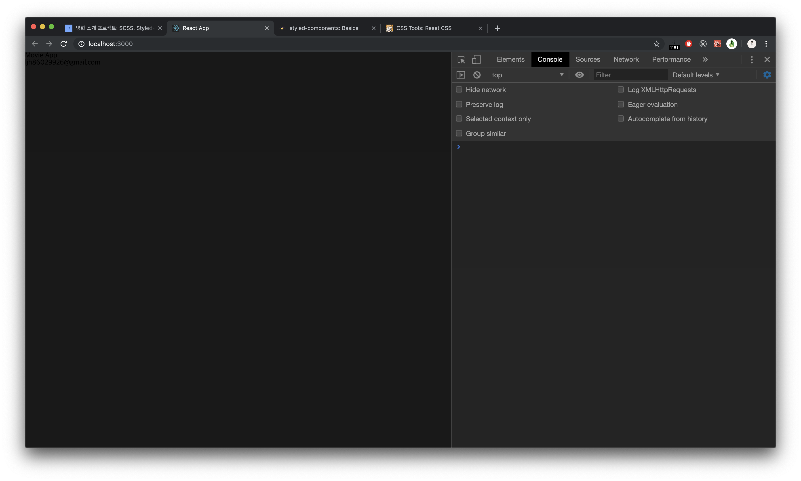

### Header 컴포넌트를 꾸며봅시다.

일전에 스타일 없이 작성해둔 Header 컴포넌트에 스타일을 주입해 보도록 하겠습니다. 이 부분은 스타일 작성을 많이 할 필요가 없는 부분이기 때문에, styled-components를 이용해서 간단하게 작업을 진행해 보도록 하겠습니다. 

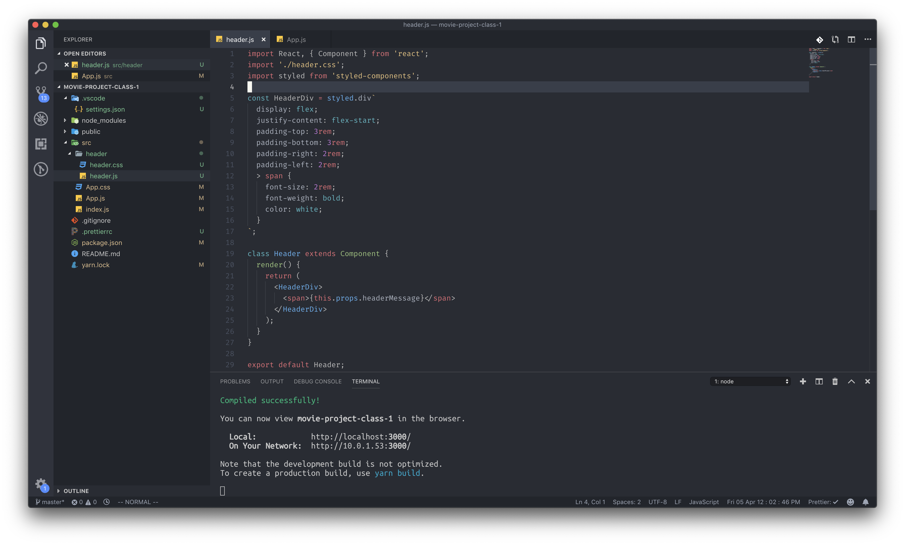



```javascript
const HeaderDiv = styled.div`
  display: flex;
  justify-content: flex-start;
  padding-top: 3rem;
  padding-bottom: 3rem;
  padding-right: 2rem;
  padding-left: 2rem;

  > span {
    font-size: 5rem;
    font-weight: bold;
    color: #7f7f7f;
    transition: 0.25s;
    cursor: pointer;

    &:hover {
      color: white;
    }
  }
`;

```



_지금 현재 제가 사용하고 있는 에디터는 VScode인데요, 백틱 문자열에 담긴 CSS코드를 하이라이팅 시키기 위해서_ [_특정_ ](https://marketplace.visualstudio.com/items?itemName=jpoissonnier.vscode-styled-components)_모듈을 사용하고 있습니다._

스타일링이 끝나고 나면 제 경우에는 검은색 화면에 'Movie App' 글자가 하나 떠 있는 화면을 보실 수 있습니다.

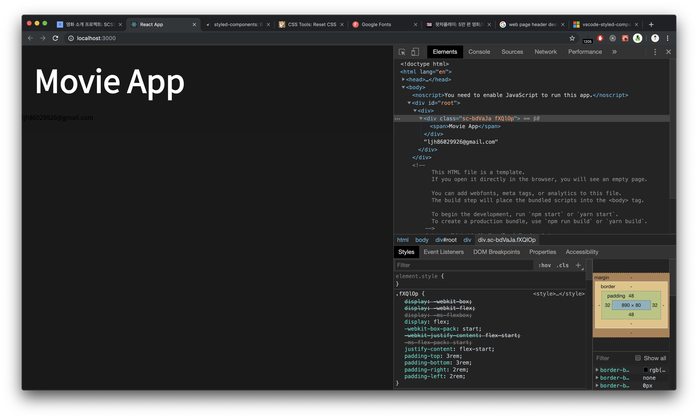

### 영화 리스트 뷰를 보기 위한 영화 데이터 주입

영화 리스트를 만들기 위해서는 우선 영화에 대한 포스터 사진, 영화 관객, 평점, 소개 글 같은 데이터들을 가지고 있어야 하겠죠? 그 데이터를 받아오는 작업을 진행해 보도록 하겠습니다. 현재 데이터는 제 개인 깃허브 레포를 통해서 제공하고 있습니다.



레포에 접속을 하게 되면 Movie app이 하나 나오는데, 그 부분에 있는 images와 data.json을 받아와 주시면 됩니다. 그리고 images 폴더 전체를 프로젝트 폴더의 public 에 넣어주세요. data.json은 src 폴더 안에 넣어주시면 됩니다.

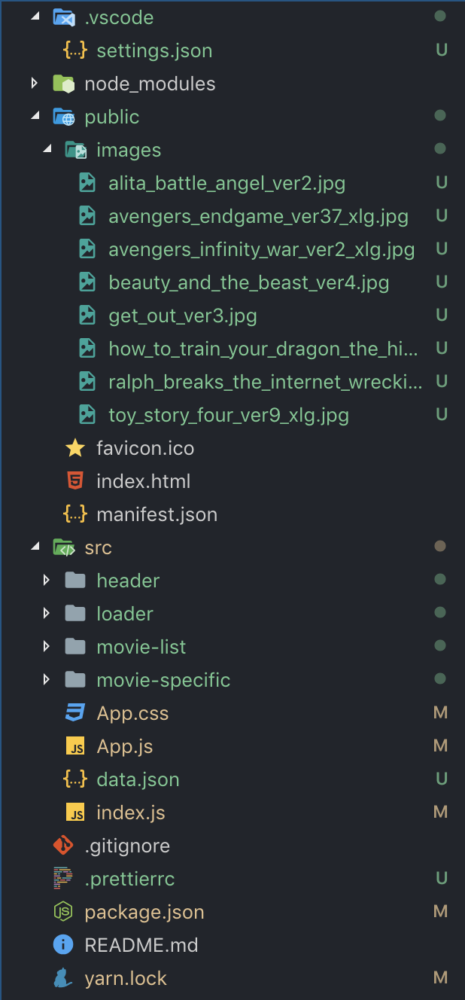

이미지를 public 폴더에 넣는 이유는, 나중에 img 태그를 통해서 이미지를 불러올 때 간단하게 불러올 수 있게 하기 위함입니다. data.json은 state로 할당해주어야 하는 변수이기 때문에 src에 위치시켰습니다.

### 더미데이터 to state

App.js부분을 다음과 같이 변경해 주세요.

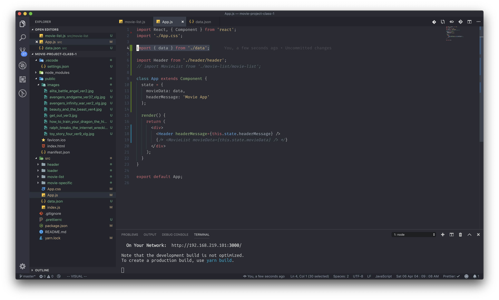

이제 모든 더미데이터의 세팅이 끝났습니다.

### 영화 소개 리스트 컴포넌트 제작하기

우선 컴포넌트를 하나 만들어야 합니다. src 폴더 안에 movie-list라는 폴더에 컴포넌트를 하나 생성해 주세요.

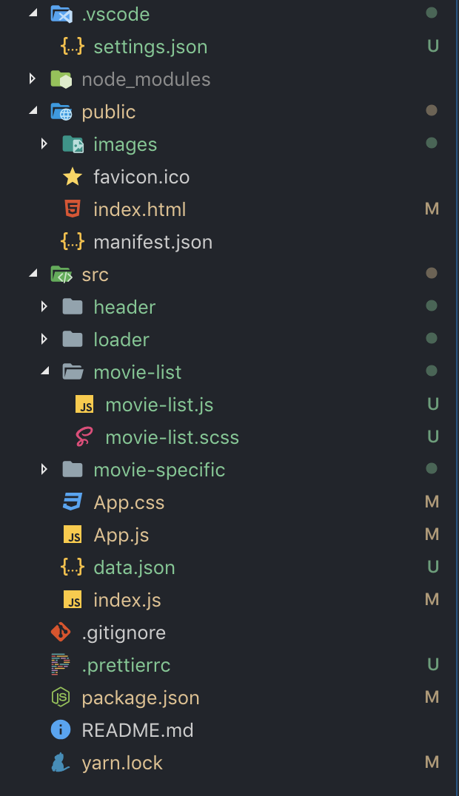

그 후, 이 컴포넌트의 기본 클래스 형태를 만든 후에, App.js에 렌더링을 시켜주도록 하겠습니다.


이제 한번 본격적으로 우리의 앱을 만들어 볼 시간입니다.

movie-list 컴포넌트에 들어가 주세요. 우선 여기서도 styled-components를 사용하겠습니다. 그러나 우리는 리액트를 하러 온거지 CSS를 하러 온 것이 아니니, CSS컴포넌트는 복사 붙여넣기를 통해 진행해 주세요.



```javascript
const StyledDiv = styled.div`
  display: flex;
  flex-direction: column;
  background-image: ${props =>
    props.backgroundImage
      ? `linear-gradient(rgba(245, 245, 245, 0), rgba(245, 245, 245, 0)), url(${props.backgroundImage})`
      : ''};
  background-position: 50% 50%;
  background-size: cover;
  padding: 2rem;
  transition: 0.25s;
  &:hover {
    padding-top: 10rem;
    padding-bottom: 10rem;
    > div.sub-introduce {
      display: flex;
      flex-direction: column;
    }
    > div.like-button {
      display: flex;
      justify-content: center;
    }
  }

  > span.title {
    font-size: 3.5rem;
    color: #61dafb;
    margin-bottom: 2rem;
    cursor: pointer;
  }
  > div.genre {
    display: flex;
    margin-bottom: 1rem;

    > span {
      margin-right: 1rem;
      font-size: 1rem;
      color: #f5f5f5;
    }
  }
  > span.sub {
    font-size: 2rem;
    color: #f5f5f5;
    margin-bottom: 1rem;
    cursor: pointer;
  }
  > div.sub-introduce {
    display: none;
    padding-top: 2rem;
    transition: 0.25s;

    > span {
      color: white;
      line-height: 1.5;
      font-size: 1.5rem;
      font-weight: bold;
      font-style: normal;
      font-stretch: normal;
      line-height: normal;
    }
  }
  > div.like-button {
    display: none;
    padding-top: 4rem;

    > span {
      width: 100px;
      height: 100px;
      cursor: pointer;
      background-image: ${props =>
        props.likeImage
          ? `linear-gradient(rgba(245, 245, 245, 0), rgba(245, 245, 245, 0)), url(${props.likeImage})`
          : ''};
      background-position: 50% 50%;
      background-size: cover;
    }
  }
`;
```



또, 이번 컴포넌트는 외부 라이브러리 두 개를 사용해 볼 계획입니다. [dom-confetti](https://www.npmjs.com/package/dom-confetti)와 [numeral](http://numeraljs.com/)이라는 라이브러리도 같이 설치해 주세요!

### 많아보이는 코드이지만, 반복의 연속입니다.

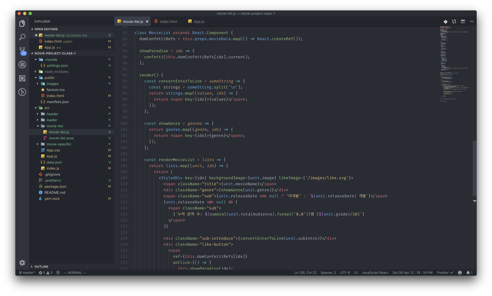

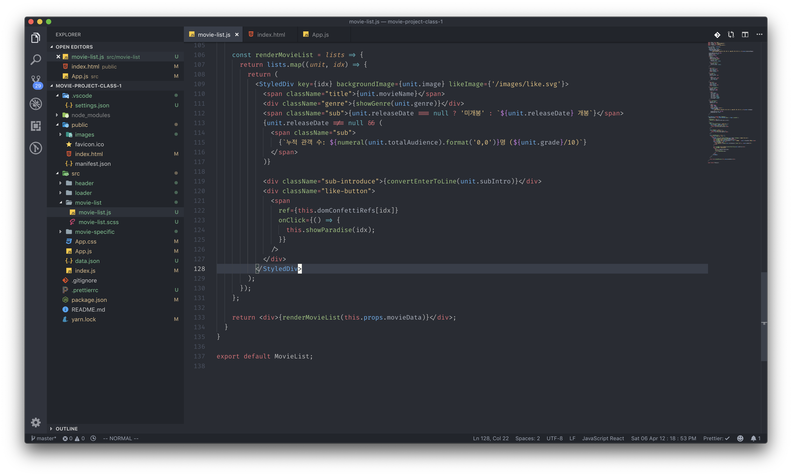

### Map 함수를 이용해서 배열을 렌더링 할 때는, key를 붙여 주어야 합니다.

map 함수를 이용해서 여러 개의 배열 리스트를 렌더링 할 때에는, 리액트에서 정해준 규칙이 있는데 그것은 바로 key 값을 붙이라는 겁니다. 붙이지 않아도 작동은 하지만, 개발자 도구에서 에러를 보게 됩니다.

계속 이상한 map 함수가 나와서 당황하셨죠? 리액트에서 map 함수에 대한 부분은 정말 중요하니, 잠시 이[ 부분](../undefined/map.md)에서 짚고 넘어가도록 하겠습니다.

props로 받은 데이터 자체가 배열이기 때문에, 그 데이터를 렌더링 해 주기 위해선 각각의 배열 요소를 렌더링 해 주어야 합니다. 이럴때 for문을 사용하는 것이 아닌, map을 사용하게 되면 편하게 렌더링을 수행해 줄 수 있습니다. map이 좋은 점은, map함수를 실행하게 되면 어쨋든 배열 형태로 데이터를 받게 되는데, 리액트가 그 데이터를 풀어서 요소를 렌더링 해 줍니다. map함수를 실행하고 join을 걸어야 하는 것이 아니고, 제대로 된 JSX구문만이 들어간 문자열을 넣으면 리액트가 알아서 렌더링을 진행해 줍니다.

### 리액트에서의 DOM 컨트롤, Ref로 하세요 !

사실 리액트에서는, querySelector를 통해서 DOM요소를 직접 가져오지 않습니다. 그렇다면 어떻게 DOM 요소를 가져와야 할까요? 그 답이 바로 Ref입니다. ref는 리액트에서 dom요소를 선택해 currentTarget, target과 같은 선택자를 특정해서 직접 우리가 DOM을 다룰 수 있게 해 줍니다. 

앞으로 우리가 할 작업은, 영화 리스트 마다 좋아요 버튼을 만들고, 버튼을 클릭하면 dom-confetti모듈을 이용해 효과를 불어넣어줄 작업을 할 것입니다. 그럴 때 필요한 것이 바로 ref입니다. dom-confetti 모듈은 DOM요소를 필요로 하기 때문이죠. 그런데 우리가 좋아요를 몇 개 만들어야 할까요? 영화 리스트는 8개이니 8개의 DOM을 잡아야 하는데, 우리는 이것을 구조화 해서 이미 하나의 map 함수로 코드를 작성을 해 놓았습니다. 요소마다 제각각 ID를 부여하는 것을 하지 못하게 되었다는 이야기 이고, 이럴 때에 element를 선택하는 것은 굉장히 부담스럽습니다. 이럴때 DOM을 컨트롤 하는 방법을 만들어 보겠습니다.

1. createRef

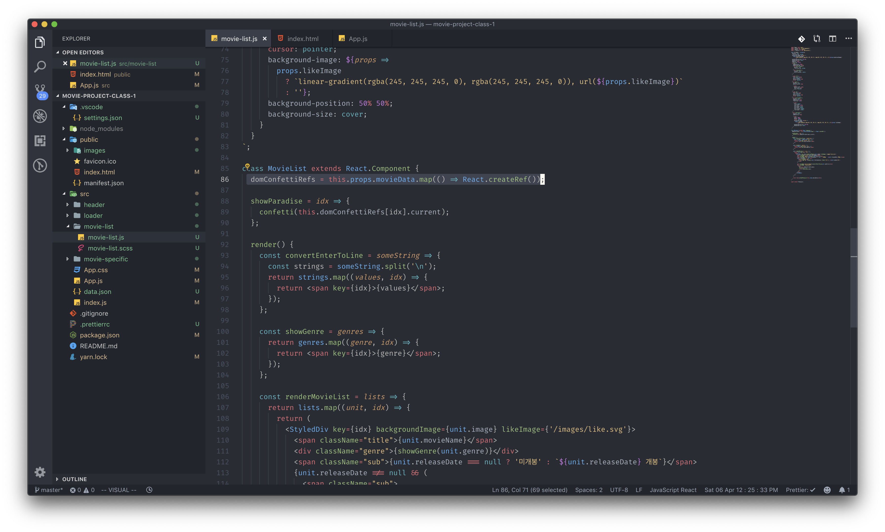

**Ref를 만들기 위해서는 반드시 createRef\(\)가 실행된 프로퍼티에만 담을 수 있습니다.**

2. ref를 연결하기

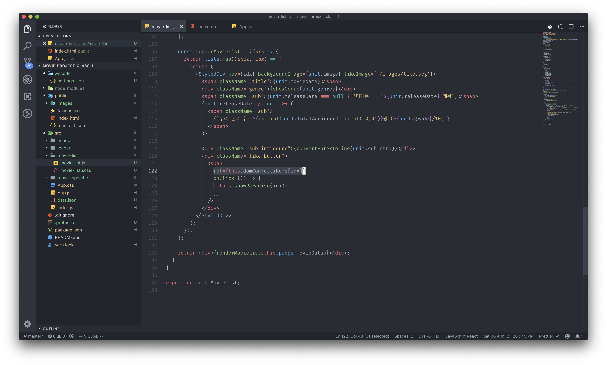

3. \(가지고 온 ref 요소\).current가 DOM 요소

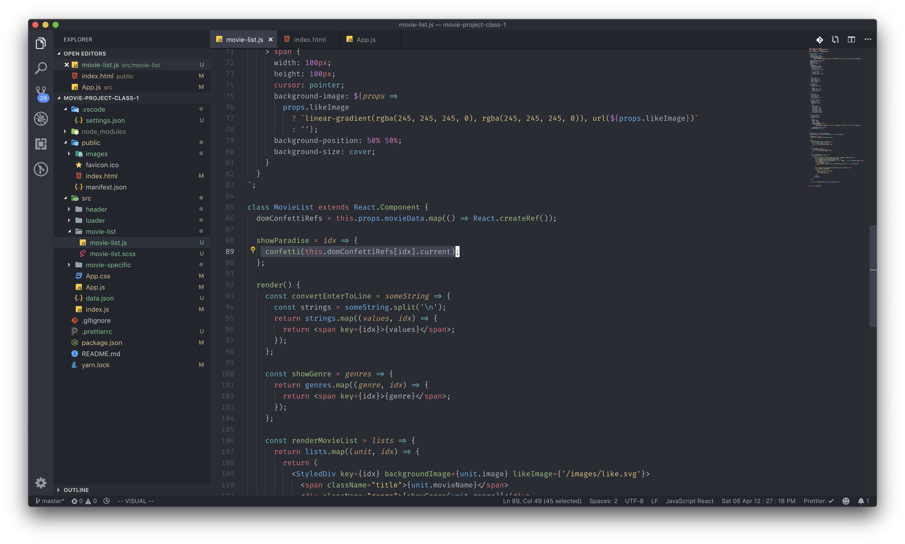

\*\*\*\*


