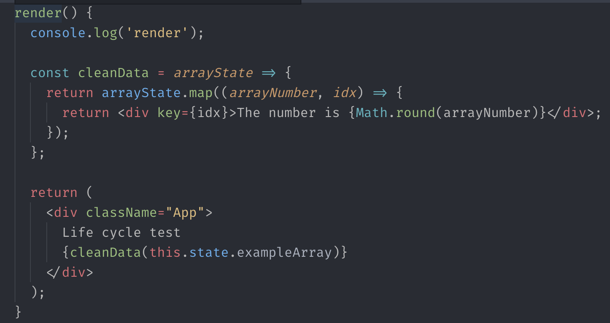

# render

### Render메소드에 대해서 이해해 봅시다.

이전 장에서, render 메소드는 작성한 JSX를 HTML로 변환해 실제 브라우저에 렌더링 하는 작업을 한다고 배웠습니다. 그렇다면, render메소드에서 우리가 할 수 있는 것들은 뭐가 있을까요? 크게 2가지가 있습니다.

### 첫 번째, JSX를 렌더링 하는것

이것은 어찌보면 당연한 이야기 일지도 모르겠습니다. render 메소드를 통해서 작성한 JSX들을 렌더링 합니다. 우리가 작성한 부분이 나타나게 되는 것이죠.

### 두 번째, setState를 하지 않고 데이터를 가공해 보여주는 것

앞으로 리액트 개발을 하면서 여러가지 많은 데이터를 다루게 될 수도 있는데, 그 데이터가 렌더링 해주기 좋은 형태로만 내려오지는 않을 것 입니다. \(ex API response\) 그럴 때마다 우리가 데이터를 다시 재조합 하여 관리를 해야 하는데, 데이터를 보기좋게 재조합 하는 과정을 render 메소드에서 수행할 수도 있습니다. 또는 state배열을 가지고 그 요소의 갯수만큼 특정 JSX부분을 반복해서 처리하는 것들을 하는데 render 메소드는 효과적일 수 있습니다. 한가지 예를 들어 드리겠습니다.

그러나 이 숫자를 전부 반올림된 형태로 보여줄 것입니다. setState를 하지 않고 render메소드에서 가공하는 것으로 해결할 수 있습니다. render 메소드는 생각보다 간편하게 제작이 가능합니다.

render 메소드를 자세히 보면, state에 있는 데이터를 가지고 마음껏 변경을 하는 모습을 보실 수 있습니다. 숫자 데이터를 직접 setState를 통해서 반올림을 하는 것이 아닌, render메소드에서 원래의 state를 다시 가공하여 보여주고 있습니다.

_map함수를 통해 배열을 리턴하는 부분은 여기를 보시면 이해할 수 있습니다_.

### Render 메소드 안에서 DOM 요소 컨트롤하기

render메소드는 JSX를 HTML로 변환해 브라우저에 붙이는 과정을 수행하기 때문에 당연히 DOM요소를 직접 getElementById같은 키워드로 가져와 데이터를 추가하거나 값을 변경하는 등의 행동은 불가능 합니다.

**불가능 합니다.** 시도하지 마세요. render 메소드 내에서 DOM요소를 컨트롤 할 수도 있을지도 모르나, 이는 안전한 작업이 아닙니다. 추후에 직접 DOM을 컨트롤 하기 좋은 메소드에서 자세히 알아보도록 할 것입니다.

