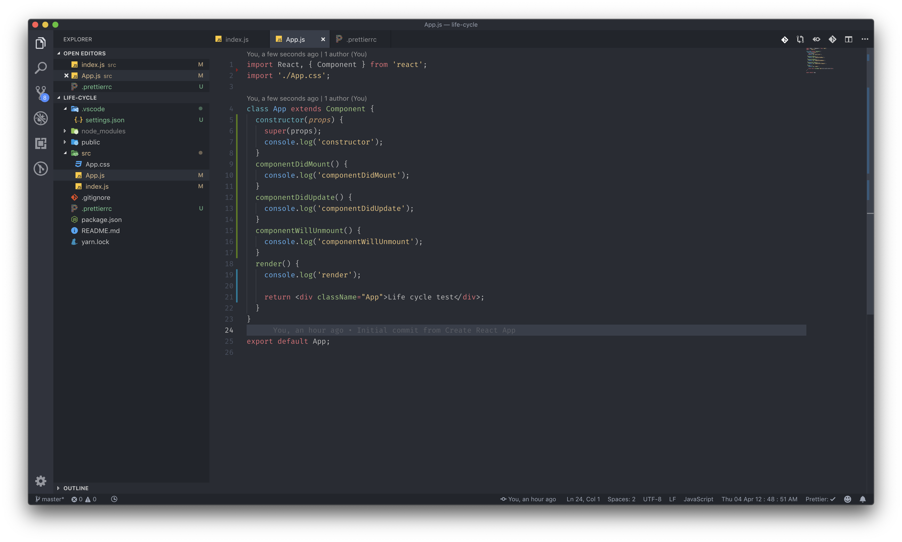
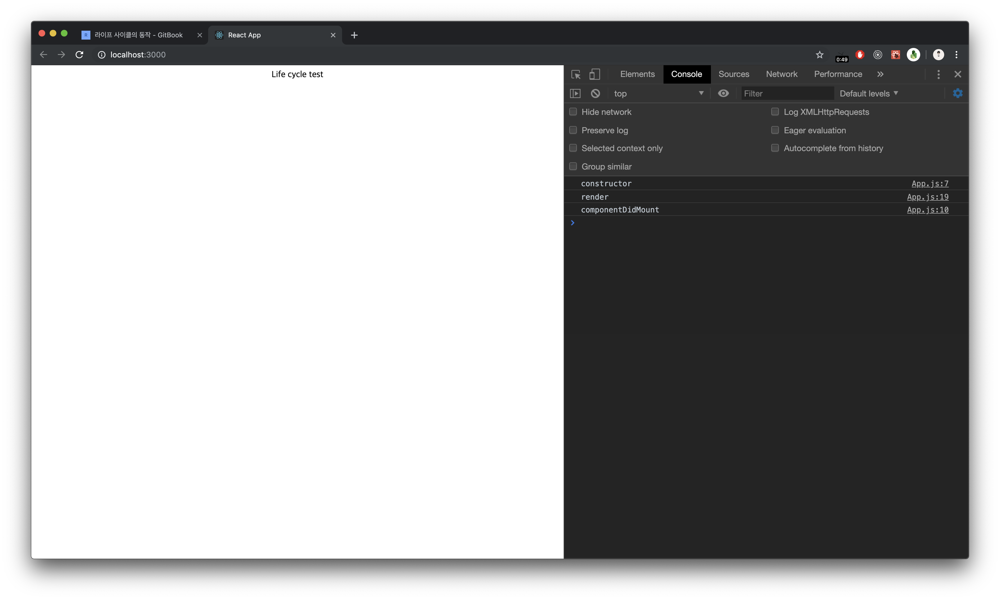
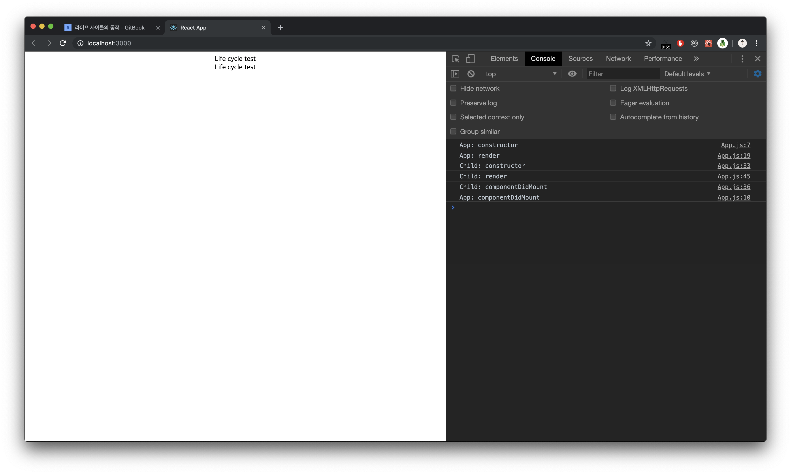
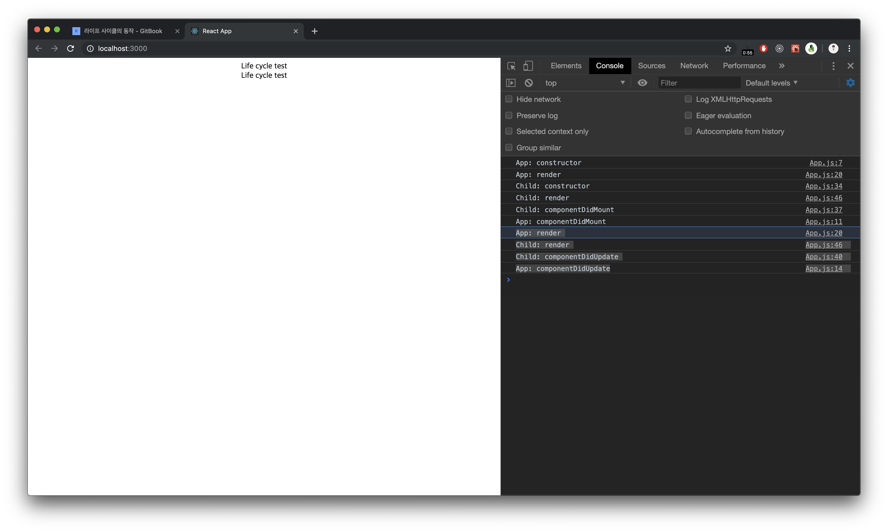

# 라이프 사이클의 동작

컴포넌트를 만들 때마다 각각의 컴포넌트의 라이프 사이클이 존재할 것입니다. 모두 제각각으로 동작합니다. 이번에는 부모 - 자식 컴포넌트를 생성한 후에, 부모의 라이프사이클이 먼저 실행되는지 자식의 라이프사이클이 먼저 실행되는지 알아보도록 하겠습니다. 

우선은, 하나의 컴포넌트에서의 라이프 사이클 동작에 대해서 알아보도록 하겠습니다.

### 한 개의 컴포넌트에서의 라이프 사이클 동작 순서 파악하기



결과는 어떻게 나왔을까요?



이번에는 컴포넌트가 업데이트 되었을 때의 순서를 보도록 하겠습니다.


간단합니다. state나 props의 값이 바뀐 후에는 다시 재 render 후 componentDidUpdate 메소드가 수행됩니다.

### 두 개의 컴포넌트, 두 개의 라이프사이클

App - App lifeCycle

* child Component - child liceCycle

이렇게 최상단 App 컴포넌트 안에 child컴포넌트를 넣고 두개의 라이프 사이클이 어떻게 동작하는지 보도록 하겠습니다.

예제 코드



```javascript
import React, { Component } from 'react';
import './App.css';

class App extends Component {
  constructor(props) {
    super(props);
    console.log('App: constructor');
  }
  componentDidMount() {
    console.log('App: componentDidMount');
  }
  componentDidUpdate() {
    console.log('App: componentDidUpdate');
  }
  componentWillUnmount() {
    console.log('App: componentWillUnmount');
  }
  render() {
    console.log('App: render');

    return (
      <div className="App">
        Life cycle test
        <Child />
      </div>
    );
  }
}

class Child extends Component {
  constructor(props) {
    super(props);
    console.log('Child: constructor');
  }
  componentDidMount() {
    console.log('Child: componentDidMount');
  }
  componentDidUpdate() {
    console.log('Child: componentDidUpdate');
  }
  componentWillUnmount() {
    console.log('Child: componentWillUnmount');
  }
  render() {
    console.log('Child: render');

    return <div className="App">Life cycle test</div>;
  }
}

export default App;

```



실행했을 때의 결과값은 어떻게 나올까요? 



컴포넌트 라이프사이클의 시작은 App이 가장 빠르지만, Child 컴포넌트의 로딩이 모두 끝나야 종료가 되는 것을 확인할 수 있습니다. 이것은 모든 컴포넌트에서 동일하게 적용되는 규칙입니다. 업데이트도 같은 방식으로 업데이트가 됩니다.



App 컴포넌트의 render가 시작된 이후에, child의 render + componentDidUpdate가 수행이 되고 나서야 모든 로딩이 끝났을 때의 App컴포넌트의 componentDidUpdate가 수행됩니다.

