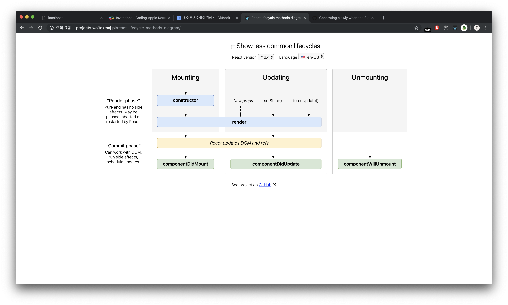

# 라이프 사이클이 뭔데?

### 컴포넌트의 생명주기, 말로만 들어선 뭔지 잘 모르는 주제입니다.

그저 컴포넌트를 만들기만 하면 되는거 아니야?

컴포넌트를 만들고, state나 props를 사용해서 데이터를 변경하는 것으로도 간단한 리액트 웹을 개발할 수 있습니다. 그러나 이는  props와 state의 개념만 알고 있으면 간단한 웹만을 만들 수 밖에 없다는 말이기도 합니다.

라이프사이클을 다루는 것은 컴포넌트가 생겨나고, 변화하고, 없어지는 일련의 프로세스를 프로그래머가 통제하는 것을 뜻합니다. 우리는 실제로 HTML을 작성한 것이 아니고 JSX를 작성했기 때문에, 이런 부분들을 알아야 합니다.

만약 라이프 사이클에 대한 개념이 없는 상태에서 document.getElementById 같은 키워드로 element를 선택하려고 한다면 선택이 되지 않을 수도 있습니다. 라이프사이클에 대한 이해가 되어 있지 않기 때문이죠. HTML이 실제로 브라우저에 나타나고 사라지는 타이밍을 알아야 이런 작업들을 수행해 더 복잡한 일을 수행할 수 있게 됩니다. 우리는 이번 장에서 라이프사이클에 대한 것들을 배워볼 것입니다.

이번 장을 이해하게 되면, 왜 그동안 render 메소드를 작성만 했는데도 리액트가 어떻게 브라우저에 HTML을 만들어 주었는지 알 수 있게 됩니다.

### 그래, 하지만 난 아직 이해가 안가

더욱 간단한 그림을 통해 알아보도록 합시다. 그림을 보기전에, 라이프사이클은 순차적으로 실행된다는 사실과 라이프사이클은 굉장히 효율적으로 업데이트 된다는 점 입니다. **처음 생성될 때, props나 state가 업데이트 되었을 때, 컴포넌트가 더이상 브라우저에 보여질 필요가 없을 때** 입니다.

원래는 저것보다 더 많은 양의 메소드가 있지만, 일단은 여기까지만 알아도 충분합니다. Mounting 부분부터 살펴보도록 하겠습니다.

### 컴포넌트가 로딩되기 시작하는 Mounting

#### constructor 클래스 생성자

이것은 어찌보면 당연합니다. 어떤 클래스를 만들더라도 생성자보다 더 빨리 샐행되는 로직은 없기 때문입니다. 하지만 지금의 리액트에서는 생성자를 건드릴 일이 거의 없어졌기 때문에 가볍게 넘어가도록 하겠습니다. 아직 클래스 인스턴스가 막 실행된 시점이기 때문에 이 시점에는 브라우저에서 우리가 작성한 JSX가 보이지 않습니다.

#### 실제 로딩이 이루어지는 render

constructor메소드가 실행된 이후에는 render 메소드가 실행됩니다. render메소드는 메소드 이름 자체로 어떤 일을 하는지 나타내고 있습니다. **이 메소드가 실행되면서 JSX가 HTML로 변환되어 우리가 보는 웹 브라우저에 나타나게 됩니다.** 그러나 한가지 명심해야 할 점은, render메소드는 컴포넌트가 로딩될 때에도 실행되지만 컴포넌트의 데이터 \(state, props\)가 업데이트 되었을 때에도 동작한다는 점 입니다. 그렇기 때문에, render 메소드에서 setState나 props를 변화시키는 메소드를 가능하면 수행하지 않는 것을 추천합니다. _\(잘못하면 무한루프가 일어나게 되겠죠?\)_

#### 처음 로딩이 끝난 뒤에 수행되는 componentDidMount

mounting의 마지막 부분입니다. render 메소드에 있는 모든 부분들이 브라우저에 나타나게 되었을 때만 실행되는 메소드 입니다. 컴포넌트의 데이터가 업데이트 되어도 이 메소드는 다시 수행되지 않습니다. 오직 초기 컴포넌트의 로딩 이후에 한번만 실행되는 라이프사이클 메소드 입니다. 이제 여기서 DOM을 직접 조작할 수 있게 됩니다. _\(하지만 리액트는 DOM조작을 직접 하지 않고도 많은 일을 할 수 있습니다.\)_ 

### 컴포넌트의 업데이트 Updating

리액트는 컴포넌트의 업데이트 감지를 오직 현재 컴포넌트에서 state나 props의 변경 유무로만 판단합니다.

#### state, props의 변경

위 그림에는 forceUpdate라고 해서 메소드가 하나 더 있는데요, 이는 강제로 재 렌더링을 하게 끔 도와주는 메소드 입니다. _\(하지만 코딩애플 강의에서는 다루지 않을게요.\)_ 만약 우리가 setState를 이용해서 state를 하나 업데이트 했다고 가정해 봅시다. 그러면 다음에는 어떤 메소드가 수행될까요?

#### 데이터가 변경이 되었으니 다시 render를 해야지 !

state의 변경이 일어났습니다. 리액트는 효율적으로 state의 변경사항을 감지해 다시 변경된 부분을 그려줍니다. 

#### 변경이 완료된 이후 수행되는 componentDidUpdate 

컴포넌트의 변경이 완료되었을 때에 수행되는 메소드 입니다. 이 메소드는 조금 복잡한 작업을 수행하기에 최적화 되어있는 메소드 인데요, render메소드가 실행되어 업데이트 된 state, props와 업데이트 되기 전인 state, props를 가지고 비교 작업을 가능하게 해 줍니다.

### 컴포넌트의 삭제 Unmounting

#### 컴포넌트에게 안녕을, componentWillUnmount

컴포넌트가 사라질 때에 수행되는 메소드 입니다. 여기서는 우리가 컴포넌트 내에 할당해 놓았던 여러가지 변수들을 해제시켜줄 수 있습니다. \(setInterval, eventListener 같은 것들\)

\_\_

\_\_

