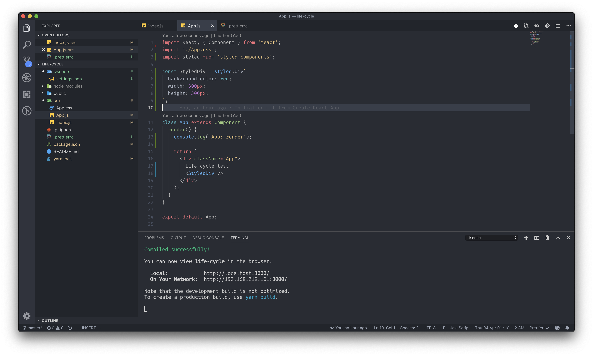
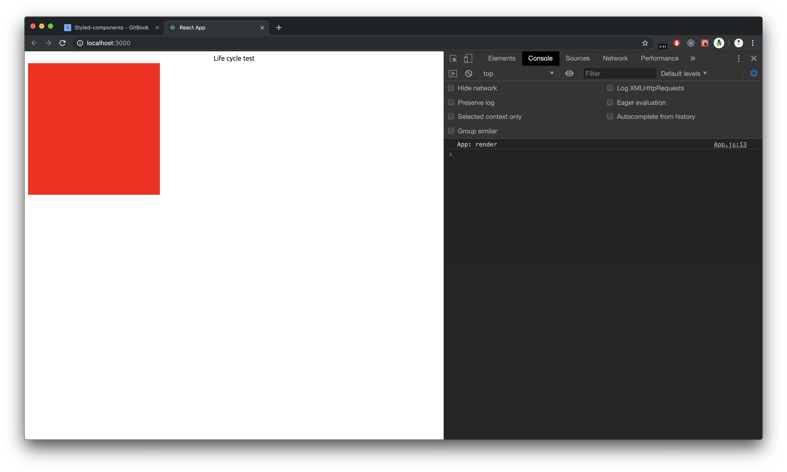
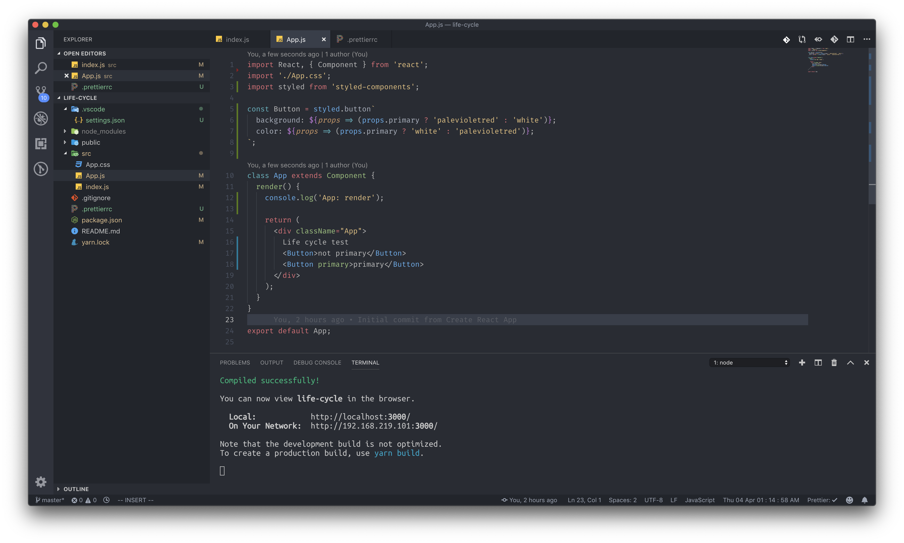

# Styled-components

### CSS 파일을 작성하지 않고 JS에 작성해 보도록 합시다.

css-in-js는 말 그대로 CSS파일을 JS에 작성하는 것을 뜻합니다. 그렇다고 CSS를 인라인으로 작성하자는것은 아니고, 더 효율적이고 간편하게 가고 싶은 개발자들의 요구에서 나온 CSS페러다임 중 하나입니다. 리액트 진영에서는 CSS-IN-JS 라이브러리 중에 styled-components가 대표적으로 많이 사용되는 것 같습니다.

### 왜 편한지 보여드리기 전에, 모듈 설치부터 진행해 봅시다.

`yarn add styled-components` 

`npm i styled-components` 

프로젝트 폴더 내에 설치해 주세요.

설치가 완료되셨다면, 이제 간단한 CSS를 작성해 보도록 합시다.

styled-component를 default로 import를 한 후에, styled.\[사용하고 싶은 HTML태그\] \`\` \(백틱 문자열\) 의 형태로 CSS를 작성하게 되면, 작성한 스타일을 가지고 있는 div 태그가 하나 생성됩니다. 그 변수를 JSX안에서 마치 태그처럼 사용할 수가 있게 됩니다.

CSS-IN-JS의 또다른 장점은, 마치 순수한 CSS를 작성하는 느낌도 받으면서 JS의 데이터 값을 다루는 느낌도 동시에 받을 수 있습니다. 

styled-component 공식 사이트에 있는 예제 소스를 기반으로 설명 드리겠습니다.

Button이라는 HTML 버튼을 만들고, css를 적용시켜 주었습니다. 그런데 가만 보면 props.primary라는 삼항연산자를 사용해 다른 스타일을 주고 있는 모습을 볼 수 있습니다. 이것이 바로 CSS-IN-JS의 장점입니다. 변수 하나를 만들 때에는 순수한 CSS를 작성하는 느낌을 주지만, props값을 넘겨주고 그 에대한 로직을 작성하는 순간에는 JS를 하고 있는 것을 느낄 수 있습니다.

아주 간단한 CSS를 작성하는 컴포넌트에서는 CSS-IN-JS를 적극적으로 활용하면 불필요한 CSS파일 생성이 줄어들어 좋지 않을까 생각해 봅니다.

