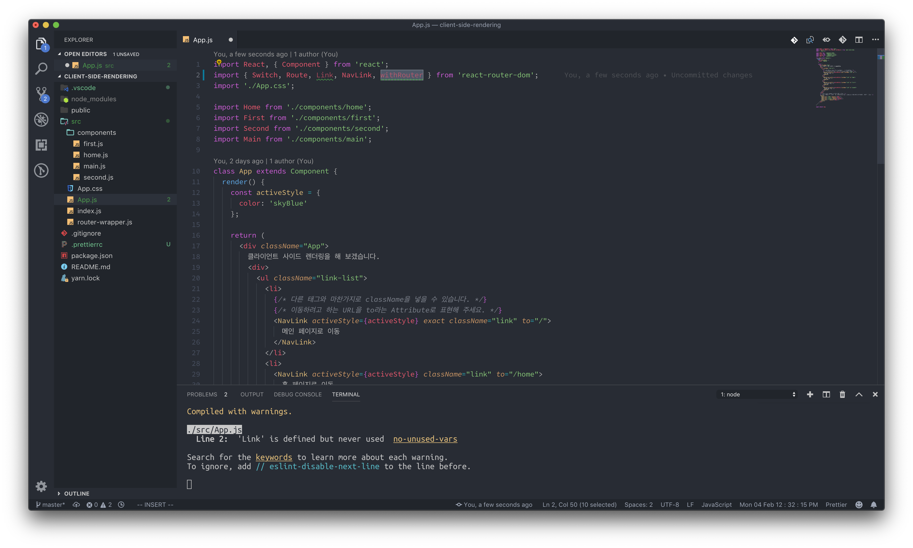
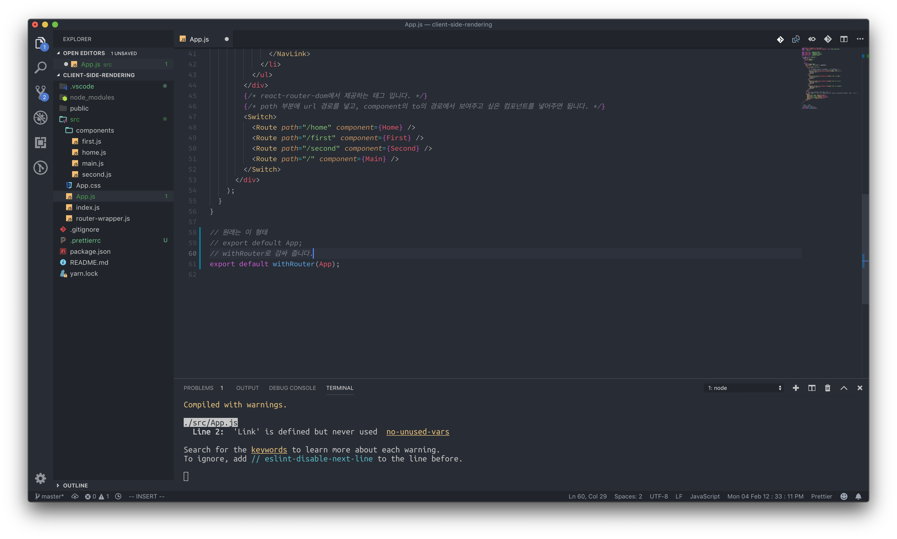
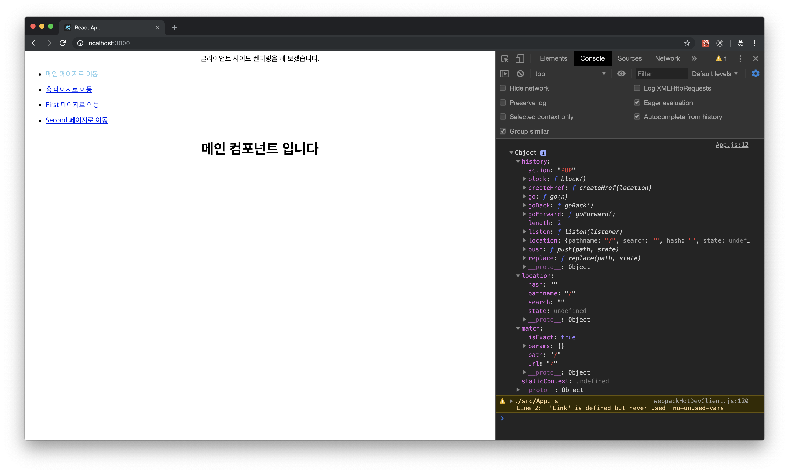
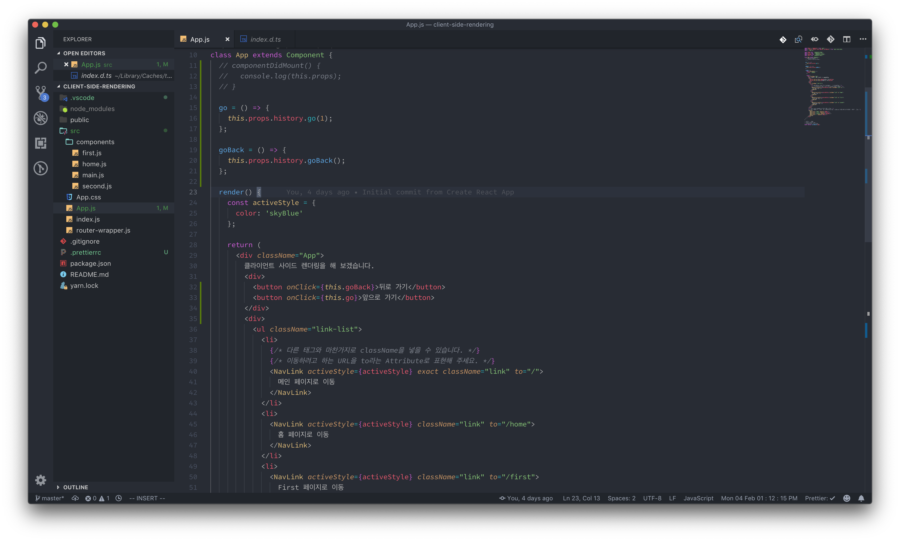
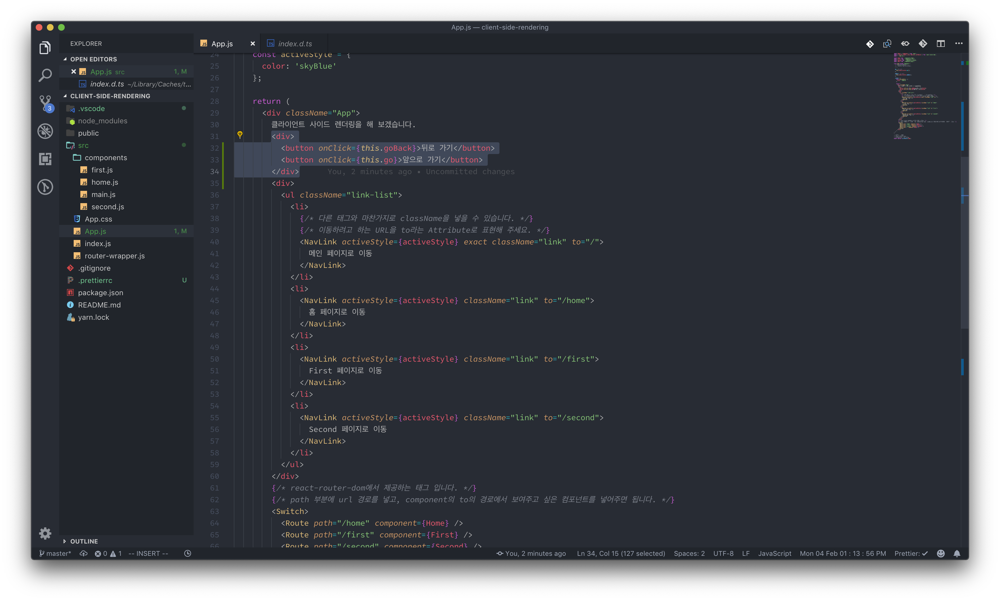
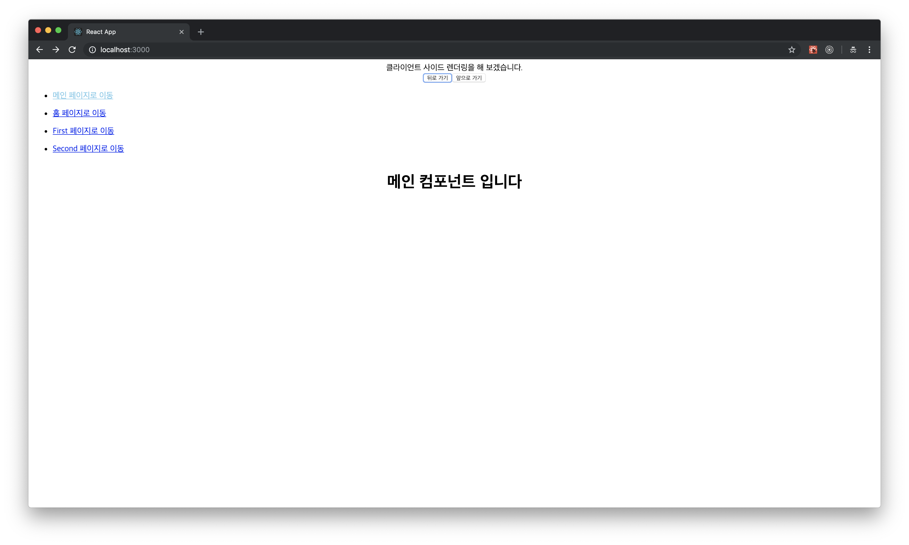

# history를 이용한 뒤로 가기 버튼 구현

지금까지 실습 했었던 내용은, NavLink나 Link를 통해서 특정 라우트의 경로를 우리가 직접 주입하고, 이동을 하는 방식 이였습니다. 하지만 경로가 같은 라우트 링크가 여러 가지 있다면, 뒤로 가기 버튼 기능이 필요할 지도 모릅니다. react-router-dom에서는 이 기능을 간단하게 제공하니, 실습을 진행해 보도록 하겠습니다. _\(크롬의 앞으로 가기, 뒤로 가기 버튼과 동일한 역할을 수행합니다.\)_

### WithRouter

'withRouter'는 react-router-dom에서 제공하는 기능입니다. 우리는 이것을 컴포넌트 안에서 Props로써 활용할 수 있습니다. 우리가 보통 컴포넌트를 export 하는 형태에 withRouter를 덮어씌우는 형태로 사용한다면 이용 가능합니다. 어떤 컴포넌트에서나 가능합니다. App.js에 있는 App컴포넌트를 export 하는 부분을 다음과 같이 바꾸어 주세요, 물론 import도 해야 합니다.

이제 우리는 이것을 어떻게 사용할 수 있을까요? 한번 App.js의 props가 어떻게 바뀌어 있는지 보겠습니다. App.js컴포넌트에 componentDidMount 라이프사이클을 이용해 props를 출력해 보도록 하겠습니다.

### history, location, match

기본적으로 react-router-dom의 withRouter는 3가지 props를 제공합니다. history, location, match. 우리는 이 3개의 props중에 history를 이용해 보도록 하겠습니다. history에서 제공하는 method는 사용법도 간편하고 읽기도 쉽습니다. go, goBack 이라는 메소드가 바로 앞으로 가기, 뒤로 가기 기능을 해주는 기능 입니다.

간편하게 this.props.history.go\(\), this.history.goBack\(\) 을 호출하면 자동으로 이전 페이지로 이동하거나 다음 페이지로 이동하게 됩니다., 간편하죠? 한번 버튼을 만들어 실습을 진행해 보도록 하겠습니다. _\(componentDidMount를 이용해서 console.log\(\)를 실행하는 부분은 지워주겠습니다.\)_

### go, goBack

우선 메소드 부터 만들어 주겠습니다. 다만 여기서 주의할 점이 있는데, history.goBack의 경우에는 호출할 때 인자를 담지 않아도 바로 전 페이지로 갈 수 있지만, **history.go의 경우에는 숫자 인자를 넣어주어야 합니다.** 만약 history.go\(1\) 을 호출할 경우에는 바로 앞 페이지로 이동하게 되고, history.go\(2\)를 호출할 경우에는 앞앞 페이지로 이동하게 됩니다. **담기는 숫자 인자에 따라서 결정되는 것이죠.** _\(go나 goBack을 실행했을 때 더이상 이동할 페이지가 없다면 버튼을 눌러도 아무 일도 일어나지 않습니다.\)_

각각의 메소드는 뒤로가기 버튼과 앞으로 가기 버튼의 역할을 수행합니다. 이 메소드를 JSX에 바인딩 해 주도록 하겠습니다.

이제 다시 [http://localhost:3000](http://localhost:3000) 에 접속을 해 보도록 하겠습니다. 접속하게 되면 크롬의 뒤로 가기, 앞으로 가기 버튼과 동일하게 동작하는 것을 확인할 수 있습니다.

다음은 간단한 토이 프로젝트인 한국 전통 음식 소개 페이지를 만들어 보도록 하는 실습을 진행하도록 하겠습니다.

