# 한국 전통 음식 소개 페이지 만들기 - Deprecated

음식 소개 페이지를 만들어 보도록 하겠습니다. 페이지는 두 개로 구성됩니다. 첫 페이지는 한국 전통 음식 리스트, 두 번재 페이지는 특정 전통 음식의 자세한 소개 페이지 입니다. 라우팅을 통해서 매끄럽게 페이지 전환을 해 보도록 할 것입니다. 먼저 프로젝트를 한 개 생성해 주시고 [작업이 가능한 상태로 프로젝트를 비워 주세요.](https://ljh86029926.gitbook.io/codingapple-react-class/create-reactapp-using-cra-5min)

### 프로젝트 세팅하기


scss, styled-components, 그리고 우리가 배운 react-router-dom도 설치해 주도록 하겠습니다.\`\`\`



```text
yarn add node-sass or npm i node-sass
yarn add styled-components or npm i styled-components
yarn add react-router-dom or npm i react-router-dom
```



[라우팅을 준비할 때](route-prepare.md) BrowserRouter 라는 컴포넌트를 한 번 감싸 주었습니다. 이 프로젝트에도 똑같이 적용해 주시면 될 것 같습니다.


기본적인 세팅이 끝났습니다. 다음은 데이터 세팅입니다.

### 데이터 세팅

데이터 파일을 만들어 보겠습니다. 음식 소개 텍스트와 더불어 사진 같은 데이터를 먼저 만들어 두겠습니다. src 폴더 안에 food-data.js 파일을 생성해 주세요. 이 파일에 우리가 소개할 음식 데이터를 넣어줄 것 입니다.


데이터를 넣어 주겠습니다. 다음 코드를 그대로 foot-data.js에 복사해 주세요.



```javascript
const foodData = [
  {
    name: '김치',
    photo: 'https://upload.wikimedia.org/wikipedia/commons/f/f8/Various_kimchi.jpg',
    subIntro:
      '배추, 무 등을 굵은 소금에 절여 씻은 다음 고춧가루, 파, 마늘, 생강 등의 양념과 젓갈을 넣어 버무려 만드는 한국의 저장 발효식품.',
    mainIntro: `배추, 무 등을 굵은 소금에 절여 씻은 다음 고춧가루, 파, 마늘, 생강 등의 양념과 젓갈을 넣어 버무려 만드는 한국의 저장 발효식품이다. 
    김치의 종류는 많지만 일반적으로 알려진 매운 김치의 경우, 대표적인 조미료는 고춧가루와 젓갈 등이며, 한국에서는 지방마다 제조 과정이나 종류가 조금씩 다르다. 
    올림픽, 아시안 게임, FIFA 월드컵 공식 지정 식품이기도 하다.`,
    cookingMethod:
      '겨울철에 채소에다 소금, 젓갈 등을 버무리는 김장을 통해 제조되며, 전통 사회에서는 김장독을 땅에 파묻어 숙성시켰으나 현대에는 이 원리를 응용한 김치냉장고에 보관하여 숙성시킨다.',
    spec: '배추, 무, 고춧가루, 파, 마늘, 생강, 젓갈, 등...'
  },
  {
    name: '된장찌개',
    photo: 'https://upload.wikimedia.org/wikipedia/commons/thumb/a/a5/Doenjang_jjigae.jpg/440px-Doenjang_jjigae.jpg',
    subIntro: '끓는 육수에 된장을 풀고 육류나 어패류, 채소, 두부, 버섯을 비롯한 각종 재료를 넣어 끓인 찌개이다.',
    mainIntro: `끓는 육수에 된장을 풀고 육류나 어패류, 채소, 두부, 버섯을 비롯한 각종 재료를 넣어 끓인 찌개이다. 
    아욱, 미역, 시금치, 배추, 무청 얼갈이를 넣은 된장국과도 비슷하다. 
    육류와 어패류를 함께 넣는 경우는 거의 없다. 
    계절에 따라서 봄에는 풋고추, 겨울에는 시래기를 넣기도 한다. 
    한국인들이 김치찌개 만큼이나 많이 찾는 음식이다. 
    토장찌개라고도 한다. 
    한국의 각종 고기구이 전문 식당에서 고기를 먹은 후에 내놓은 식사류로 많이 이용된다.`,
    cookingMethod: `된장찌개를 만드는 과정은 개인에 따라 순서나 재료에 차이가 있지만, 대부분 아래와 비슷한 과정을 따른다. 
    먼저, 뚝배기에 물을 넣은 후 멸치와 무를 넣고 국물을 우려낸다. 
    국물이 충분히 우러나 맛국물이 만들어지면 된장을 풀고 다시 끓인다. 
    된장이 끓고 있는 동안 된장에 들어갈 재료를 썬다. 
    재료는 개인에 따라 다르지만, 일반적으로 감자, 파, 청양 고추, 애호박, 버섯, 두부가 들어간다. 
    된장국이 충분히 끓으면 미리 썰어놓은 재료를 넣고 다시 끓인다. 
    이 때, 두부는 넣지 않는데, 그 이유는 두부는 쉽게 물러지기 때문이다. 
    두부는 완성되기 직전에 넣고 찌개를 짧게 끓여준다.`,
    spec: '된장, 두부, 파,  감자, 애호박, 고추, 팽이버섯, 쇠고기, 조개, 바지락, 우렁이, 등...'
  },
  {
    name: '비빔밥',
    photo: 'https://upload.wikimedia.org/wikipedia/commons/thumb/4/44/Dolsot-bibimbap.jpg/440px-Dolsot-bibimbap.jpg',
    subIntro:
      '비빔밥 또는 교반(攪飯)은 대표적인 한국 요리의 하나로, 밥에 고기나 거섶(나물), 달걀 등과 고추장, 참기름 등 양념을 넣고 비벼서 섞어 먹는 음식이다. ',
    mainIntro: `비빔밥 또는 교반(攪飯)은 대표적인 한국 요리의 하나로, 밥에 고기나 거섶(나물), 달걀 등과 고추장, 참기름 등 양념을 넣고 비벼서 섞어 먹는 음식이다. 
    부빔밥이나 재삿밥, 골동반(骨董飯) 등으로도 부르며, 궁중에서는 비빔이라 불렀다.`,
    cookingMethod: '재료를 넣은 뒤, 비비면 왼성된다.',
    spec: '콩나물, 오이, 고사리, 당근, 버섯, 양파, 무우(생채), 도라지, 시금치 등 각종 나물 + 고추장, 쇠고기, 참기름, 볶음고추장, 등...'
  }
];

export default foodData;
```



이제 이 데이터를 App.js의 state로 만들어 주도록 하겠습니다. App.js의 파일을 다음과 같이 변경해 주세요.


### 페이지 구성

* /foods - 전체 음식이 들어가 있는 부분입니다
* /foods/:foodName - 음식 이름에 따라서 각 음식에 대한 정보를 알려 줍니다.

### 전통음식 미리보기 컴포넌트 만들기

우리가 만들 라우트는 /foods에 대한 라우트 입니다.

미리보기 컴포넌트를 통해 카드 형태로 전통음식 리스트를 보여 줍니다. 각각의 리스트를 클릭하게 되면, 상세보기로 이동합니다. 카드 형태로 전통음식의 특징을 미리보기 할 수 있는 컴포넌트를 제작해 보도록 하겠습니다.

src폴더 내에 food-card.js 파일을 생성해 주세요.

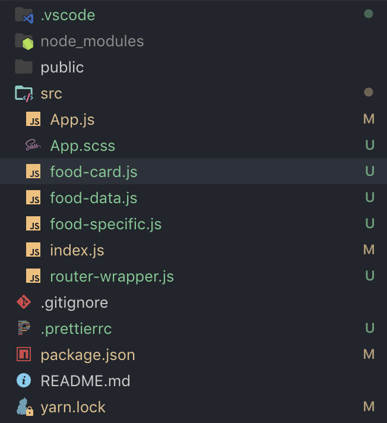

이 카드는 대략적인 음식의 정보를 받아 음식의 이름, 간략한 소개만 보여줄 수 있는 카드 형태의 컴포넌트가 될 예정입니다. food-card.js 컴포넌트를 제작해 보도록 하겠습니다.


이 컴포넌트는 음식의 자세한 정보를 알기 전, 간략한 정보만을 축약해서 보여줄 수 있는 페이지입니다. 따라서 음식의 이름과, subIntro라는 간단한 소개 글만 있는 컴포넌트 입니다. scss파일도 하나 만들어서 넣어 주세요.



```css
.food-card {
  display: flex;
  flex-direction: column;
  border: 1px solid #dfe7f2;
  border-radius: 0.5rem;

  .food-card-name {
    margin-top: 0.5rem;
    margin-bottom: 0.75rem;
    margin-left: 0.5rem;
    margin-right: 0.5rem;
    > span {
      font-size: 1.5rem;
      font-weight: bold;
    }
  }

  .food-card-content {
    margin-bottom: 0.75rem;
    margin-left: 0.5rem;
    margin-right: 0.5rem;
  }
}

```



이제 완성한 컴포넌트를 보여주는 일이 남았습니다. 그러기 위해서는 음식 데이터의 리스트를 조합해서 하나의 카드로 보여줄 수 있는 리스트 컴포넌트가 필요합니다. 

### 전통음식 미리보기 컴포넌트 리스트 만들기

src 폴더에 food-card-list.js 파일을 생성해 주세요.

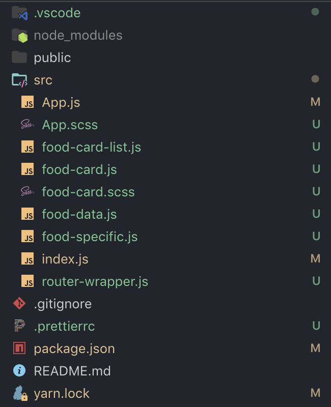

리스트 컴포넌트를 작성해 보겠습니다.

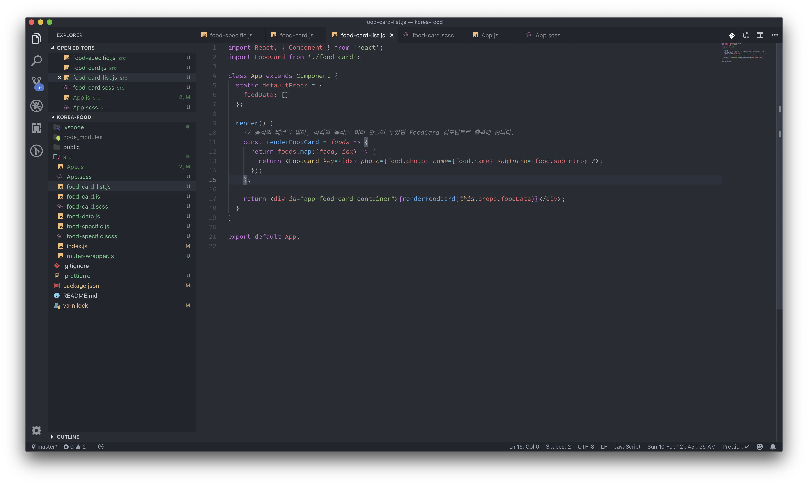

리스트 컴포넌트와 카드 컴포넌트를 완성했으니, 남은 것은 App.js에 적용해주는 일이 남았습니다.

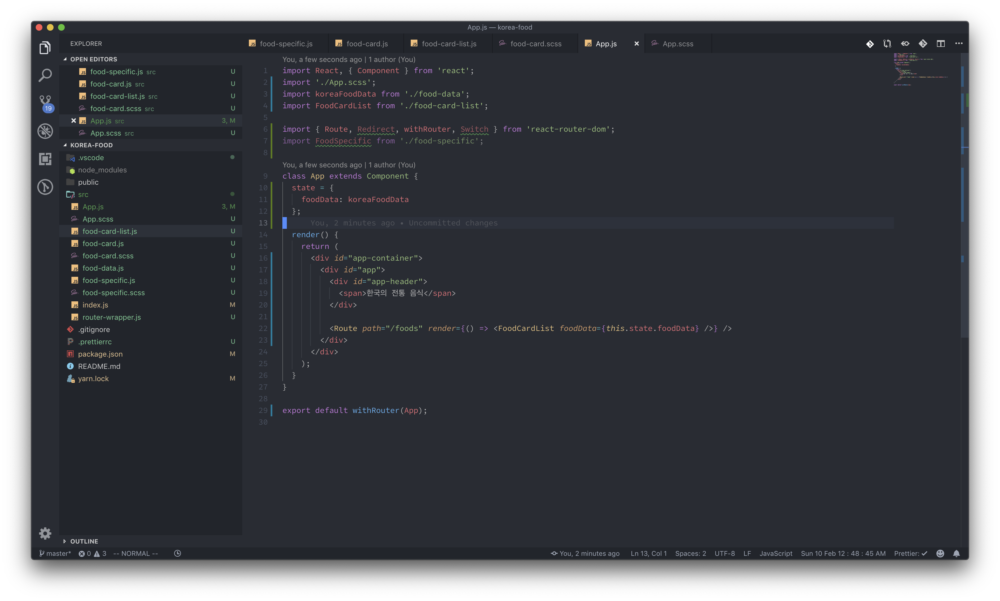

여기에 지금까지 배웠던 예제와 다른 속성이 Route에 있는 것을 볼 수 있습니다. 바로 render 인데요, 이것을 사용한 이유는, 넘겨주는 컴포넌트인 FoodCardList 컴포넌트가 음식 리스트를 Props로 받기 때문입니다. 

#### Render를 사용하면, props를 담아서 라우팅을 할 수 있습니다.

component={컴포넌트 이름} 형태로 출력하게 되면, FoodCardList 컴포넌트가 받아야 할 음식 리스트를 받지 못하게 됩니다. render 컴포넌트는, 라우팅되는 컴포넌트에 Props를 전해주고 싶을 때 사용하는 컴포넌트 입니다. Arrow function을 사용하는 형태로 작성합니다.

추가로, App.scss도 조금 변경 되었습니다.



```css
#app-container {
  display: flex;
  flex-direction: column;
  align-items: center;

  #app {
    max-width: 720px;

    #app-header {
      margin-top: 0.5rem;
      margin-bottom: 2rem;
      > span {
        font-size: 2rem;
        font-weight: bold;
      }
    }

    #app-food-card-container {
      .food-card:nth-last-child(1) {
        margin-bottom: 0;
      }
      .food-card {
        margin-bottom: 1rem;
      }
    }
  }
}

```



[http://localhost:3000/foods](http://localhost:3000/foods) 로 들어가보면, 우리가 작성한 컴포넌트가 매우 잘 동작하는 것을 확인 할 수 있습니다.

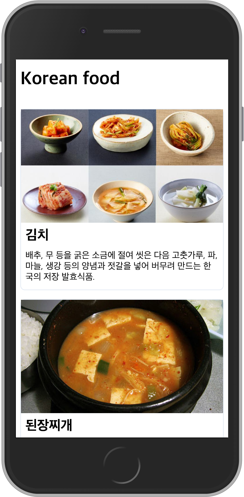

### 전통음식 상세보기 컴포넌트 만들기

라우터를 통해 특정 음식의 정보를 알고 싶을 때 사용하는 컴포넌트 입니다. 라우트 주소는 미리 정해두었던 데로, foods/:foodName 라우트로 들어왔을 때 각 음식 이름 별로 처리를 해 주는 것으로 하겠습니다. 지금 경우에는 3개의 전통음식 상세보기 페이지가 만들어 질 예정입니다. 소개할 음식이 3가지니까, 라우트도 /foods/김치, /foods/된장찌개, /foods/비빔밥, 이렇게 3가지의 라우트에 따라서 각각의 상세 보기 페이지가 만들어 질 예정입니다. 그러나 컴포넌트는 하나만 있으면 충분합니다.

우선, food-specific 컴포넌트를 하나 만들어 주도록 하겠습니다.

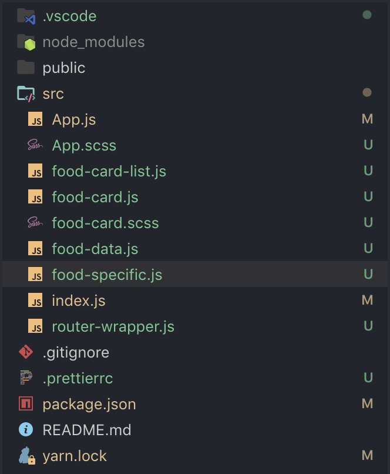

이번 컴포넌트는 제법 깁니다. 그러나 특별한 부분은 render내부에 있는 함수 한 개밖에 없습니다.

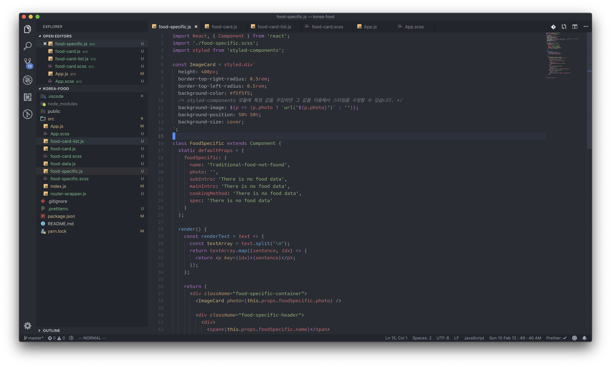

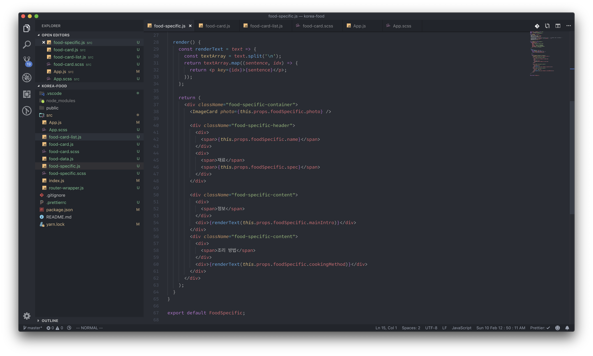

specific 컴포넌트가 받는 props는 App.js에서 다루는 foodData배열의 요소 한 개 입니다. 그래서 데이터를 보여줄 때도 그 객체 내에 있는 데이터를 그대로 보여줍니다. 눈여겨 봐야 할 부분은 render 메소드 부분입니다. render 메소드 내부에 있는 renderText 함수는 말 그대로 문자열 텍스트를 받아서 엔터 를 기준으로 배열을 생성합니다. 그 후, map 함수를 이용해서 문장 하나하나 p태그에 담아서 출력하는 부분을 담당합니다. 이 부분이 필요한 이유는, HTML에서 단순 문자열을 출력할 경우에 엔터 개행이 불가능 하기 때문입니다. 이미지를 보여주는 부분 같은 부분은 일전에 만들었던 미리보기 컴포넌트에서 대부분 가져와서 사용했습니다.

scss파일입니다.



```css
.food-specific-container {
  display: flex;
  flex-direction: column;
  margin-top: 1rem;
  border: 1px solid #dfe7f2;
  border-radius: 0.5rem;

  .food-specific-header {
    margin-top: 0.5rem;
    margin-bottom: 1.5rem;
    padding-right: 0.5rem;
    padding-left: 0.5rem;

    > div:nth-child(1) {
      margin-bottom: 0.5rem;
      > span {
        font-size: 2rem;
        font-weight: bold;
      }
    }
    > div:nth-last-child(1) {
      display: flex;
      flex-direction: column;
      > span:nth-child(1) {
        margin-bottom: 0.75rem;
        font-size: 1.5rem;
        font-weight: 600;
      }
    }
  }

  .food-specific-content {
    display: flex;
    flex-direction: column;
    margin-bottom: 1rem;
    padding-right: 0.5rem;
    padding-left: 0.5rem;

    > div:nth-child(1) {
      > span:nth-child(1) {
        font-size: 1.5rem;
        font-weight: 600;
      }
    }
  }
}

```



이제 지금 만든 컴포넌트를 App.js 컴포넌트에 적용해야 합니다. App.js에 다음과 같이 타이핑 해 주세요.

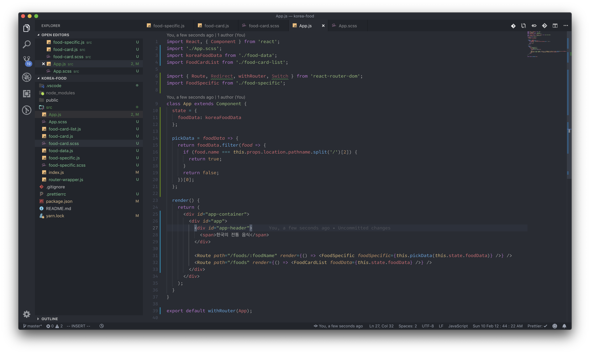

우선 기존의 App.js는 history, location 같은 react-router-dom의 props가 필요하지 않았습니다. 하지만 Specific 컴포넌트에게 각각의 음식 데이터를 주기 위해서는 현재 어떤 URL을 가리키는지 알 필요가 있기 때문에 withRouter로 react-router-dom의 props를 가져왔습니다. 당연히 Route로 /food/:foodName으로 들어오는 라우트에는 FoodSpecific 컴포넌트를 render시켜 주었습니다. **이제 어려울 수 있는 부분이 pickData 메소드** 입니다. 이 메소드는 foodData라는 함수 인자를 받습니다. 지금 render부분에서 foodSpecific부분에 props로 활용되는 부분을 보면, pickData메소드가 사용되는 것을 알 수 있습니다. 이 메소드의 인자로는 foodData state가 담겨져 있구요. **pickData에서 사용되는 foodData인자는 this.state.foodData와 동일합니다.** 메소드 내에서는 두 가지 과정을 통해 하나의 foodData객체를 반환합니다.  
1. 필터링을 통해, 현재 배열 객체의 name과 url의 foodName을 비교해서 같은 값만을 추려냅니다.  
2. 그렇게 필터링 된 배열의 첫 번째 요소 \(당연히 한 개밖에 없을 것임\)를 리턴합니다.

**본래 foodData의 state는 길이가 3인 배열이고, 각각의 요소는 음식 데이터인데, 그 데이터를 필터링 해서 맞는 객체 한 개만 리턴을 해 준다는 의미 입니다.**

FoodSpecific컴포넌트는 그렇게 받은 데이터를 출력해 주는 것 뿐입니다. 그리고 두 개의 라우트 path가 /foods를 동시에 가지고 있으므로, /foods일 때 FoodCardLIst를 보여주는 라우트에는 exact를 걸어 주었습니다.

#### 기본적인 설정이 전부 완료 되었습니다. 지금 [http://localhost:3000/foods/김치](http://localhost:3000/foods/김치) URL로 접속하게 된다면, foodSpecific컴포넌트를 제대로 볼 수 있을 것 입니다.

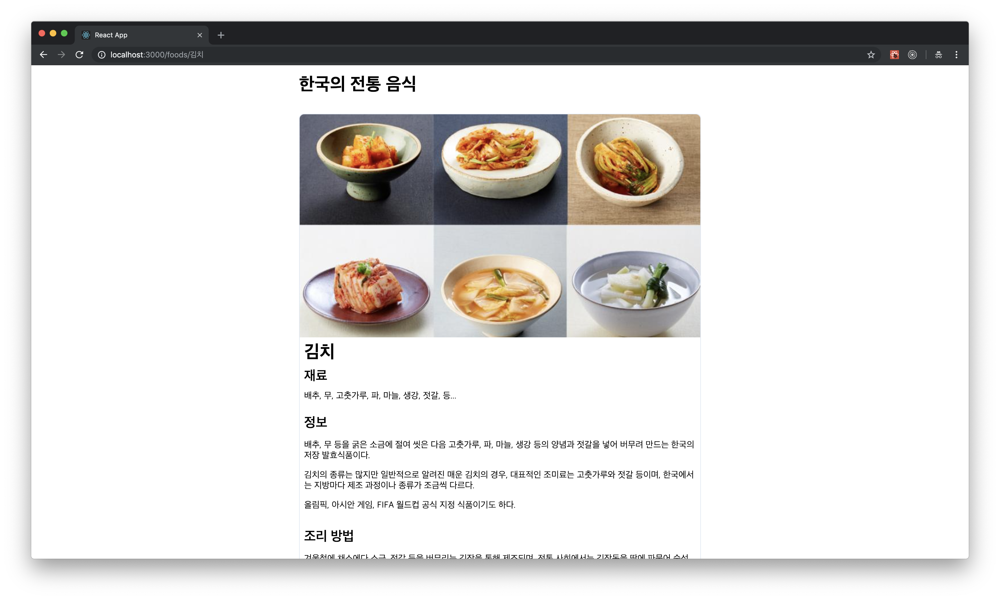

### Redirect 설정하기

http://localhost:3000/foods, http://localhost:3000/foods/:foodName URL로 접속했을 때에는 우리가 만들어둔 페이지들을 확인할 수 있지만, http://localhost:3000컴포넌트로 접속하게 되면 확인을 할 수가 없습니다. 이를 방지하기 위해서 잘못된 URL로 들어갔을 때의 Redirect를 설정해 주도록 하겠습니다.

이를 위해서는 새로운 react-router-dom의 속성인 Redirect를 알아야 합니다. 컴포넌트 처럼 사용할 수 있고, to 라는 props를 받는데, 여기에 문자열로 기본 페이지로 돌아갈 URL을 적어 두면 됩니다. 그리고, Redirect를 활용하기 위해서는 Switch안에다가 사용하면 좋습니다. Switch를 통하게 되면 매치되는 라우트가 있을 때에는 Redirect가 작동하지 않을 테니까요. App.js를 다음과 같이 수정해 주세요.

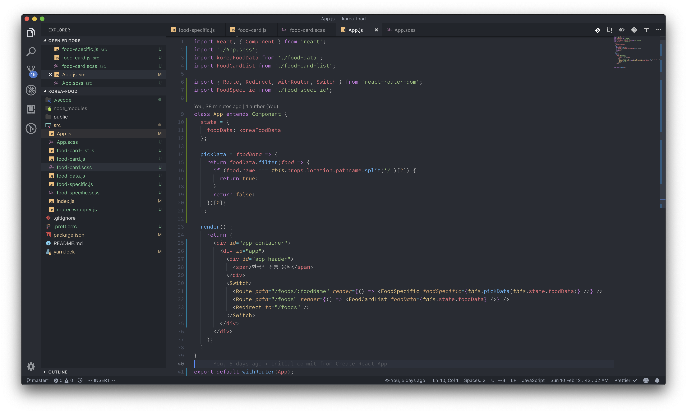

_\(Switch를 사용했기 때문에, /foods라우트에 걸어둔 exact는 없애 주었습니다.\)_ 이제 의도하지 않게 이상한 라우트에 접속하게 되어도, 모두 /foods 기본 라우트로 Redirect 되게 됩니다. 

### 클릭 라우트 지정해주기

우리가 한 가지 만들어 두지 않은 부분이 있습니다. FoodCardList 컴포넌트에서 음식 개수대로 카드가 나오는데, 각각의 카드를 클릭해 봐도 상세보기 페이지로는 이동하지 않습니다. 그 부분을 처리해 보도록 하겠습니다. react-router-dom의 제공 props인 history의 push 라는 메소드를 사용할 것 입니다. food-card.js를 다음과 같이 변경해 주세요.

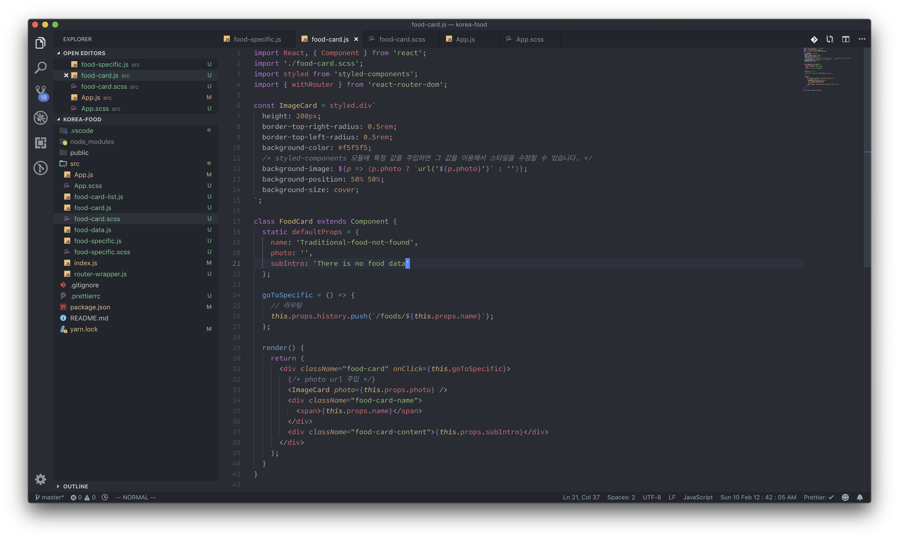

### 옵션: 뒤로가기, 앞으로 가기

각각의 페이지 마다 있으면 좋은 메뉴 인 것 같습니다. 실습할 때 이미 구현을 해 보았었구요. 만들어 보도록 하겠습니다. App.js부분에 만들어 줄 것 입니다. scss도 조금 변경해 주겠습니다.

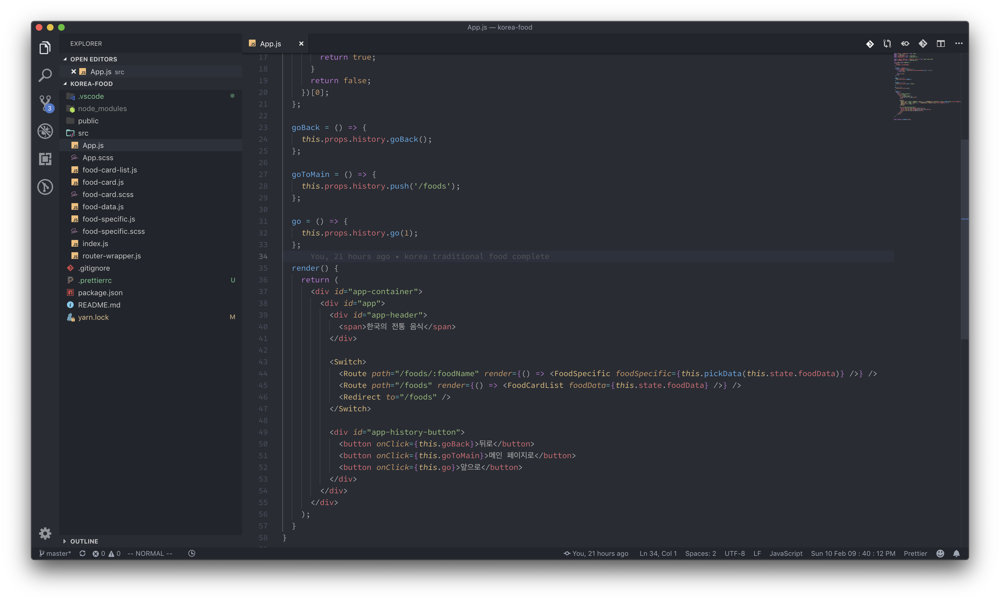

[3강에서 진행했던 내용입니다.](history-go-and-goback.md) 

scss파일입니다. 



```css
#app-container {
  display: flex;
  flex-direction: column;
  align-items: center;

  #app {
    max-width: 720px;

    #app-header {
      margin-top: 0.5rem;
      margin-bottom: 2rem;
      > span {
        font-size: 2rem;
        font-weight: bold;
      }
    }

    #app-food-card-container {
      .food-card:nth-last-child(1) {
        margin-bottom: 0;
      }
      .food-card {
        margin-bottom: 1rem;
      }
    }

    #app-history-button {
      display: flex;
      justify-content: space-between;
      margin-top: 1rem;
      margin-bottom: 1rem;

      > button:nth-child(1) {
        margin-right: 0.5rem;
      }
      > button:nth-last-child(1) {
        margin-left: 0.5rem;
      }
      > button {
        border: 1px solid #dfe7f2;
        border-radius: 0.5rem;
        padding: 1rem;
        color: #4287c9;
        background-color: white;
        font-size: 1rem;
        font-weight: bold;
        cursor: pointer;
        outline: none;
      }
    }
  }
}

```



여기까지 전부 완료가 되면, 다음과 같이 잘 동작하는 전통음식 소개 페이지를 확인할 수 있습니다.

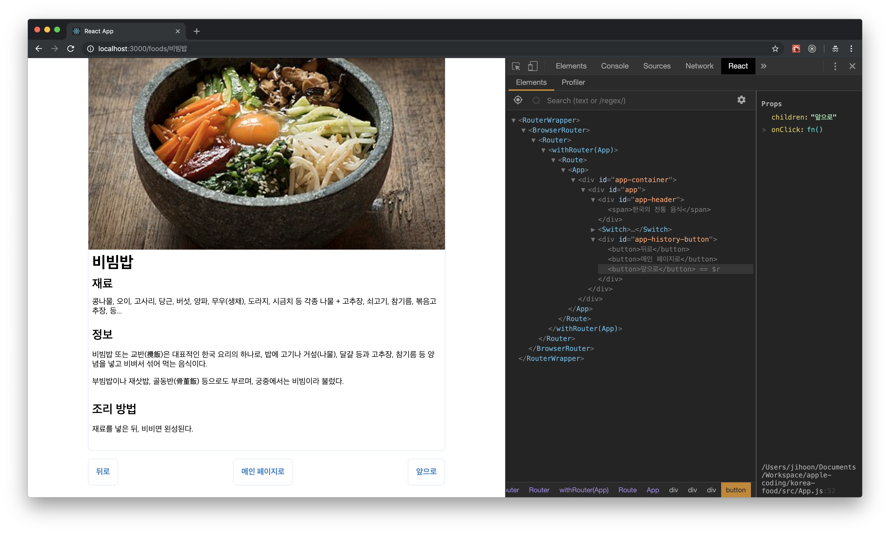

