# Routing \(실전\)

  
_\(주의 \* 작성자의 편의를 위해서 CSS를 따로 수정한 부분이 있어 UI가 다르게 보일 수도 있습니다. 하지만 기능 상에는 차이가 없고 단지 보여지는 UI부분에만 차이가 있을 수 있습니다. 참고해 주세요.\)_

### 기본 라우팅 실습 목표

우리는 3개의 컴포넌트를 만들어, URL에 따른 라우트 3개를 생성해 3개의 페이지를 보여주는 실습을 하도록 하겠습니다. 기본 루트 URL ' / '로 접속하는 사용자들을 위한 홈, 다음은 ' /first ', ' /second ' 의 라우트를 만들어 각각의 페이지에서 다른 페이지를 보여주는 것을 실습해 보도록 하겠습니다.

우선, src 폴더에 파일을 세 개 만들어 주도록 하겠습니다. 각각의 이름은 home.js, first.js, second.js 파일입니다. 저는 src 폴더에 components 라는 폴더를 만든 후에 이 세개의 파일들을 만들어 주도록 하겠습니다.

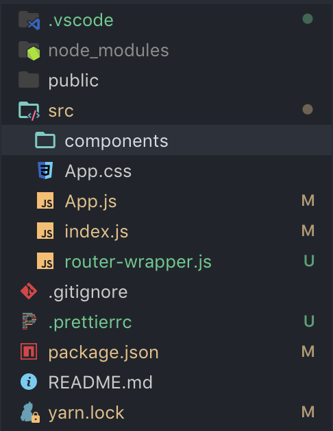

이제 특정 URL에 따라서, 다르게 보여지는 페이지를 만들어 보도록 하겠습니다.

3개의 컴포넌트를 일단 만들어 볼까요? 그저 각각의 컴포넌트가 어떤 컴포넌트 인지 우리가 인지할 수 있을 정도로만 만들어 주겠습니다.

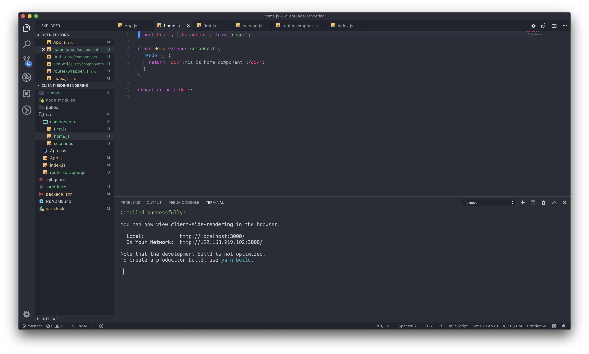

나머지 컴포넌트들도 home.js 컴포넌트와 마찬가지로, render 부분에 있는 JSX 텍스트만 바꾸어 주면서 만들어 주세요.

### URL에 따라서 다르게 보이는 페이지

이렇게 다 만들고 나면, 이제 특정 URL에 따라서 다르게 보이는 페이지를 만들어 보겠습니다. 3개의 컴포넌트를 만들기만 했으니, 이제 연결을 해 주어야겠죠? App.js 컴포넌트에 들어가 보겠습니다. 방금 전 준비 할 때 우리가 작성했었던 [App.js 컴포넌트를](route-prepare.md#browerrouter-csr), 밑에 사진과 같이 변경해 주세요.

Route 태그가 바로 특정 case를 작성하는 부분 입니다. path 라는 Attribute는 URL 경로를 넣어주는 부분 입니다. _\(string 형태로 작성 합니다.\)_ component는 그 URL경로에 보여줄 컴포넌트를 넣어주는 부분 입니다. _\(객체를 넣는 스타일로 작성\)_  현재는 세 개의 컴포넌트 이름대로 path와 컴포넌트를 연결해 주었습니다. 우리는 localhost:3000 포트로 실습을 하고 있기 때문에, 'http://localhost:3000/home' 경로로 접속하게 되면 home 컴포넌트가 보이게 됩니다. 한 번 들어가 볼까요? [http://localhost:3000/home](http://localhost:3000/home) 

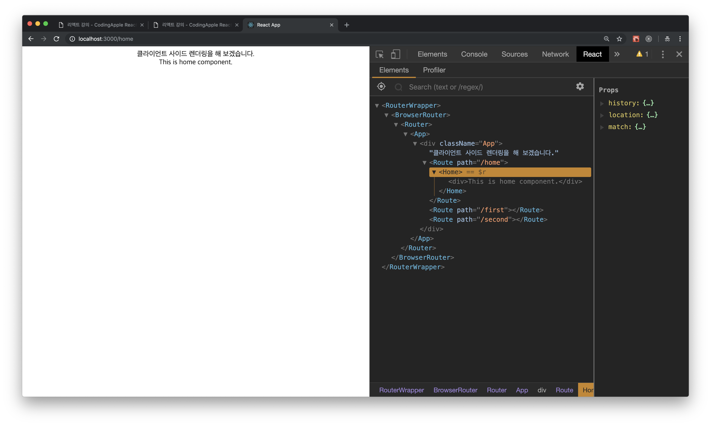

옆에 보이는 리액트 개발자 도구는 다른 path 경로의 Route 태그는 보이지 않고 현재 경로에 맞는 태그만 보이게 됩니다. 한번 다른 경로로도 접속해 보세요. [http://localhost:3000/first](http://localhost:3000/first)

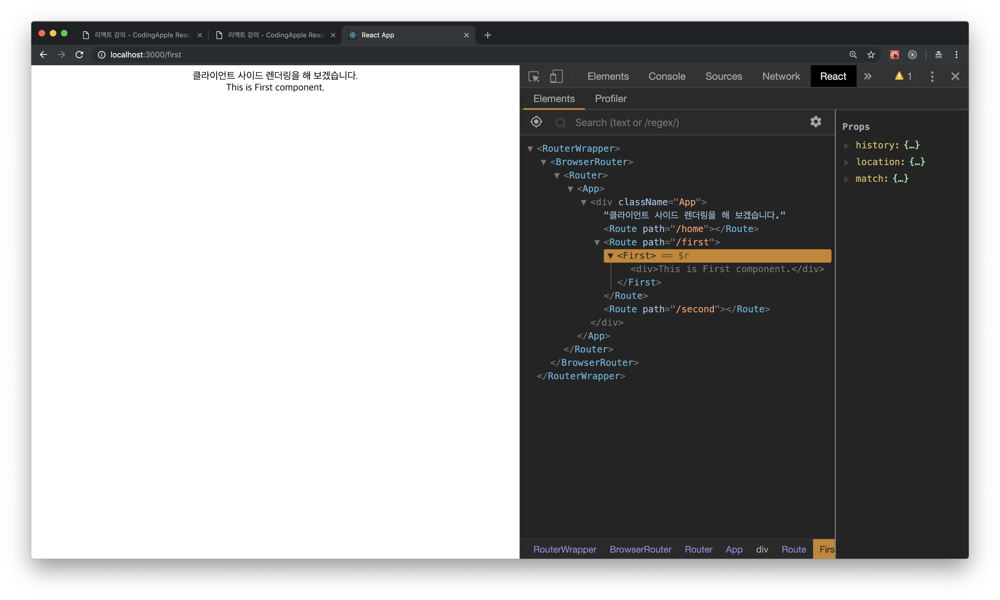

### Route 컴포넌트를 사용할 때 주의할 점..!

Route 컴포넌트의 path 경로에 따라서 지정해둔 component가 보여지는 기능에 대한 것에 대한 것을 알았습니다. 이번에는 Route 태그의 맹점에 관해서 파악하고, 이를 방지하는 방법에 대해서 알아보겠습니다. 우선 이를 위해선 컴포넌트 하나를 더 만들어야 합니다. components 폴더에 main.js라는 파일을 한개 만들어 주세요.

방금 만들었던 Main.js 컴포넌트를 App.js 부분에 적용 시켜보도록 하겠습니다.

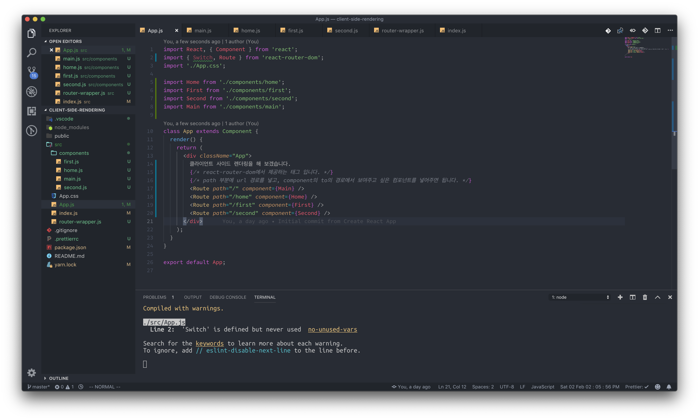

path="/" 제가 이렇게 path를 넣은 이유는, 이 main 컴포넌트는 localhost:3000에서만 보여야 하고, localhost:3000/first, localhost:3000/home에서는 보이지 않아야 하는 것을 의도했기 때문입니다.   
하지만 우리가 localhost:3000/home 컴포넌트에 들어가면, 신기한 현상을 볼 수 있습니다.

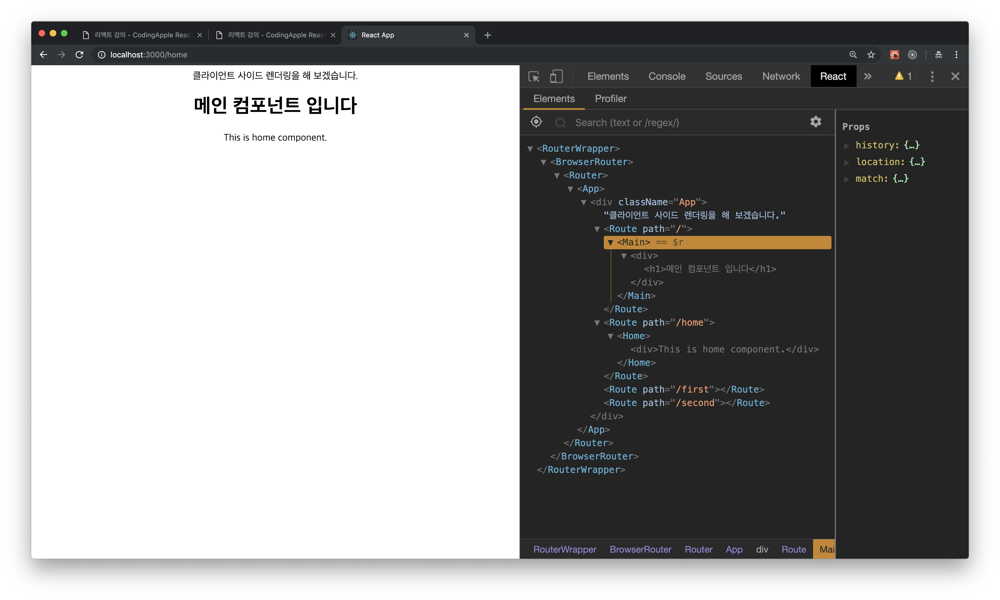

이런 현상이 나타나는 이유는, /home 라우트에는 이미 '/' 존재하고 있기 때문입니다. 이런식으로 라우트를 나열하게 되면, 중복되는 부분은 전부 보여지게 됩니다.

###  Route 컴포넌트의 의도치 않은 동작 방지 방법 1 - exact

방금과 같은 현상을 의도 했다면 상관이 없지만, 대부분은 의도하지 않았을 것 입니다. 지금 소개할 exact를 사용하게 된다면, 정확히 URL이 매치 되었을 때에만 Route 태그를 보여줄 수 있습니다.

App.js의 main 컴포넌트를 보여주는 Route 태그를 수정해 주세요.

이 Attribute는, URL이 정확히 매치 되었을 때에만 Route에 있는 컴포넌트를 보여줄 수 있도록 하는 속성 중 하나 입니다. 이 태그에 JSX 스타일로,  `exact={true}` 라던지, `exact={false}` 와 같은 스타일로 작성해서, 언제든지 exact의 활성화 여부를 변경할 수 있습니다. exact만 단순히 넣어준 경우에는 기본 값 true로 취급 됩니다. 이제 [localhost:3000/home](http://localhost:3000/home)에 들어가게 되면, 우리가 의도했었던 home 컴포넌트만 보여지게 됩니다.

마찬가지로, [localhost:3000](http://localhost:3000)에 들어가게 되면, 메인 컴포넌트 한개만 보이게 됩니다.

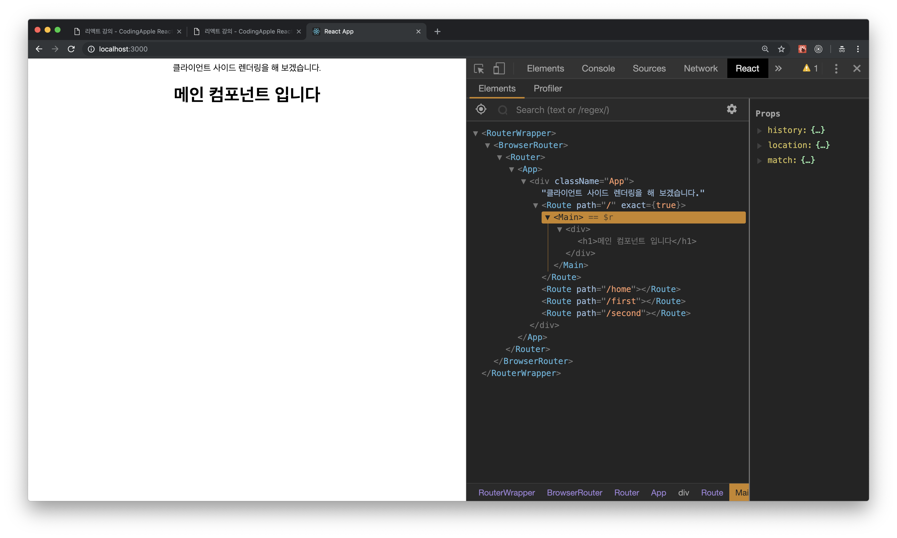

### Route 컴포넌트의 의도치 않은 동작 방지 방법 2 - Switch

switch는 우리가 지금 CSR을 위해 사용 중인 react-router-dom 모듈에서 제공해 주는 태그 중 하나 입니다. Route 태그 처럼 JSX 태그로 사용되며, 이 Switch 태그 안에다가 Route 컴포넌트를 넣어두면, 마치 Switch case처럼 컴포넌트들을 비교하면서 맞는 컴포넌트가 있으면 그 컴포넌트 하나만 렌더링 해 줍니다.   
App.js를 Switch를 이용해서 한 번 수정해 볼까요?

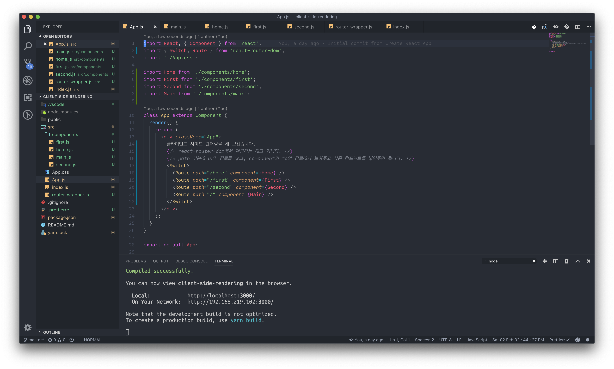

이제 URL이 바뀔 때 마다, Switch 태그에 걸리는 path가 있다면 그 컴포넌트만 보여 주게 되고 밑에 있는 다른 path들은 비교하지 않게 됩니다. 실제로 자바스크립트에서 사용되는 Switch case의 동작 방식과도 같아요. 단지 지금 Switch 태그들은 break가 자동으로 적용 되어있다는 점 입니다. 위 App.js 부분에서, main컴포넌트의 Route 태그를 가장 밑으로 넣어 놓았는데, 그 이유는 다음과 같습니다.

* /home, /first, /second 태그 모두 '/' 포함하고 있습니다.
* '/' 부분을 가장 앞에 놓게 되면, 어떤 URL로 들어가던지간에 main 컴포넌트만 보여지게 됩니다.

#### **그렇기 때문에 Depth가 가장 깊은 URL 부터 먼저 보여지게 하는 방법을 선택했습니다.**

앞으로 Switch를 사용하실 때 다들 이렇게 사용하시면 됩니다. 가장 Depth가 깊은 path를 가지고 있는 Route를 가장 먼저 Switch 앞에 위치 시키고, 그 다음 복잡한 path를 가진 Route를 나열하는 방식으로 프로그래밍 하시면 됩니다. 이 방식을 사용하게 되면, exact를 추가할 이유가 없어 집니다. 두 개의 방법 모두 나쁜 방식도 아닐 뿐더러, 취향 차이입니다.

### 일반적인 a 태그와 다른 Link 태그

html 마크업을 작성 하면서, 다른 페이지나 다른 URL로 사용자들을 이동 시키고 싶을 때 보통은 a태그 라는 것을 사용해 그에 맞는 href를 주어 이동 시킵니다. 그러나 SPA인 리액트에서는 이 방식을 사용하면 안 됩니다. 리액트를 하면서 a태그로 사용자의 페이지를 이동 시키는 행동을 하게 되는 것은 SPA인 리액트를 할 필요가 없을 정도입니다. a태그를 클릭하게 되면, 그 URL에 대한 정보를 서버에 요청하는데, 리액트는 어떤 URL로 요청을 하던지 서버에서는 같은 JS, CSS 파일을 내려주게 되고, JS 파일이 로딩된 후 맞는 URL을 로딩된 JS가 분석하여 보여주게 됩니다. 서버에서 이런 작업을 수행하는 것이 아닌 클라이언트에서 수행을 하는 것이죠. 그렇기 때문에 우리는 페이지 요청을 하지 않고 클라이언트에서 URL을 변경하는 방식을 사용해야 합니다. 서버의 부담을 줄이기 위해서 SPA를 사용하기 때문이죠. 그것이 바로 지금 배울 Link태그를 이용한 방법 입니다.

### Link 태그를 이용한 페이지 이동

Link 태그 역시 react-router-dom에서 기본적으로 제공하는 태그 입니다. App.js에서 Link태그를 이용한 페이지 이동 실습을 해 보도록 하겠습니다.

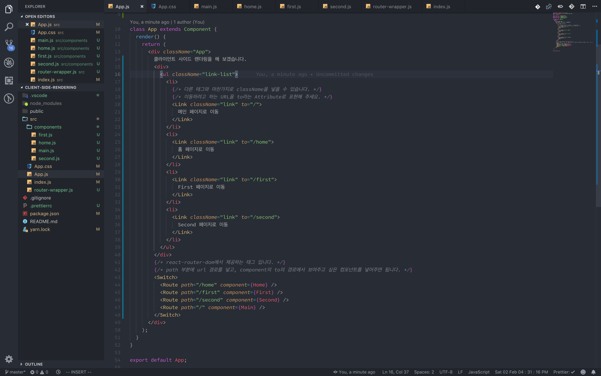

이제 이 링크를 클릭하게 되면, a태그를 클릭했을 때의 새로운 페이지가 로딩이 되는 것이 아닌, 클라이언트상에서 url이 바뀌며 그에 맞는 Route 페이지가 보여지게 됩니다. 페이지 간 로딩이 자연스럽게 바뀌는 것이죠. 사용자 경험을 한층 높여줄 수 있습니다.

### 특정 링크에 스타일을 넣어주는 NavLink

지금 만들어 실습한 메뉴 같아 보이는 리스트는, 나중에 다른 리액트 웹 페이지를 만들 때에도 메뉴를 넣을 때 이런식으로 Link를 넣어 웹 페이지를 작성할 것 입니다. 그런데 지금은 특정 URL을 클릭해서 들어가도 그 URL을 들어갔다고 사용자가 인지하기 위해서는 보여지는 컴포넌트를 확인해야 합니다. 메뉴에 스타일을 줄 수 있다면 정말 좋겠네요. 그러나 현재 Link 태그를 이용해서 이런 작업을 하기에는 복잡한 면이 있습니다. 하지만 우리의 react-router-dom은 이런 점을 미리 생각해 Link의 업그레이드 버전 같은 느낌인 NavLink 태그를 제공합니다. 이번에는 NavLink를 학습해 보도록 하겠습니다.

우선, NavLink를 import 해 주세요, react-router-dom 모듈에 내장되어 있습니다.

그리고, 현재 링크로 작성되어 있는 메뉴를 전부 NavLink로 바꾸어 주세요.

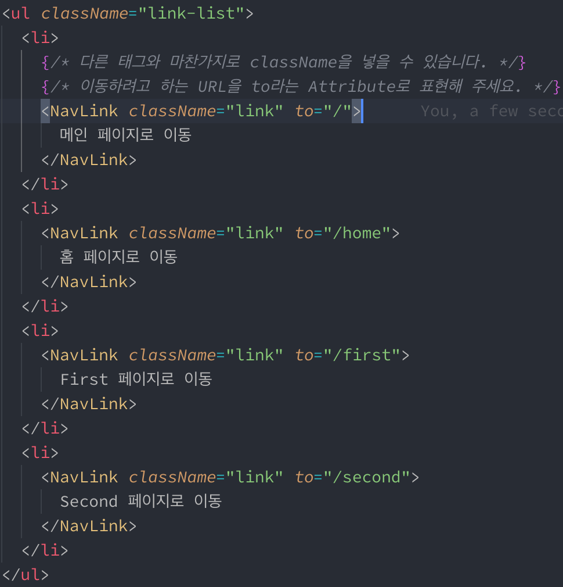

Link에서 NavLink로 바뀐다고 딱히 달라지는 부분은 없습니다. 하지만 NavLink에서 제공하는 속성을 사용하면 이제 달라진 모습을 볼 수 있습니다. 바로 activeStyle과 activeClassName 속성입니다. 리액트 웹의 현재 URL과 to가 가리키는 링크가 일치할 때, activeStyle과 activeClassName이 활성화 됩니다. 일치하지 않으면 사라지구요. 동적으로 링크가 변할 때마다 NavLink가 작동합니다. 정말 사용하기 편합니다. 우선 activeStyle을 사용해 보도록 하겠습니다.

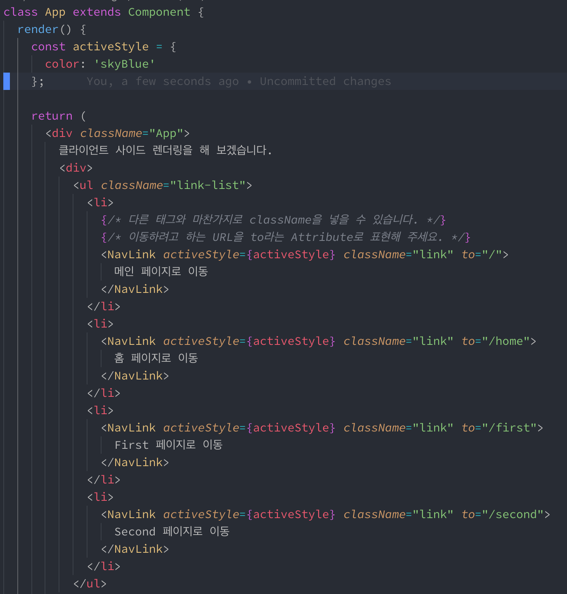

이렇게 만든 후에 웹 페이지를 확인해 보면, 신기하게도 특정 링크를 클릭할 때 마다 스타일이 바뀌는 현상을 볼 수 있습니다.

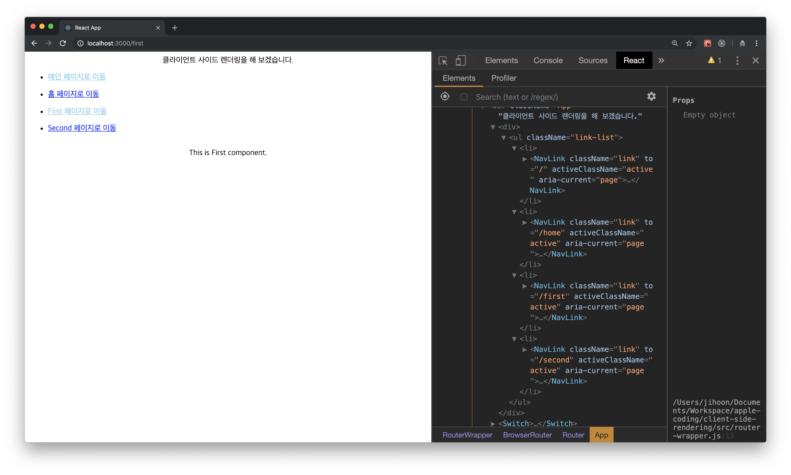

한가지 문제가 있다면, 어떤 URL 링크를 클릭 하던지, 메인 링크는 활성화가 되어 있다는 점 인데요, Route태그에서 마주쳤던 문제와 같은 현상입니다. Route 태그에서 이 문제를 해결하기 위해서 exact라는 속성을 태그 내에 삽입하는 방법이 있었는데요, NavLink도 같은 방식으로 해결할 수 있습니다.

그 후 웹 페이지를 보면 우리가 원했던 효과를 제대로 수행하는 것을 볼 수 있습니다.

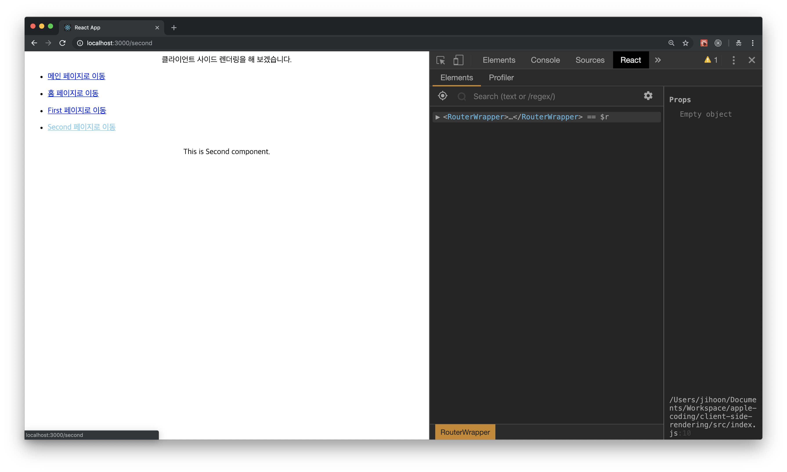

지금까지 리액트에서 CSR, SSR의 차이, Route와 Switch를 이용한 Client routing에 대해서 알아보았습니다.

다음 장은 단순히 클릭을 통해서 다른 라우트 페이지 전환을 하는 것이 아닌, 크롬의 뒤로가기 버튼을 리액트 상에서 구현해 보도록 하겠습니다.

