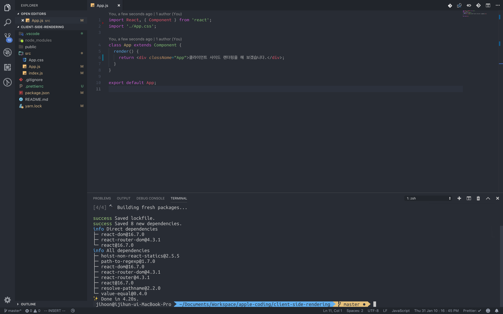
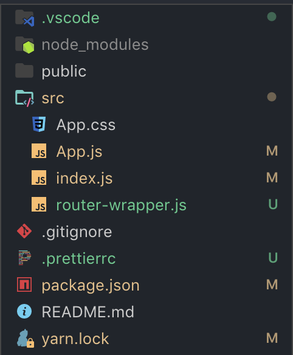
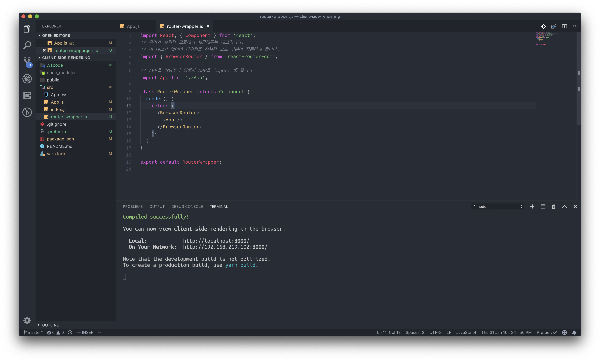
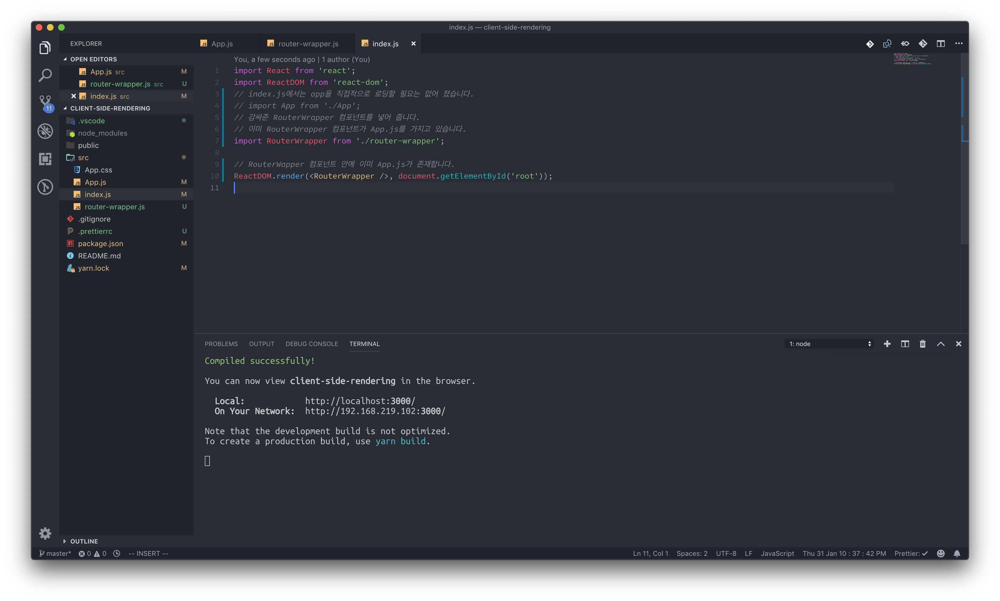

# Routing \(준비\)

### 서버사이드 렌더링 방식의 라우팅

특정 검색 사이트 웹 페이지 메인에 들어갑니다. -&gt; 메인 페이지가 나옵니다. 

검색을 합니다. -&gt; 검색 결과 페이지가 나옵니다.

뉴스에 들어갑니다. -&gt; 뉴스 페이지가 나옵니다.

이 각각의 페이지 3개를 들어 갈 때마다 다른 자바스크립트, HTML, CSS 파일이 로드됩니다. 페이지 3개를 구현하기 위해서 3개의 HTML과 각각의 페이지에서 사용되어야 하는 자바스크립트, CSS가 필요합니다. 미리 서버에서 HTML뷰가 완성되어 있고, 사용자는 그 응답을 받은 즉시, 또는 아주 짧은 시간 내에 웹을 사용할 수 있습니다. 처음 로딩이 굉장히 빠르지만, 페이지를 넘어갈 때 느리다는 단점이 있습니다.

### 클라이언트 사이드 렌더링 방식의 라우팅

검색 페이지, 메인 페이지, 뉴스 페이지 모두 같은 자바스크립트와 같은 CSS파일을 가집니다. URL이 달라질 때 마다 서버에 요청을 하는 것이 아닌, 자바스크립트에 그에 맞는 뷰를 생성해서 로드해 줍니다. 오늘 실습해볼 예제는 클라이언트 사이드 리액트 입니다. _\(리액트에서도 서버사이드 렌더링이 가능함\)_  클라이언트 사이드 렌더링 방식의 단점은, 아직 들어가지도 않은 뷰에 대한 자바스크립트를 미리 가지고 있기에, 초기 로딩이 서버사이드 렌더링에 비해서 느립니다.

### 클라이언트 사이드 렌더링 실습 해 보기

create-react-app 프로젝트를 생성해 주세요.

`npx create-react-app client-side-rendering`

클라이언트 사이드 렌더링을 진행하기 위해선, 외부 모듈 설치가 필요합니다. 생성된 프로젝트 폴더로 들어간 후, 다음 모듈을 설치해 주세요.

`npm install react-router-dom or yarn add react-router-dom`

리액트에서 라우팅을 할 수 있게 도와주는 모듈입니다. _\(실제로 많은 사람들이 이 모듈을 사용합니다.\)_

[프로젝트를 비워 주겠습니다. ](https://ljh86029926.gitbook.io/codingapple-react-class/create-reactapp-using-cra-5min)

### BrowerRouter - CSR을 위한 준비

우선, 클라이언트 사이드 라우팅을 위해선, 클라이언트 라우팅에 사용될 HTML 부분을 브라우저 라우터 라는 특별한 태그로 감싸 주어야 합니다. 브라우저 라우터 태그로 감싸진 부분은 URL이 바뀜에 따라서 설정해놓은 라우트에 맞는 컴포넌트가 자동으로 로딩되게 됩니다. _\(이 태그는 우리가 설치한 리액트 라우터에서 제공해주는 태그입니다.\)_ 지금 만드는 페이지 에서는 App.js전체를 라우팅으로 사용할 것이기 때문에, App.js 컴포넌트 전부를 브라우저 라우터로 한번 감싸 주겠습니다. 코드의 지저분함을 방지하기 위해서 다른 파일을 하나 더 만들어서 감싸도록 하겠습니다. src 폴더에 router-wrapper.js파일을 생성해 주세요.

그런데, 지금은 어디에서도 router-wrapper.js를 불러내는 곳이 없습니다. 실제로 브라우저에 렌더링 되는 부분은 index.js에서 렌더해 주고 있는 &lt;App/&gt; 컴포넌트 입니다. 이 부분을 router-wrapper 컴포넌트로 넣어 주도록 하겠습니다.

완료하게 되면, 실제 브라우저 상에서는 바뀐 내용을 찾을 수 없을 것 입니다. 그러나 리액트 개발자 도구로 다시 한번 살펴보게 되면, 새로운 태그가 App을 덮고 있는 것을 확인하실 수 있습니다.

개발 상으로만 존재하는 태그가 있습니다. 이제 준비를 전부 끝냈으니, 기본적인 라우팅에 들어가 보도록 하겠습니다.

