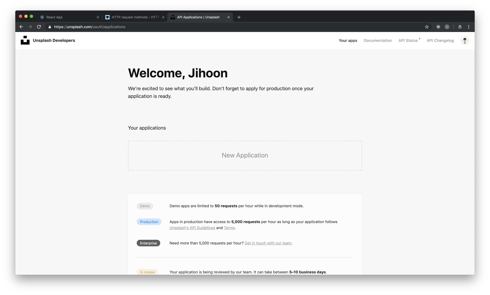
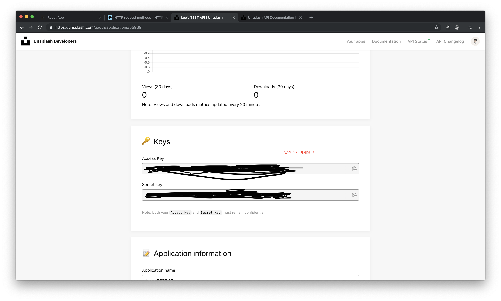
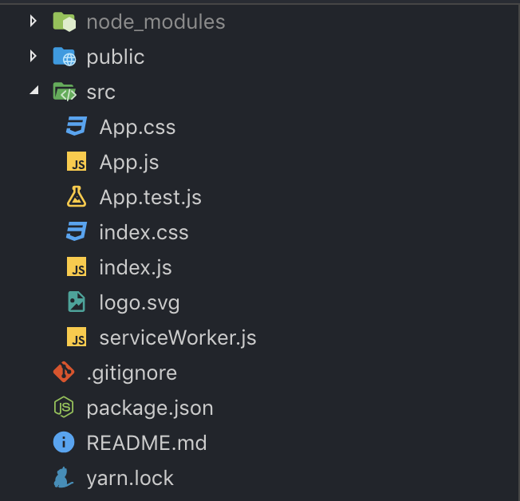

# 4강 - Unsplash API를 이용한 사진첩 만들기

Unsplash API를 이용해서 간단한 사진접 프로젝트를 제작해 보도록 하겠습니다. [Unsplash](https://unsplash.com/) 는 다양한 주제의 사진을 이용할 수 있는 웹 사이트 입니다.

### Unsplash 회원가입


회원이신 분들은 로그인 해 주세요. 회원이 아니신 분들은 회원 가입을 부탁 드립니다.


### Unsplash API 발급받기

API를 사용하기 위해서는 API를 사용할 수 있는 key를 발급 받아야 합니다. Developers 전용 메뉴가 있기 때문에 우선 이동해 주세요. [이동하기](https://unsplash.com/developers)


Your apps라는 메뉴를 누르고 들어가 주세요. 그렇게 되면 다음과 같은 화면이 나타날 것 입니다.



New Application버튼을 클릭해 Demo버전의 Application하나를 생성해 주도록 하겠습니다.


Create Application 버튼을 클릭하게 되면 Demo버전의 Application이 생성될 것 입니다.


밑으로 스크롤을 조금 해 보면 Key와 관련된 부분이 보일 것 입니다.



우리에게 필요한 키는 AccessKey 뿐입니다. 바로 가져다 사용할 수 있는 곳이나 편한 공간에 저장해 주세요.

### 프로젝트 세팅하기

이제 프로젝트를 시작할 준비가 끝났습니다. 리액트 작업에 들어가 보도록 하겠습니다.

`npx create-react-app unsplash` 를 통해 프로젝트를 하나 생성해 주시고,

`yarn add axios node-sass styled-components` or `npm i axios node-sass styled-components`설치하신 패키지 매니저에 맞추어 모듈 설치를 진행해 주세요. axios 라이브러리를 사용하는 이유는 Promise기반이기 때문에 에러 핸들링을 하기에 간편하고,  누구나 빠르게 익힐수 있을 정도로 라이브러리의 복잡도가 낮기 때문에 사용합니다.




기존 App.css, index.css도 확장자를 변경해 주었습니다. _logo, serviceWorker같은 파일은 지우셔도 되고 안 지우셔도 됩니다._

### State형태, 메소드 제작하기

모든 값은 App.js에서 핸들링 될 예정입니다. 당연하게도 State가 App.js에 있으니 모든 변경도 App.js에서 일어납니다.

#### State 세팅

기본적으로 어떤 데이터를 가지고 있어야 하는지를 알아야 합니다. 우선 당연히 이미지들의 URL이 string 배열 형태로 담겨져 있는 state 객체 하나면 충분합니다. 에러 핸들링을 위해서 나중에 변수 몇 개가 추가될 예정이지만, 일단 지금은 state안에 배열 하나를 생성하는 것으로 하겠습니다. App.js를 변경해 주세요.


이제, 이미지를 불러오는 API를 제작 할 것 입니다. App.js에 메소드를 하나 만들어 주겠습니다.


저 메소드는 딱히 특별한 점이 없습니다. 다만 조금 이상하게 느껴질 부분이 setState부분인데요, 첫 번째 인자는 이미지를 이어준다고 치고, 두 번째 인자는 굉장히 이상한 코드같이 보입니다. 하지만 저 부분은 Unsplash의 API response값 중에서, 이미지만 빼내오려고 했기 때문에 저런 구문이 쓰여졌습니다.


지금 사진에 보이는 count === 30이기 때문에, 랜덤 사진 요청을 보내면 30개의 랜덤 사진 요청응답이 옵니다. 그 30개의 정보들 중에서 우리에게 필요한 사이즈의 이미지 URL만 골라서 state를 업데이트 해야 하기 때문에 response를 setState하는 과정이 이상하게 느껴질 수도 있으나 필요한 부분입니다.

### 사진 컴포넌트 제작하기

사진 하나를 나타내 줄 수 있는 picture 컴포넌트를 제작해 보도록 하겠습니다.


### 사진 리스트 컴포넌트 제작하기

picture, picture-list 컴포넌트 두 개를 만들었습니다. 그 중에 사진들의 전체적인 리스트를 관리하는 picture-list 컴포넌트를 만들어 보도록 하겠습니다.


picture-list styled-components 부분



```javascript
const Content = styled.div`
  margin-top: 1rem;
  /* Prevent vertical gaps */
  line-height: 0;
  @media screen and (max-width: 832px) {
    -webkit-column-count: 1;
    -webkit-column-gap: 0px;
    -moz-column-count: 1;
    -moz-column-gap: 0px;
    column-count: 1;
    column-gap: 0px;
  }
  @media screen and (min-width: 833px) and (max-width: 1232px) {
    -webkit-column-count: 2;
    -webkit-column-gap: 0px;
    -moz-column-count: 2;
    -moz-column-gap: 0px;
    column-count: 2;
    column-gap: 0px;
  }
  @media screen and (min-width: 1233px) and (max-width: 1632px) {
    -webkit-column-count: 3;
    -webkit-column-gap: 0px;
    -moz-column-count: 3;
    -moz-column-gap: 0px;
    column-count: 3;
    column-gap: 0px;
  }
  @media screen and (min-width: 1633px) {
    -webkit-column-count: 4;
    -webkit-column-gap: 0px;
    -moz-column-count: 4;
    -moz-column-gap: 0px;
    column-count: 4;
    column-gap: 0px;
  }
`;

```



### App.js에 적용시키기

일단 첫 번째로 해야할 일은, PictureList 컴포넌트를 App.js에 넣어주는 겁니다. props로는 images를 넣어주면 됩니다. 그 다음으로 해야할 일은 기본 API 요청 입니다. 현재 사이트에 접속했을 때에는 빈 배열이기 때문에 접속했을 때 빈 화면이 보입니다. 사진이 보이게 하기 위해서는 API요청이 가야 합니다. 적당한 LifeCycle은 componentDidMount가 있겠네요. 




```css
.App {
  > span {
    font-size: 2rem;
    font-weight: bold;
    margin: 1rem;
  }
}
```



전부 완료된 뒤에 브라우저 화면을 보면 의도한 대로 잘 출력됩니다.


