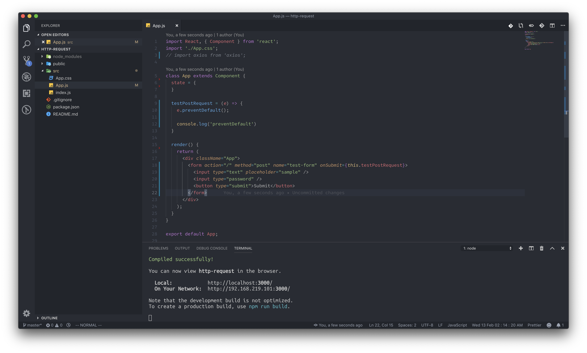

# Form in react

우리가 흔히들 회원가입, 로그인 페이지를 만들 때 사용하는 form태그, 자체 이벤트가 완료된 후에는 페이지를 refresh하는 특징을 가지고 있습니다. 그러나 우리가 사용하는 리액트의 특성상, 이런 방식은 좋지 못한 것 같습니다. 항상 거의 모든 페이지에 대한 정보를 미리 처음 로딩 때 받아오는데, 단순히 회원가입 요청이나 로그인 요청 때문에 페이지를 다시 리로드 한다는 것은 좋은 일이 아니라고 생각합니다. 그래서 우리는 이번에 리액트 안에서 form의 기본 refresh 되는 부분을 방지해 보도록 하겠습니다.

방법은 총 3가지가 있습니다.

### Form 태그를 사용하지 않는다

가장 확실한 방법이기도 하면서 가장 귀찮은 방법이기도 합니다. 기존 form태그를 사용했을 때는 엔터 클릭이면 요청 전송이 되었는데, form태그를 사용하지 않으면 프로그래머가 입력 부분에 전부 이벤트를 걸어주어야 합니다.

### preventDefault\(\)를 사용한다

이 방법이 가장 이상적이고 좋은 방법이라고 생각합니다. 프로젝트를 열고 실습을 시작해 보도록 하겠습니다.

프로젝트 파일은 [https://ljh86029926.gitbook.io/codingapple-react-class/ajax-in-react](https://ljh86029926.gitbook.io/codingapple-react-class/ajax-in-react) 에서 그대로 사용하셔도 무방합니다. 우선 App.js에 form태그를 이용한 간단한 요청을 제작해 보도록 하겠습니다.

App.js파일을 다음과 같이 수정해 주세요.

단순히 onSubmit에 자신이 사용할 메소드만 걸어놓는다고 리 렌더링이 비활성화되지는 않습니다. 가장 필요한 부분은 testPostRequest에 있는 preventDefault부분입니다. e는 onSubmit이 실행 될 때의 전달인자 입니다. _\(currentTarget이 form\)_ preventDefault는 리액트에서만 사용할 수 있는 것은 아닙니다. 그렇기 때문에 이벤트 인자로 전달되어있는 e를 이용해서 preventDefault를 수행할 수 있었던 것이죠.

앞으로 리 렌더링 요청을 방지하고 싶을 때에는 preventDefault를 사용하면 될 것 같습니다.

