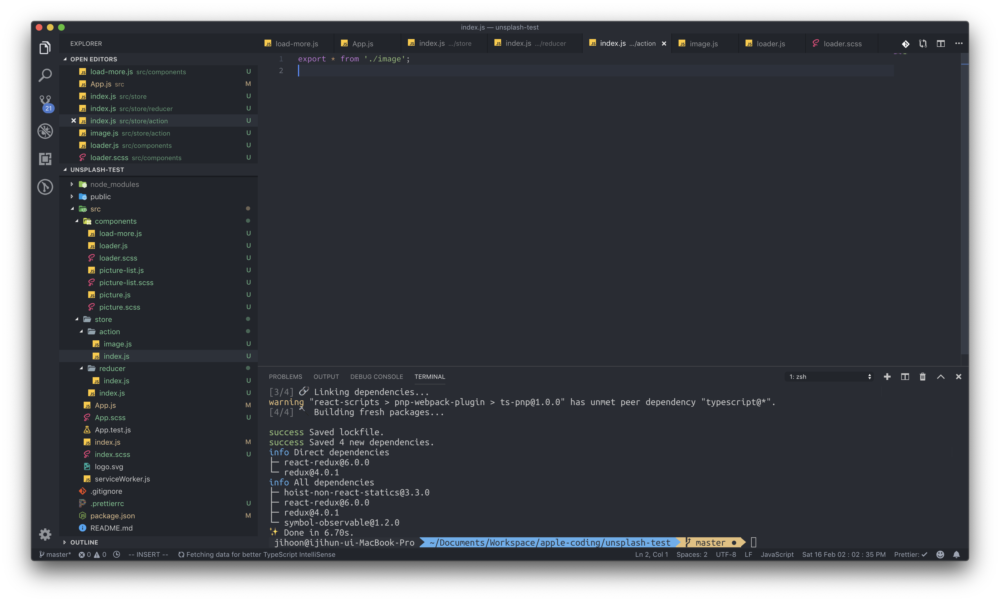

# Redux - 데이터를 관리하는 또 다른 방법 - Deprecated

상태 관리, state관리에 대한 필요성을 아직까지는 느끼시지 못했을 지도 모릅니다. 왜냐하면 1강부터 4강까지의 내용이 복잡한 state를 다루는 내용이 아니였기 때문입니다. 그러나 실제 리액트로 개발을 하게 되면 아주 복잡하게 상호작용하는 state와 메소드를 관리해야 합니다. 그럴 때 개발자에게 도움을 줄 수 있는 것이 바로 리덕스 입니다. 리덕스는 컴포넌트에서 관리되는 state를 Store라는 state공용 관리 구역을 두어 컴포넌트들이 props를 부모로부터 받아오는 것이 아닌, store로부터 받아오는 형태를 띱니다. 

먼저, 저 사진에 나온 요소 하나가 리액트 컴포넌트라고 가정합니다. 그리고 마지막에 있는 AA, BB컴포넌트들이 같은 state를 props로부터 받는다고 했을 때, 그 state가 관리되어야 하는 곳은 공통으로 가지고 있는 부모 컴포넌트인 App컴포넌트로부터 state를 전달받아야 합니다. 그런데 이 부분이 굉장히 까다롭습니다. 거쳐가야 하는 컴포넌트가 4개나 되기 때문입니다. 이 부분은 프로그래머로 하여금 매우 지치게 만드는 요소입니다. 이름 하나만 변경해도 모든 자식 컴포넌트가 받는 props의 이름도 변경되어야 하니까요. 다시 한번 얘기하지만 이런 문제점을 해결하고자 등장한 것이 리덕스 입니다.

이렇게 되면 개발자가 생각해야 하는 저장소는 오직 store한 개밖에 없기 때문에 데이터 변화에 신경을 곤두세울 일이 줄어들고, props를 계층별로 계속 내려주지 않기에 개발상 오류가 발생할 수 있는 여지가 줄어듭니다. 그렇기 때문에 복잡한 state를 다룰 때에는 그 이점이 더욱 증가하는 것 입니다.

### 좋은 이유는 알겠어, 그러면 이제 꼭 리덕스를 사용해야만 하나?

그렇지는 않습니다. 리덕스 개발자인 Dan abromove의 포스트에 따르면 그렇습니다. [https://medium.com/@dan\_abramov/you-might-not-need-redux-be46360cf367](https://medium.com/@dan_abramov/you-might-not-need-redux-be46360cf367)

저 내용을 간단하게 설명드리자면, 리덕스를 무작정 사용할 필요는 없고 꼭 필요한 상황에 리덕스를 적재적소에 사용하라 라는 의미입니다. 리덕스가 필요 없는 리액트 앱을 만들게 될 지도 모르니까요.

### 그래도 한 번 시도 해보는 것이 어떨까?

오늘은 간단하지만 리덕스 실습을 해 보도록 하겠습니다. 기존에 만들었던 unsplash 앱을 수정하는 방식으로 리덕스를 사용해 보도록 하겠습니다. 그 전에, 리덕스의 특징에 대해서 짚고 넘어가도록 하겠습니다.

### 리덕스의 특징 3가지

#### Store는 오직 한개입니다.

Store는 리덕스의 데이터 집합소를 얘기합니다. 여러 가지 State들이 머물러 있는 공간입니다. 그러나 이 Store는 두 개 이상이 되면 안 됩니다. 반드시 하나의 큰 store라는 공간 안에 모든 값들을 넣어 놓아야 합니다.

#### Store의 state는 오직 액션으로만 변경 가능합니다.

store로부터 받는 state는 setState할 수가 없다는 의미입니다. 애초에 props로 받는 것이기 때문에 불가능 하지만요. 그렇기 때문에 state를 변경하기 위해서는, 액션을 실행시켜 Reducer에서 state를 변경 시키는 방법 밖에는 존재하지 않습니다.

#### 어떤 요청이 와도, 리듀서는 같은 행동을 해야 합니다.

순수해야 합니다. 이 말을 더 자세히 풀어서 설명해 드리겠습니다. 리듀서는 하나의 함수입니다. 함수에 들어오는 액션의 이름을 통해서 특정 액션일 때는 state를 특정 액션의 리듀서 변경 함수 대로 처리됩니다. 그러나 이 부분에서 반드시 함수는 순수해야 합니다. 외부 인수를 활용하지 않아야 하고, API호출 같이 변칙적인 작업은 진행이 되면 안 됩니다. 

### 리덕스의 실행도

리덕스를 이해하기 위해서는 Store, Action, Reducer에 대해서만 알고 있으면 됩니다. 우선 처음은 간단한 Store입니다. Store는 말 그대로 state를 저장하는 저장소 입니다. 다음은 Action 입니다. Action의 역할은 store로부터 받은 state데이터를 변경하고 싶을 때 사용하는 일종의 실행 메소드 같은 역할을 합니다. 마지막으로 Reducer인데, Reducer는 Action을 통해서 받은 Action의 이름에 따라서 그 액션에 맞는 reducer함수를 실행시켜 state를 변화시키는 역할을 합니다.

실제 프로세스를 예로 들어 설명해 드리겠습니다.

어떤 리액트 앱의 store에는 count라는 값 밖에 들어있지 않다고 가정해 봅시다. count의 타입은 number 입니다. 이 앱의 리덕스에는 두 개의 액션이 존재합니다. increment와 decrement. 이 액션은 count를 1더하게 하기 위해서 만들어져 있습니다. Reducer에는 increment와 decrement의 액션을 받았을 때 실행되는 로직이 담겨 있습니다. 이 리액트 앱 에서는 버튼 증가 버튼을 누를 때마다 \(increment Aciton을 실행했을 때\) increment액션이 실행되면서 reducer에 정의되어 있는 increment의 함수를 통해  count의 값이 1 증가하고, 감소 버튼을 누를 때마다 count의 값이 1 감소하는 로직입니다.

### Unsplash API를 이용한 리덕스 실습

* _\(지금 진행하는 수업은 이해가 잘 되지 않을 수도 있습니다. 수많은 반복학습이 필요 할 수도 있습니다. 개념은 어렵지 않지만 그 개념을 리액트에 적용시켜 이해하기가 처음 할 때는 쉽지 않습니다.\)_

### 리덕스 모듈 설정하기, \(Action, Reducer\)

Unsplash API를 이용해서 제작했었던 프로젝트를 리덕스를 사용해서 데이터 관리르 하는 프로젝트로 변경을 해 보도록 하겠습니다. 만들어두셨던 프로젝트를 열어 주세요.

리덕스를 사용하기 위해서는 리덕스 전용 모듈을 설치해 주어야 합니다.

`yarn add redux react-redux` or `npm i redux react-redux`

이 모듈들이 리액트 안에서 리덕스를 사용할 수 있도록 도와주는 모듈 입니다. 리덕스 폴더 구성을 진행해 볼까요?

store라는 폴더 안에 action이라는 폴더와 reducer라는 폴더를 생성해 주세요.

그리고 각 폴더 안에 전부 index.js를 만들어 주세요. 모듈 간 export import를 index.js에서 진행시켜 나중에 복잡도를 줄이기 위함입니다. 우리는 이미지를 로딩하는 액션, 이미지 로딩이 성공했을 때의 액션, 이미지 로딩이 실패했을 때의 액션을 만들 것 입니다. 

이미지를 로딩하는 액션은 state로 사용되고 있던 isPending변수를 변경하기 위한 액션입니다.

이미지 로딩이 설공했을 때의 액션은 isPending변수의 값을 다시 false로 변경하고, 받은 이미지를 추가하기 위한 액션입니다.

이미지 로딩이 실패했을 때의 액션도 마찬가지로 isPending변수의 값을 false로 변경하고, 이미지 요청 API실패를 핸들링 하기 위한 액션입니다.

우선 action폴더 안에 image.js라는 파일을 다시 생성해 주세요. 3개의 액션을 생성해 줄 것 입니다.

우선 가장 위에 있는 3개의 스트링 변수는 액션의 이름을 나타냅니다. **리듀서에서 어떤 액션이 요청되었는지를 알기 위해서 스트링을 통해 변수를 설정해 준 것 입니다.** 리듀서는 특정 액션에 따라서 그 액션에서 원하는 로직으로 store를 변경시켜 주어야 하기 때문입니다. 변수 이름을 저렇게 지어준 이유는 딱히 없습니다. 다만 많은 사람들이 액션 이름을 생성할 때 저 방식을 따릅니다. _\(모두 대문자, 글자 사이에 언더바\)_

다음으로 중간에 있는 3개의 변수는 액션을 실행시키는 함수를 나타냅니다. imageLoad 함수는 타입만을 리턴 해 주고, imageLoadSuccess는 image라는 파라미터를 받아서 타입과 함께 payload로 리턴을 해 줍니다.

payload라 함은 리듀서에 특정 액션의 type과 함께 payload를 보내 payload를 바탕으로 store의 state를 업데이트 하기 위함입니다. 지금의 예제로 들면 새로운 이미지 데이터를 payload로 전달해 store가 새로운 이미지를 추가할 수 있도록 합니다. 마지막은 이미지 액션 실패 시 실행하는 액션 입니다. 전달해 줄 값은 없기 때문에 이미지 로딩이 시작되었을 때 와 같은 형태를 띱니다. 

다음은 리듀서를 제작해 보도록 하겠습니다. reducer폴더 내에 image.js파일을 생성해 주세요.

우리는 IMAGE\_LOAD, IMAGE\_LOAD\_SUCCESS, IMAGE\_LOAD\_FAILURE이렇게 3개를 생성해 놓았기 때문에 리듀서에도 3개의 액션에 대한 로직만 작성해 두면 됩니다. switch case를 통해서 우리가 각 액션을 만들때 정해 놓았던 type을 기준으로 어떤 액션이 실행되었는지를 감지하게 됩니다.

index.js파일에서도 리듀서를 export 해 주도록 하겠습니다. 그러나 action을 해 주는 것과는 다르게 export 해 주도록 하겠습니다.

스토어는 유일해야 한다는 얘기 기억하시나요? 그러나 앞으로 리덕스를 이용한 웹 개발 시에는 절대로 하나의 액션, 하나의 리듀서 파일로는 핸들링 할 수 없을 정도의 많은 state를 다루게 될 텐데, 그렇게 되면 별도의 액션, 별도의 리듀서가 필요합니다. 그럴 때 흩어진 리듀서들을 하나로 모아서 하나의 스토어로 병합시켜 주는 로직이 필요한데, combineReudcers가 그 역할을 해 줍니다.

이제 기본적인 모듈 설정이 끝났습니다. 다음은 우리가 만들었던 이런 액션들을 방출시켜 주어야 합니다. 정확히는 App.js가 있는 컴포넌트 부분에 store의 state, action들을 전달해 주어야겠죠. 그렇기 위해서는 지금 만들어둔 모듈을 export 해 줄 필요가 있습니다. store에 있는 index.js파일을 다음과 같이 수정 해 주세요.

### 리덕스 모듈을 컴포넌트로 전달하기

이제 리덕스 모듈 생성이 완료되었습니다. 그러나 이걸 사용하도록 하기 위해서는 react-router-dom을 사용했을 때와 마찬가지로 리덕스를 연결해 주어야 합니다. 프로젝트 src폴더의 최상단에 있는 index.js파일을 수정해 주세요.

리덕스를 사용하기 위해서 Provider라는 react-redux에서 제공하는 모듈을 통해 App.js를 감싸 주었습니다.

### State에서 리듀서로 변경하기

App.js컴포넌트를 변경하기 전에, 한가지 폴더를 더 생성해서 연결 작업을 해 주어야 합니다. 이 작업을 간편하게 하기 위해서는, 기존 컴포넌트 구조를 살짝 변경해 주어야 합니다. src폴더 아래에 container라는 폴더를 생성해 주세요. 기존에는 App.js의 state를 데이터로 삼아 picture-list, load-more컴포넌트에 App.js에 있는 state변경 함수를 전달해 주었다면, 이제는 리덕스에 있는 store를 props로 받아와야 합니다. 그 때 번거로울 수 있는 구조를 조금 더 쉽게 만들어 주는 것이 바로 container입니다. picture-list.js파일을 컨테이너 폴더에 생성해 주세요. 또한 load-more.js파일도 컨테이너 폴더에 생성해 주세요.

connect는 react-redux에서 연결 해 주는 모델이고, connect는 함수입니다. 2개의 인자를 담는데, 첫 번째 인자는 store로부터 불러올 state입니다. 두 번째 인자는 store에서 실행할 action 이구요. 그렇기 때문에 버튼을 통한 로딩이 필요 없는 picture-list 컴포넌트는 액션이 필요하지 않고 state만 필요합니다. 반대로 load-more컴포넌트는 액션이 필요하죠. 그렇기 때문에 상황 따라서 컴포넌트에 전달해 줄 값을 다르게 설정할 수 있습니다.

준비는 완료 되었습니다. 이제 App.js컴포넌트를 수정해 주도록 하겠습니다. _\(state를 제거하는 일 입니다.\)_

기존 컴포넌트로부터 받아왔던 state는 필요가 없기 때문에 삭제했고, 새로 리덕스로부터 연결되어서 받아올 container에 있는 컴포넌트를 렌더링 해 주었습니다. 그런데 지금 지워진 부분이 있죠? 바로 loader컴포넌트 입니다. App.js는 직접적으로 isPending이라는 store의 값을 가져오고 있지 않기 때문에 loader 컴포넌트의 위치를 변경시켜 주도록 하겠습니다. 위치는 Picture-list컴포넌트가 좋을 것 같네요. isPending을 컨테이너 컴포넌트로부터 받아오는 유일한 컴포넌트 이기 때문입니다. picture-list컴포넌트를 수정해 주세요.

마지막으로 액션을 전달받는 loadMore컴포넌트를 수정해 주어야 합니다. 현재는 받은 액션을 실행하고 있지 않기 때문이죠.

다른 점이 하나 있다면, App.js에서 실행되던 API로직은 setState를 통해서 상태관리가 이루어 졌습니다만, 이제는 action을 실행시킴으로써 값을 변화시킵니다. API요청이 시작할 때 imageLoad액션을 실행시켜 isPending을 true로 바꾸어 줍니다. 그렇게 되면 Picture-list컴포넌트에서 받고 있는 isPending의 값이 변경됨에 따라서 로딩 애니메이션이 나오게 됩니다. API요청이 끝나게 되면 성공 액션과 실패 액션 둘 중 하나를 실행시켜 리듀서에서 로딩을 끝내고 새로운 이미지를 로딩시켜 줍니다.

여기까지 unsplash 프로젝트를 리덕스로 전환해보는 실습이 끝났습니다. 수고하셨습니다.

