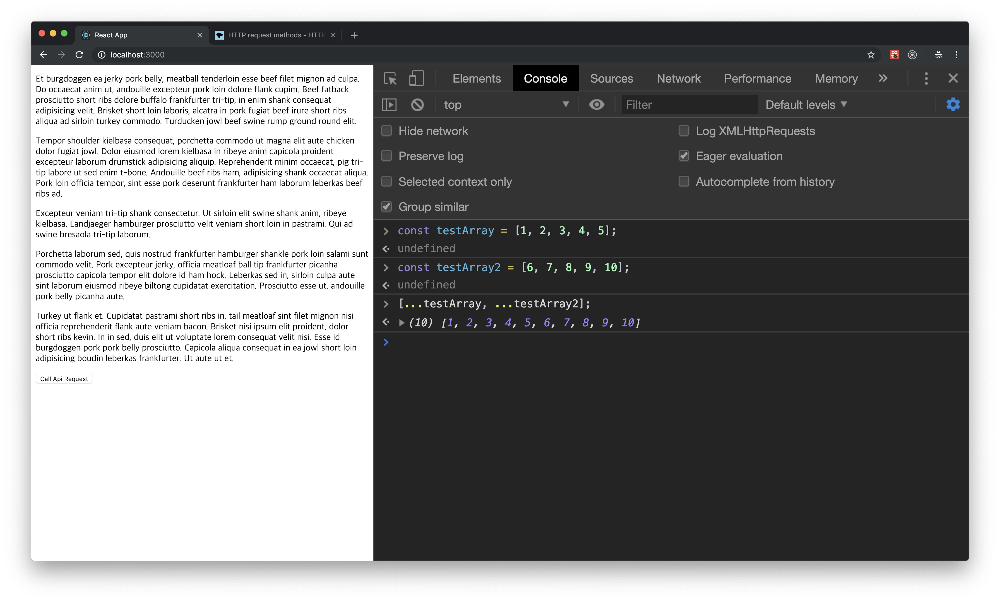

# 4강 - Ajax In React

하루에 많은 사이트를 돌아다니는 행동 자체가, 서버에 GET요청을 하는 것 입니다. 로그인 요청을 하는 것도, POST 요청을 하는 것 입니다. 수많은 API요청 속에서 이번에는 리액트에서의 API 요청을 해 보도록 하겠습니다.

### 기존 웹 페이지에서 하던 Ajax요청과 뭐가 다른거지?

앞으로 리액트에서 API 요청을 할 때, 특별한 상황을 제외하고는 페이지를 새로고침 하지 않는 방법을 사용하게 될 것입니다. 예를 들면, 기존 웹 페이지를 할 때 로그인 폼을 만들때면 POST요청을 하는 form 태그를 이용해서 로그인 요청을 하곤 했습니다. 하지만 리액트에서는 이런 방식을 특별한 상황을 제외하고는 사용하지 않습니다. API 요청을 할 때, from태그의 기본 동작을 막고, API요청을 따로 합니다. 그래서 그 응답을 기준으로 사용자와 인터렉션하게 됩니다. 상황에 따라서 사용자는 API요청이 오고가는지 조차 못 느끼게끔요. 사용자의 웹 페이지 사용자 경험을 올라가게 할 수 있습니다. 이런 API 요청을 우리는 Axios 라는 라이브러리를 통해서 진행하게 될 것입니다.

#### Axios가 절대적인 Ajax라이브러리는 아닙니다.

axios라는 라이브러리 사용법이 간단하고 실습하기에 좋아서 이번 강의에서 axios를 사용하기로 했습니다. 개인적으로 더 편한 라이브러리가 있으시다면 그 라이브러리를 통해서 진행하셔도 상관이 없습니다. 사용법만 다를 뿐 같은 작업을 하기 때문입니다. Ajax를 먼저 배우기 전에, GET, POST같은 요청들의 개념에 대해서 먼저 알아보도록 하겠습니다.

### GET, POST, PUT, DELETE ?

이것은 HTTP request를 할 때의 타입입니다.

그래서 우리가 요청하는 거의 모든 요청들이나 앞으로 만들 모든 요청들은, 저 명세를 따라서 만들게 됩니다. 많은 사람들이 저 명세를 따라 지키면서 웹 서버를 제작합니다. 프론트에서 요청을 보낼 때에도 당연히 맞추어 주어야 합니다. 같은 API request URL이라도 http 타입이 다르게 되면 다른 기능을 하도록 만들 수 있습니다. 기본적으로 우리가 페이지를 드나들거나 필요한 데이터를 요청하는 것들에 대한 http 타입은 GET타입 입니다. 이번 시간에는 GET을 사용해서 데이터를 주고받는 실습을 하게 될 것입니다.

### 프로젝트 세팅

`npx create-react-app http-request` 를 통해서 프로젝트를 하나 생성해 주세요. 프로젝트를 생성하신 후에는, 프로젝트를 쉽게 개발할 수 있게끔 정리해 주세요. 또한 라이브러리를 하나 설치해야 합니다. 리액트에서도 기본적으로 제공하는 fetch라는 라이브러리가 있지만 이번 강의에서는 그보다 더 편하게 느껴질 수 있는 axios를 사용하겠습니다. axios를 설치해 주세요.

`yarn add axios 또는 npm i axios` 라이브러리 설치가 완료되고 나면, 이제 본격적인 실습을 해 보도록 하겠습니다.

### API request

App.js를 다음과 같이 수정해 주세요.

axios 라이브러리의 사용법은 꽤나 간단합니다. axios를 default import를 한 후에, axios.HTTP메소드이름 을 붙이는 형식으로 Ajax요청이 가능합니다. 단순히 URL말고도 헤더 안에 필요한 정보들을 넣어 줄 수도 있고, POST요청이나 PATCH요청을 할 때에는 body안에 JSON같은 데이터도 같이 전송할 수 있습니다. 하지만 지금의 예제는 단순히 텍스트를 요청하는 예제이므로, 필요한 것은 URL 주소 하나 밖에 없습니다. 

axios가 사용되어지는 부분에서, API 요청 부분에 then, catch라는 키워드로 Chaining이 되어 있는 것을 볼 수 있습니다. 저 문법은 Promise라고 해서 비동기 요청을 할 때에 유용하게 사용할 수 있는 문법 입니다. axios라이브러리도 Promise를 기반으로 작성되어 있기에 우리가 then, catch와 같은 키워드를 사용할 수 있는 것 입니다. _\(_[_Promise에 대한 문서는 MDN에 잘 정의되어 있습니다._](https://developer.mozilla.org/ko/docs/Web/JavaScript/Guide/Using_promises)_\)_

이 작업을 끝낸 후에 [http://localhost:3000](http://localhost:3000)에 접속해서 개발자 콘솔을 열고 확인해 주세요. 다음 사진과 같은 화면을 볼 수 있을 것 입니다.

Axios를 통해서 API요청의 response값을 출력했습니다. 받은 데이터는 5개의 배열입니다. 

### Response to State

이 데이터를 state로 전환해서 화면에 출력해 보도록 하겠습니다. 우선 데이터를 setState를 통해 먼저 담아 주겠습니다.

이제 이 API를 출력해야겠죠? render 함수 부분을 사진처럼 수정해 주세요.

기본적인 API를 호출해서 state에 데이터를 넣고, 사용자의 뷰 까지 보여주는 기본적인 실습은 끝났습니다. 그러나 끝내기 보다는, 사용자의 인터렉션을 통해서 API 통신을 하는 예제를 또 한번 작성해 보도록 하겠습니다.

### Request by user

App.js의 render부분에 다음과 같은 구문을 작성해 주세요.

이렇게 적용한 후에 브라우저에 있는 버튼을 클릭하게 될 때마다 다시 API요청을 수행해 새로운 state로 대체합니다.

지금 예제는 setState를 통해서 데이터를 새롭게 바꾸는 작업을 수행 했지만, 이번에는 버튼을 누르면 기존의 문자열에 새로운 API요청의 문자열이 추가되는 형태로 변경해 보도록 하겠습니다.

App.js의 requestApi함수를 변경해 주세요.

여기서 조금 생소한 문법이 보이실 수도 있습니다. setState를 하는데 배열 안에 있는 두 개의 값 앞에   
`...` 이라는 문자가 붙어 있습니다. Spread문법으로, ES6문법 중 하나입니다. 이 문법에 대해서 설명을 드리도록 하겠습니다.

이 두개의 배열을 하나의 배열로 병합하기 위해서는 어떠한 방법을 사용해야 할까요? 방법은 많습니다. concat이라는 메소드를 활용한 방법도 있고 무궁무진 합니다. 그러나 이번에는 ES6에 추가된 spread라는 문법을 사용해서 두 개의 배열을 병합해 보도록 하겠습니다.

이제 사용법이 느껴지시나요? 둘러싸고 있는 큰 배열\(객체도 해당\) 안에 배열\(객체\)을 spread문법을 사용한 형태로 입력하게 되면 그 안에 모든 요소가 들어가게 됩니다. 이런 문법을 굳이 사용하는 이유는, 불변성 유지 때문이기도 합니다. 리액트에서 state는 불변성을 유지 하면서 업데이트 되어야 하기 때문입니다. _\(자체 메소드로 state를 변경해도 리 렌더링이 되지 않는다. 오직 setState를 통한 업데이트만 리 렌더링을 하게 됨\)_ 또한 추후에 사용할 리덕스에서 변수를 업데이트 할 때에는 항상 불변성을 유지해 주어야 하는데, 리덕스를 사용하는 상황에서 spread문법을 자주 사용하기 때문에 미리 setState를 할 때부터 이 문법을 사용하면 나중에 러닝커브가 줄어들 것 입니다.

기본적인 API요청에 대해서 알아보았습니다.

