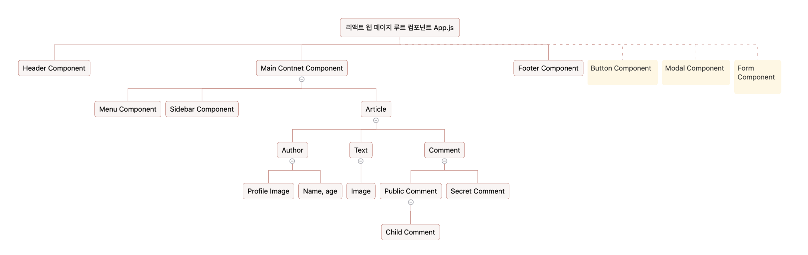
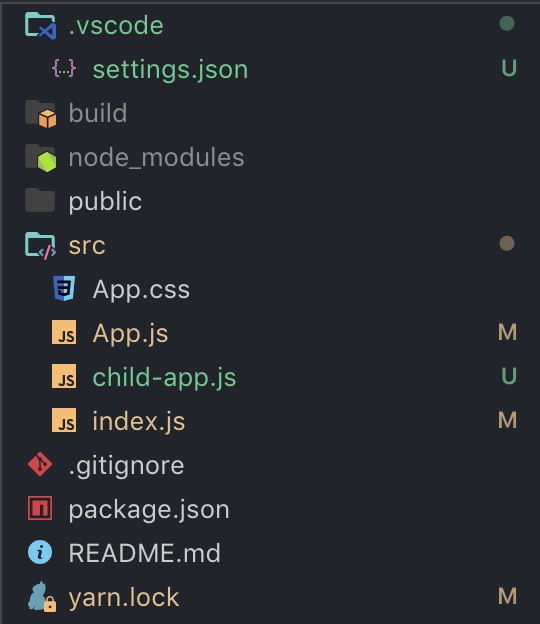
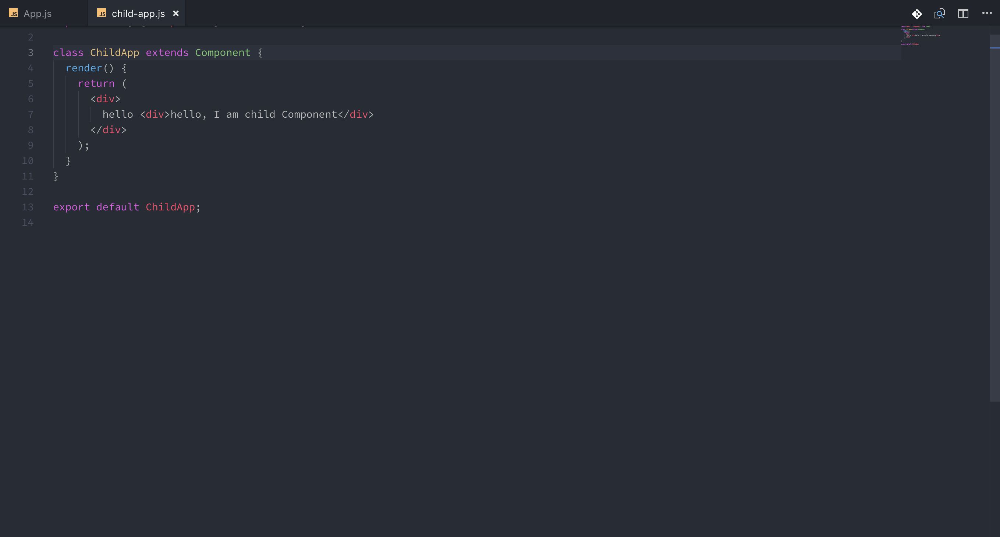
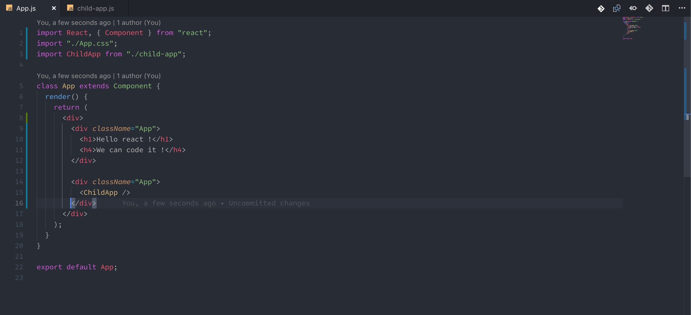
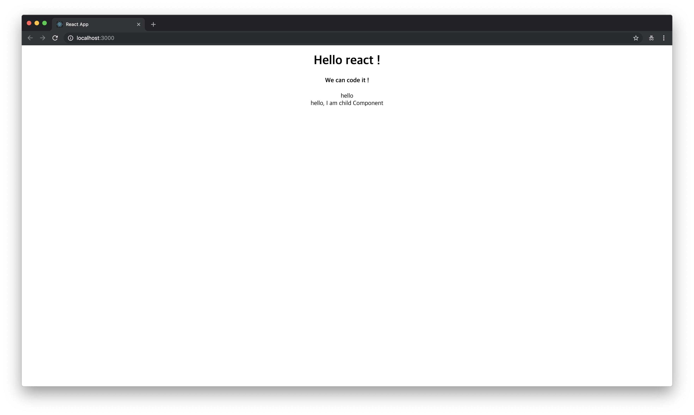

# 1강 - Component Of React

### 리액트는 여러 개의 컴포넌트 구조로 이루어져 있습니다

우리가 어떤 뉴스 기사를 보여주는 웹 사이트를 만든다고 해 볼게요. 만약 리액트로 이 뉴스 기사 사이트를 제작했다면, 그 사이트의 컴포넌트 구조는 다음 처럼 될 수도 있을 것입니다.

루트 App.js 컴포넌트가 있을 테구요, 그 아래로 3개의 상단, 메인 콘텐츠, 하단 컴포넌트가 존재할 것 입니다. 자주 쓰는 버튼이나 모달, 폼 같은 것들도 따로 빼 줄게요. 그 뒤로 메인 콘텐츠를 더 깊게 들어가면, 이곳에는 사이드 바가 있을 수도 있고, 메뉴가 있을 수도 있습니다. 아니면 뉴스 기사가 있겠죠. 뉴스 기사도 기자의 프로필을 보여주는 컴포넌트, 단순히 기사만 있는 컴포넌트, 댓글 컴포넌트로 분리할 수 있습니다. 이렇게 리액트를 사용하면 웹 사이트의 구조를 보다 쉽게 잡고 만들 수 있습니다. 예를 들어서 설명해 볼까요?

전에 사용하던 First react 프로젝트를 이용해 보도록 하겠습니다. 폴더 구조를 다음과 같이 변경해 보세요. 우리는 App 컴포넌트에 ChildApp 컴포넌트를 넣어 부모 - 자식 관계의 컴포넌트를 만들어 보는 실습을 해볼 것 입니다.

우선, 부모 자식 관계를 만들기 위해서 first-app 프로젝트의 src 경로에다가 child-app.js라는 파일을 생성해 보도록 하겠습니다.

다음은 새로 만든 child-app.js 컴포넌트를 만들어 주도록 하겠습니다.

이 상태로 서버를 켜서 돌려 보면, 어디에서도 이 ChildApp 컴포넌트의 내용이 보이지 않을 것 입니다. 왜냐하면 현재는 App 컴포넌트만을 렌더링 하도록 설정이 되어 있기 때문입니다. 다른 컴포넌트를 보여주도록 하고 있지 않습니다. 이를 위해서는 App컴포넌트에서 ChildApp 컴포넌트를 렌더링 하도록 해야 합니다. App.js를 수정해 볼까요?

App.js 컴포넌트에 우리가 방금 전에 만들었던 ChildApp컴포넌트를 불러와서 HTML 태그 형태로 작성합니다

Child 컴포넌트를 이렇게 가져다 붙히면 쉽게 부모 - 자식 관계를 가지는 컴포넌트를 생성할 수 있습니다.

