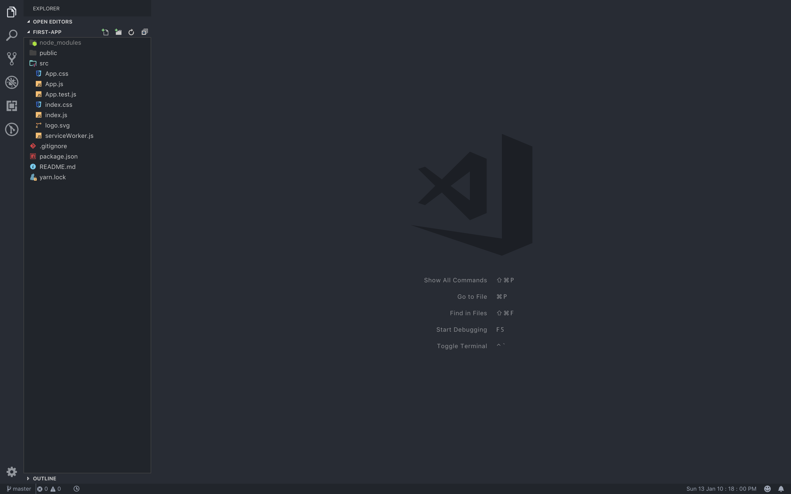
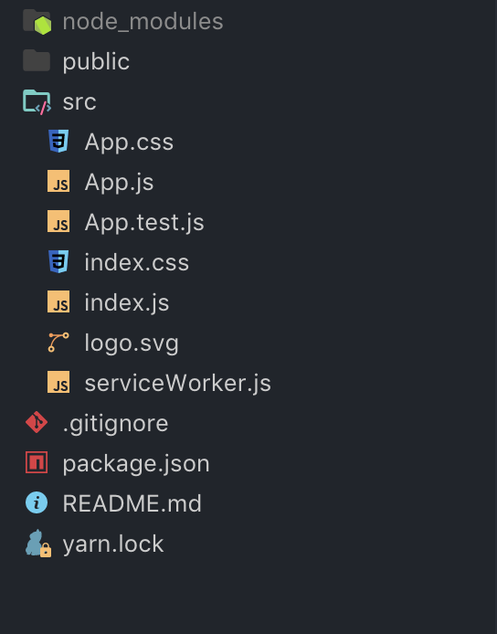
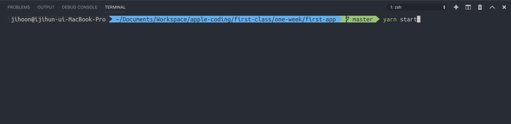
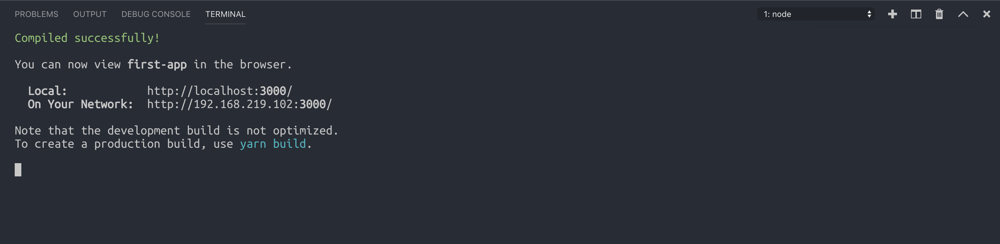
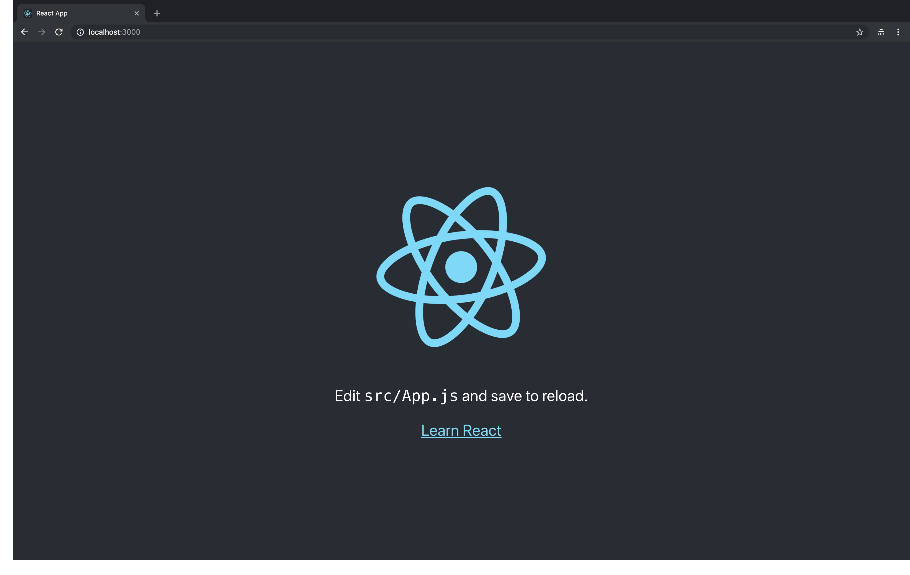

# 1강 - CRA를 활용한 리액트 앱 만들기

### 본격적으로 리액트 개발 시작해보기

[create-react-app](https://github.com/facebook/create-react-app) 이라는 페이스북에서 제공하는 리액트 보일러플레이트를 이용해서 리액트 앱을 만들어 보도록 하겠습니다.

우선 작업을 위한 폴더 한개를 만들어 주세요! 리액트 공부 자료를 모아놓는 그런 공간이라고 생각하셔도 됩니다. 물론 그런 폴더 없이 그냥 만들어도 되지만 그래도 공부 자료 모아놓는 폴더가 있으면 앞으로도 프로젝트 많이 생성할텐데 편하실 것이라고 생각합니다.

자신의 컴퓨터에 node.js 8 버전이상을 설치하신 분들이라면 이 명령어를 통해 프로젝트를 생성해 주세요. `npx create-react-app first-app` 을 터미널에 입력해 주세요. 이 명령은, npx 저장소에서 create-react-app 패키지를 이용해 first-app 이라는 이름을 가진 프로젝트를 생성하는 코드입니다.

[create-react-app](https://www.npmjs.com/package/create-react-app) 이라는 것은 사실 npm 모듈입니다. 그리고 npx라는 키워드도 생소하실텐데, npx는 global 모듈을 사용하기 않기 위해 npm에 5버전? 이상부터 기본 내장된 모듈입니다. npx를 통해 설치되지 않은 모듈을 불러올 수 있습니다. 장점은 항상 웹 상에서 최신 버전의 모듈을 불러오기 때문에, 자주 설정이 바뀌거나 업데이트 되는 보일러플레이트 모듈을 매번 확인하면서 업데이트할 필요가 없어집니다. 매번 최신 안정 버전이 설치되기 때문입니다.

설치가 완료되면 `first-app` 이라는 폴더가 생성 되어있을 것 입니다. 이 폴더를 에디터로 열어줍시다.

우리는 터미널에 몇 개의 명령어만 입력 했지만 실제로는 리액트 앱을 만들었습니다.

현재 터미널에서 `yarn start`or`npm run start` 라는 명령어를 입력합니다.

지금 보시면 You can view first-app in the browser 라는 문구 밑에 local: http://localhost:3000 이라는 주소가 보일 텐데 여기로 들어가 줍시다. 아 한가지 단점은 현재의 CRA 버전은 IE를 지원하지 않습니다. 그래서 IE로는 접속하지 말아주세요. 개발환경은 크롬을 권장드립니다.

