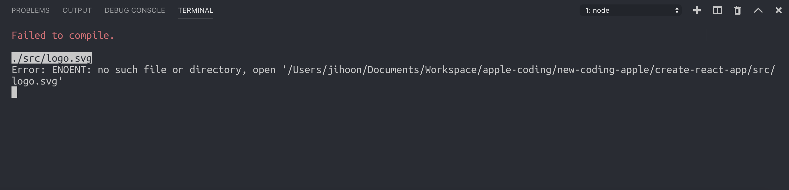

# 1강 - CRA를 활용한 리액트 앱 만들기

### 본격적으로 리액트 개발 시작해보기

[create-react-app](https://github.com/facebook/create-react-app) 이라는 페이스북에서 제공하는 리액트 보일러플레이트를 이용해서 리액트 앱을 만들어 보도록 하겠습니다.

### npx를 통해 create-react-app으로 react app 설치하기

우선 작업을 위한 폴더 한개를 만들어 주세요! 리액트 공부 자료를 모아놓는 그런 공간이라고 생각하셔도 됩니다. 물론 그런 폴더 없이 그냥 만들어도 되지만 그래도 공부 자료 모아놓는 폴더가 있으면 앞으로도 프로젝트 많이 생성할텐데 편하실 것이라고 생각합니다.

자신의 컴퓨터에 node.js 8 버전이상을 설치하신 분들이라면 이 명령어를 통해 프로젝트를 생성해 주세요. `npx create-react-app first-app` 을 터미널에 입력해 주세요. 이 명령은, npx 저장소에서 create-react-app 패키지를 이용해 first-app 이라는 이름을 가진 프로젝트를 생성하는 코드입니다.

[create-react-app](https://www.npmjs.com/package/create-react-app) 이라는 것은 사실 npm 모듈입니다. 그리고 npx라는 키워드도 생소하실텐데, npx는 global 모듈을 사용하기 않기 위해 npm에 5버전? 이상부터 기본 내장된 모듈입니다. npx를 통해 설치되지 않은 모듈을 불러올 수 있습니다. 장점은 항상 웹 상에서 최신 버전의 모듈을 불러오기 때문에, 자주 설정이 바뀌거나 업데이트 되는 보일러플레이트 모듈을 매번 확인하면서 업데이트할 필요가 없어집니다. 매번 최신 안정 버전이 설치되기 때문입니다.

설치가 완료되면 `first-app` 이라는 폴더가 생성 되어있을 것 입니다. 이 폴더를 에디터로 열어줍시다.

우리는 터미널에 몇 개의 명령어만 입력 했지만 실제로는 리액트 앱을 만들었습니다.

현재 터미널에서 `yarn start`or`npm run start` 라는 명령어를 입력합니다.

지금 보시면 You can view first-app in the browser 라는 문구 밑에 local: [http://localhost:3000](http://localhost:3000) 이라는 주소가 보일 텐데 여기로 들어가 줍시다. 아 한가지 단점은 현재의 CRA 버전은 IE를 지원하지 않습니다. 그래서 IE로는 접속하지 말아주세요. **개발환경은 크롬을 권장드립니다.**

### 필요없는 파일 정리하기

거의 다 왔습니다. 사실 우리는 한게 없어요. 리액트에서 기본 제공하는 모듈을 통해 프로그램을 받고 실행시키기만 했습니다. 우리는 리액트를 이제부터 공부하기 위해서 필요없는 파일을 정리해 보도록 하겠습니다. _앞으로 프로젝트를 생성해서 실습을 할 때에도 이 파일들은 사용할 일이 없는 파일 입니다._

src에 있는 파일들을 정리해 주겠습니다. 우선 제가 얘기하는 파일들을 src에서 전부 삭제해 주세요.

* App.test.js - 우리의 목표는 리액트 컴포넌트 단위 테스트가 아닙니다.
* index.css - 여기에 무엇을 작성할 일이 없을 겁니다.
* logo.svg - 리액트 기본 로고 파일입니다.
* serviceWorker.js - 웹을 앱 처럼 동작할 수 있게 해주는 놀라운 파일입니다만, 우리에게는 아직 필요가 없습니다.

이제 이 상태로 `yarn start`or`npm run start`를 실행하게 되면 오류가 나게 됩니다.

오류를 하나하나 없애 보도록 하겠습니다. 우선은 시작해야 하니까요. index.js 파일에 들어가 주세요.

index.css를 import 하고 있는 코드, serviceWorker를 import 하고 있는 코드를 없애 주었습니다. 하지만 우리는 그래도 오류를 마주하게 됩니다.

한가지 덧붙일 말이 있다면, 앞으로 모든 에러가 생겼을 때에 당황하지 말고 왜 이런 에러가 생겼는지 에러 내용을 한 번만 읽어도 어떤 검색 키워드로 구글링을 해야 할 지 눈에 보이게 됩니다. _**에러 코드를 잘 읽어주세요.**_ 무작정 에러라고 겁먹을 필요가 전혀 없습니다.

App.js 파일을 열어 주세요

이 코드에서, 우리는 저 html 같이 보이는 코드와, 위에 logo.svg를 import 하고 있는 부분을 없애 주겠습니다.

아까 보이던 검은색 화면은 index.css와 App.css에서 설정되어 있는 CSS설정들인데, 우리는 지금 그 부분을 사용하고 있지 않으니 흰색으로 변경된 것입니다.

