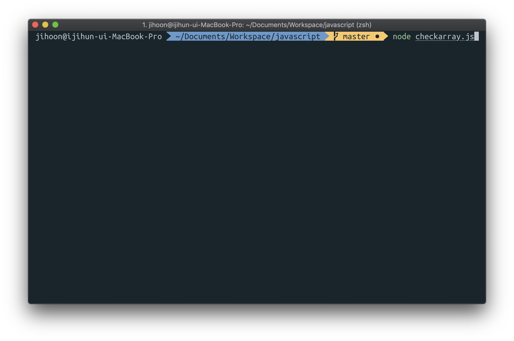

# 개념 정립 - Node.js ? npm ?

### Node.js가 뭐야 ?

**우리는 현재 많은 브라우저에서 자바스크립트를 사용하고 있습니다.** 이렇게 우리가 자바스크립트를 웹 페이지에서 사용할 수 있는 이유는 브라우저 내에 자바스크립트를 컴파일해서 실행할 수 있는 엔진이 장착되어 있기 때문입니다. 혹시 웹 프론트엔드를 경험해 보신 분들 이라면, 브라우저 간 자바스크립트 코드 동작이 잘 되기도 하고 잘 안되기도 하는 현상을 경험해 보신 적이 있으실 것 입니다. 여기서 알 수 있는 사실은, **자바스크립트 엔진은 브라우저마다 다르다는 겁니다.**

크롬의 경우에는 구글이 자체적으로 제작한 V8엔진 \(오픈소스\)를 사용하고 있고, 사파리의 경우에는 웹킷 이라는 엔진을 사용합니다. ~~영원한 적인 익스플로러는 차크라 엔진을 사용합니다.~~


Node.js는 이 많은 엔진들 중에, **가장 잘나가는 구글 크롬의 엔진인 V8엔진을 기반으로 동작하는 서버사이드 런타임 입니다.** 브라우저 안에서만 돌아가던 자바스크립트가 서버사이드로 이동 하게 된 것이죠. 또한 서버에서 여러 가지 자바스크립트 모듈들을 받아오기 위한 저장소인 npm\(node package manager\)이라는 것 것도 생겼습니다. _\(리눅스 우분투의  apt-get과 같은 개념, 파이썬의 pip와 도 같음\)_ 이 **Node.js는 CommonJS문법 체계를 기반으로 동작합니다.**


CommonJS는 자바스크립트의 문법을 브라우저 뿐만 아니라, 서버사이드에서도 사용할 수 있게 하려고 하는 목적을 가지고 자발적으로 만들어진 그룹입니다. 자바스크립트의 범용성을 넓히기 위한 목적도 가지고 있습니다.

### 한 번 실행을 해 보는 것은 어떨까요?

nodejs가 설치되어 있고, node 명령어가 자신의 터미널 환경변수에 등록이 되어 있다면, 이 명령어 하나면 nodejs 런타임을 실행 시킬 수 있습니다.


이 터미널로 열고 들어가게 되면 자바스크립트 문법을 실시간으로 사용해서 테스트 해 볼 수 있습니다.


이런 식으로 nodejs를 사용할 수도 있고, 자바스크립트 파일을 실행 시키는 것도 가능합니다.



실행할 파일을 넣게 되면 node 터미널이 뜨는 대신 실행할 파일을 동작하게 한 후 종료됩니다.

이런식으로 nodejs를 서버쪽에서는 사용해 오고 있습니다.

### npm scripts

nodejs의 모듈을 다운로드 받거나 재 다운로드를 하거나, 모듈의 버전을 기록해야만 다른 개발자간의 협업도 가능할텐데, **nodejs에서는 package.json이라는 버전 관리 파일 하나를 기준으로 관리합니다.** 이 파일이 프로젝트 내에 없다면 굳이 생성할 필요는 없습니다. 모듈 하나만 설치해도 package.json이 생기기 때문이죠. 그런데 이 package.json의 역할은 버전 관리 말고도 **특정 명령어를 매크로로서 간단하게 실행할 수 있게 해 줍니다.**

```javascript
{
  "name": "javascript",
  "version": "1.0.0",
  "main": "index.js",
  "license": "MIT",
  "scripts": {
    "start": "node index.js"
  },
  "devDependencies": {
    "eslint": "^5.12.0",
    "eslint-config-airbnb-base": "^13.1.0",
    "eslint-plugin-import": "^2.14.0"
  }
}
```

**개발 할때 필요한 모듈이 기록되어 있고, 어떤 버전인지도 기록되어 있습니다.** 지금 scripts json 안에 start 라는 객체 보이시나요? 이 문자열은 node index.js로 되어 있습니다. 만약 저 프로젝트 내에서 npm 명령어를 이용해서 프로젝트 루트 폴더 콘솔에서 npm start 라고 타이핑 하게 된다면, node index.js가 실행되도록 할 수 있습니다. 이런식으로 npm scripts는 관리되어지고 있습니다.

### 아아 이제 package.json 알겠어, 그런데 이 모듈 어디에 저장해?

**모듈 파일들의 저장 공간은  node\_modules라는 폴더입니다.** 만약 개발을 위해서 여러가지 모듈을 설치하고 사용하는 경우에 모든 모듈 파일 내은 node\_modules 안에 있게 됩니다. 이 모듈들은 수정하지 않는 것을 원칙으로 합니다. 내가 로컬에서 특정 모듈의 에러를 수정 했다고 할 지라도 그게 다른 사람이 받은 모듈의 버그는 아직 남아있는 상태일 것이고, 그렇게 되면 원하던 동작과 다르게 동작하는 웹 or 서버가 될 수도 있습니다.

### 근데 이게 왜 리액트에 필요해 ?

리액트는 라이브러리 한개 이지만, 리액트를 제대로 활용하기 위해서는 정말 많은 라이브러리 간 상호작용이 필요합니다. 또한 이 모듈들로 구성된 리액트 앱을 빌드해야 하죠. 개발 서버를 만들때에도 Node.js 없이 혼자서 많은 라이브러리를 다운받아서 설치하고 하는 일들은 꽤나 골치 아픈 일일 겁니다. 그래서 리액트 개발자들도 모듈 같은 것들을 npm에서 편하게 받아서 설치하고, 개발서버를 띄우는 일도 서버 런타임인 nodejs를 이용해서 개발 시 작업환경을 구성하고 있습니다_. \(Creact-react-app 기준\)_ 

