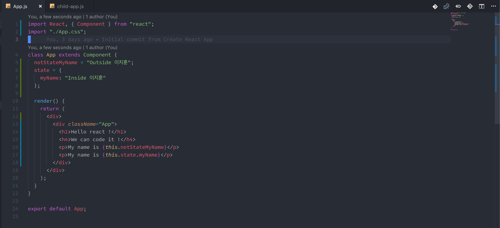

# 1강 - Props와 State

### Props & State의 개념만 이해하면 리액트의 반이 끝납니다

Props와 State는 리액트에서 다루는 데이터의 개념입니다. 쉽게 말하자면, Props는 받은 데이터 이거나 생성된 데이터, 즉 데이터의 기원이 자기 자신이 아닌 것이고, State는 자신의 컴포넌트에서 만들어진 데이터 입니다. 어떤 컴포넌트 기준에서 얘기하는지에 따라서 같은 데이터 이더라도 State가 될 수 있고 Props가 될 수 있습니다.우선 우리는 State에 관해서 먼저 알아본 후, Props에 대해 알아보겠습니다.

### Props와 State의 개념

이것은 리액트에서 컴포넌트 간 데이터 관리를 더욱 쉽게 하기 위해서 도입된 개념입니다. A 컴포넌트 안에서 데이터를 생성하면, 그것은 A 컴포넌트 기준으로 State로 취급됩니다. 그러나, A 컴포넌트 안에 B 컴포넌트를 넣고, B 컴포넌트에다가 A 컴포넌트의 State를 주입시키면 B 컴포넌트 기준으로는 A에게 받은 모든 데이터는 Props 입니다. 또한 State는 현재 컴포넌트에서 변경이 자유롭게 가능하지만, Props는 변경할 수 없습니다. 리액트는 이러한 컴포넌트의 계층을 이용한 데이터관리를 함으로써 컴포넌트가 현재의 데이터에 충실할 수 있는 환경을 만들어 냈습니다 . 사실 Props는 데이터 말고 함수가 될 수도 있습니다. 그 말 뜻은 State는 함수가 될 수도 있다는 뜻 입니다. 하지만 어떠한 값이 온다고 할 지라도 State를 내려받는 Child 컴포넌트는 받은 값을 변경할 수 없습니다. 이렇게 나누어진 이유에는 렌더링에 대한 이점도 있기 때문인데요, 부모 Props에서 받은 Props를 하위 컴포넌트 View에서 사용하고 있지 않다면, View를 업데이트 해야 할 필요가 없기 때문에 컴포넌트의 렌더링을 하지 않아도 됩니다. 리액트는 이것을 라이프 사이클 메소드를 통해 제공합니다.

### State, 현재 컴포넌트의 데이터

State를 선언하는 방법은 간단합니다. 예전에는 리액트 컴포넌트에 constructor이라는 생성자를 넣어서 이 안에서 State를 생성해야 했는데, 요즘 리액트는 생성자를 사용하지 않고 State를 생성합니다. 마치 class property 처럼요.

State는 반드시 객체 형태로 생성 되거나 아니면 null \(State를 정의하지 않음\) 타입이여야 합니다. 그 이유는 리액트의 렌더링 방식에 있습니다. 또, 리액트에서는 State를 업데이트 하기 위한 특수한 메소드를 제공합니다. class property 변경 하는 것 처럼 `this.state.myName = 'awefwef'` 이렇게 업데이트 하게 되면 재 렌더링 되지 않습니다. 오히려 State의 상태를 직접 변경하지 말라는 오류와 맞닥뜨리게 됩니다. 리액트에서 컴포넌트의 데이터 변화를 감지해서 업데이트 시키기 위해서는 리액트 자체 메소드인 setState를 사용해야 합니다.

천천히 설명해 드리겠습니다. 우선 JSX 부분의 button에 있는 onClick 메소드가 보이시나요? 이건 html의 onclick 메소드와 역할이 같습니다. 이상한 점은, onClick 을 할 때 this.handleClick 메소드가 실행되지 않는 형태입니다. 눌러도 메소드를 실행시키지 않습니다. 우리가 그동안 알고 있던 onclick에서는 함수를 실행시켜 주었는데 말이죠. 그러나 리액트는 HTML이 아닌 JSX 입니다. JSX가 컴파일 되면서 메소드 실행 부분을 실행시켜 버리기 때문에 JSX에서는 onClick onChange와 같은 메소드에 메소드를 실행시키지 않습니다. 저렇게 메소드를 만들어 놓게 되면, 자동으로 담기는 인자는 자신의 element가 됩니다. 아무튼, 저 상태에서 버튼을 클릭하면 Inside 이지훈 =&gt; Changed 이지훈 으로 값이 변경되었을 것 입니다. 저런 방식으로 State를 업데이트 해야만 재 렌더링을 할 수 있습니다. State를 업데이트 하는 방법은 한 가지 더 있습니다.

함수처럼 사용할 수도 있습니다.

#### 그런데 여기서 의문이 들기 시작합니다. 데이터를 꼭 State만 사용해야 할까?

State는 현재 컴포넌트 내에서 만들어 변경이 가능한 데이터 입니다. 물론 클래스 문법을 사용하는 컴포넌트에서는 State로 굳이 데이터를 정의하지 않아도 사용할 수 있긴 합니다.

둘 다 제대로 할당받은 값을 보여주긴 합니다. 하지만 문제는 이 다음에 발생하는데요, 만약 this.notStateMyName의 값을 변화 시킬 지라도, 컴포넌트의 값은 변하지 않을 것 입니다. 리액트는 안전한 컴포넌트 렌더링을 위해서 3가지 방식으로 컴포넌트를 재 랜더링 합니다.

1. 부모 컴포넌트가 내려주는 Props의 값이 변화했을 때
2. 현재 컴포넌트의 **state가 immutable 하게 업데이트** 되었을 때
3. forceUpdate\(\) 라는 강제 렌더링 메소드를 실행할 때

이 3가지 방식 이외에는 리액트 컴포넌트를 렌더링 시킬 방법이 없습니다. 이런 방식을 통해서 리액트는 컴포넌트의 재 랜더링 방식을 효율적으로 관리합니다. 보여지는 데이터는 모두 Props 와 State를 사용해야만 원하는 렌더링을 할 수 있습니다. 그렇기 때문에 class property로 선언한 this.notStateMyName의 값이 변경되어도 리액트는 재 렌더링 되지 않습니다. State와 Props 어디에도 속해있지 않으니까요.

자, 그럼 렌더링 되는 3가지 방식 중에 우리는 2가지 방식을 살펴볼 것 입니다. 마지막 3번 forceUpdate\(\) 메소드는 나중에 여러분이 필요하실 때 사용하게 될 것이므로, 이번 강의에서는 다루지 않겠습니다. \(class property로 선언한 변수를 업데이트 시키고 싶으시다면, forceUpdate를 사용하시면 됩니다.\)

