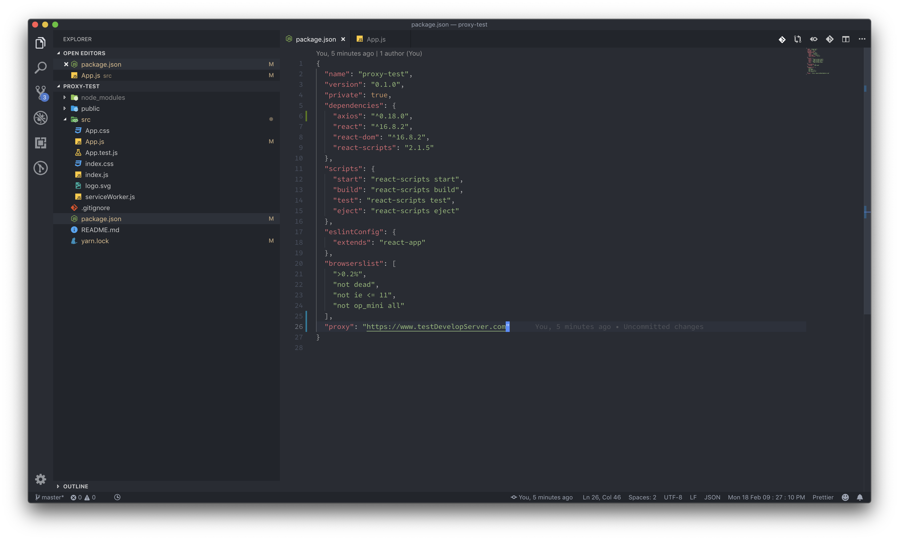

# CRA 프록시 서버 설정하는 방법

리액트는 기본적으로 서버와 분리된 환경에서 개발 되기 때문에 프론트 개발 서버와 서버 개발 서버를 분리한 형태로 개발이 들어가게 됩니다. 그러나 이러한 상황이라면 리액트가 서버에 테스트 API를 요청해야 하는 상황에는 서버의 모든 URL을 타이핑 해야 하는 불편함이 있습니다. 물론 변수로 정의해놓는것도 하나의 방법이겠지만 완벽한 해결책은 될 수 없습니다. 그런 불편함을 한번에 해결해 드리는 방법을 알려드리도록 하겠습니다. 우선 CRA로 리액트 프로젝트 하나를 생성해 주세요.


### 간편설정




끝입니다. 정말 간단하게 설정을 할 수 있습니다. 앞으로 Full URL \(https://로 시작하는\) 형태의 URL을 작성하지 않는 이상은 모든 API요청이 proxy서버로 들어가게 됩니다.

### 이게 뭐가 좋은거야?


프록시 서버를 설정해주지 않으면 testRequest의 위 함수처럼 처리할 수 밖에 없습니다.

그러나 프록시 서버를 적용한 지금은 밑으로 요청을 보내도 http://localhost:300 URL로 리퀘스트가 가는 것이 아닌, 미리 생성해둔 proxy서버로 전송되게 됩니다. 손이 덜 가게 되고 귀찮음도 줄어듭니다.

또한 개발 서버는 불안정하기 때문에 언제든지 URL이 바뀔 가능성이 다분한데, 그 때마다 하나하나 수정을 하기에는 매우 불편합니다. 하지만 proxy를 사용한다면 proxy가 사용된 package.json만 변경하면 되기 때문에 훨씬 수월하게 개발이 가능해 집니다.

### 여러 개의 개발서버를 사용해야 한다면...


3개의 프록시 서버에 요청을 하는 방법은 무엇일까요?

```javascript
axios.get('/api/customers');   // http://localhost:8093/api/customers
axios.get('/auth/my-info');    // http://localhost:8091/auth/my-info
axios.get('/images/gogo.png'); // http://hello.com/images/gogo.png
```

여러 개의 다른 프록시 주소도 쉽게 관리할 수 있습니다.


