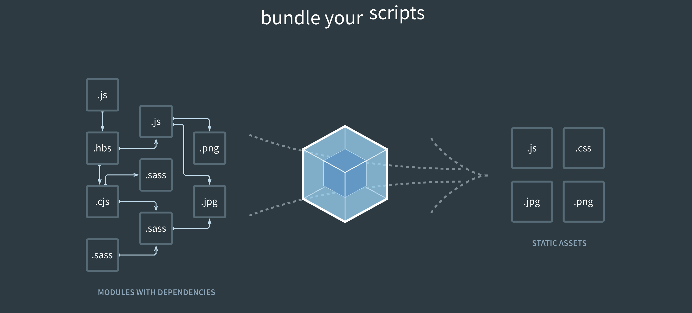
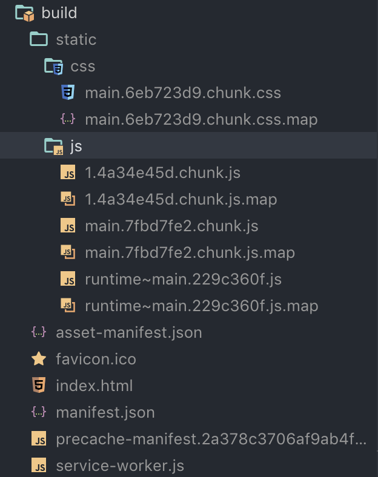

# Bundler

### 복잡한 자바스크립트 모듈 호환성

프론트엔드 자바스크립트에서는 모듈간 import export가 불가능 합니다. script태그를 이용해서 global \(window\)로 불러와진 객체들을 사용하는 것은 가능하죠. 이런 방식을 사용하게 되면 import가 필요 없이 어떤 파일에서나 모듈을 불러와 사용하는 것이 가능합니다. 그러나 결국 이 점이 단점으로 지적되었죠. 다른 파일에서 같은 이름의 변수를 사용하게 되는 경우도 있기 때문에 모듈 간의 경계가 모호해지고 변수 이름의 충돌 가능성이 복잡한 웹을 제작하게 될 수록 커져 갔습니다. 생각해 보세요. 이제부터 우리가 만드는 웹에 붙이는 변수의 이름은 항상 달라야 한다면 어떻게 하시겠습니까? 개발 하기 정말 힘들 것 입니다.

 그러나 리액트, 앵귤러 같은 복잡하고 다양한 구조로 import와 export되는 라이브러리, 프레임워크의 의존성을 관리하기 위해서는 한 가지 대책이 필요했고, 그에 맞춰서 사람들은 번들러를 사용하기 시작했습니다. 여러가지 자바스크립트 파일의 의존성을 묶어 하나의 파일로 만들어 내는 것 입니다. 번들러의 장점은, 의존성을 우리가 직접 관리할 필요 없이 번들러에서 import export 하는 파일들의 경로를 알아서 설정해주기 때문에 같은 이름의 변수를 사용해도 사용처가 다르면 충돌하지 않게 됩니다.

### 리액트도, 번들러 사용합니다.

여러가지 자바스크립트 파일 \(map 파일을 제외: 하나로 합쳐진 코드의 에러를 트래킹해 원래 코드의 어디서 오류가 났는지 알기 쉽게 함\)이 뭉쳐서 3개의 파일이 되었습니다. 번들러의 역할은 이런식으로 작업을 해 여러가지 자바스크립트의 모듈 간 호환성이나 의존성을 잘 결합시켜 문제가 없게 해 줍니다.

