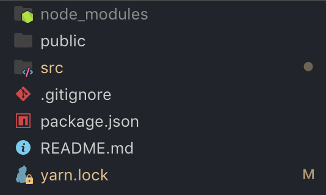
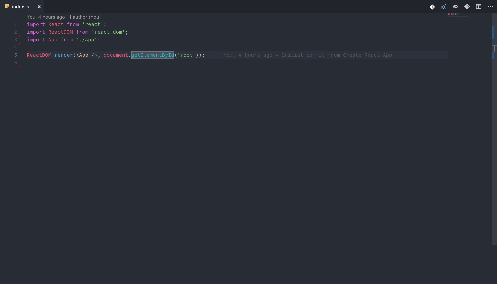
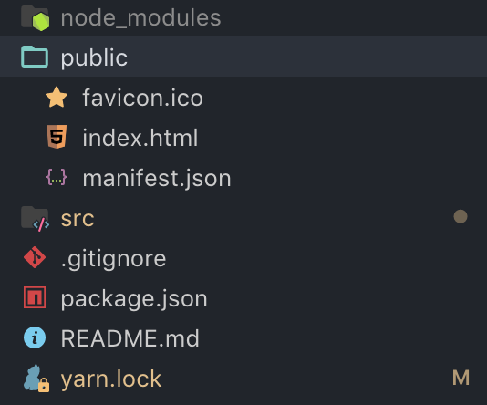
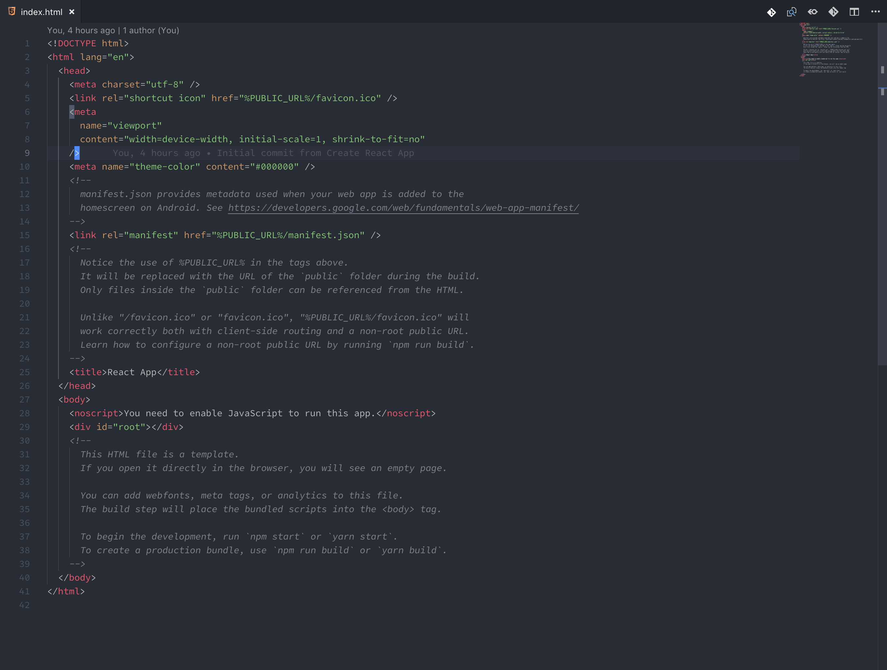
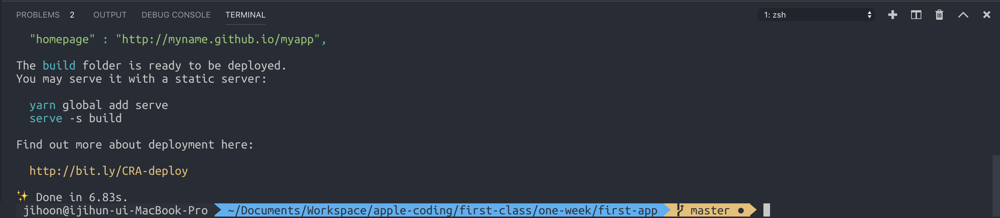
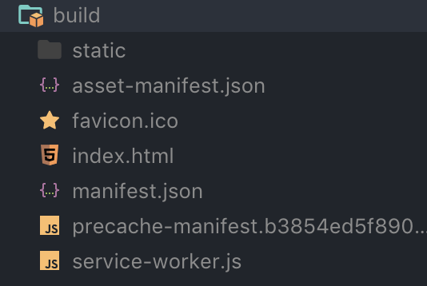
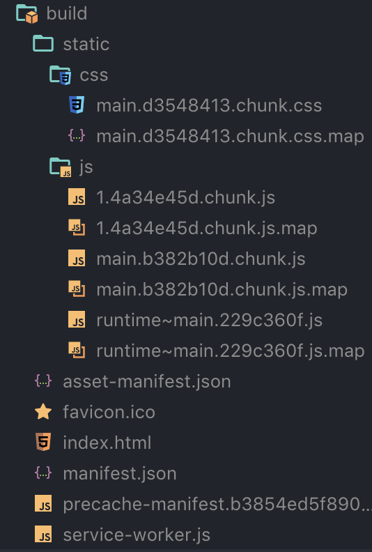

# 1강 - JS, CSS만 있고 HTML은 없나요 ?

### 껍데기 HTML.

create-react-app으로 리액트 프로젝트를 생성하신 분들이라면, 이런 폴더 구조를 보실 수 있을 텐데요.

src에서는 리액트 컴포넌트를 작성하고 모든 JSX를 관리하는 메인 소스 파일이라고 생각하고, 그런데 어떻게 우리는 이런 JSX 파일을 html을 통해서 볼 수 있을까 ? 라는 생각이 들 것입니다.

index.js 코드를 살펴보면, ReactDOM이라는 모듈이 render라는 메소드를 실행시킵니다. 첫 번째 인자로는 리액트 컴포넌트인 App을 담고 있습니다. 두번째 인자로는 id="root"인 html elemet를 가져오고 있습니다. 그렇습니다. 이 메소드는 우리가 힘들게 만들어 놓은 리액트 코드들을 실제 DOM에 가져다 붙히는 코드입니다. 그런데 html 파일이 도대체 어디에 있을까요?

### Public 폴더에 있습니다.

_\(\#manifest.json에 관한 것은 다루지 않겠습니다. serviceWorker를 사용할 때 앱의 테마 컬러 같은 것들을 변경할 수 있는 파일입니다. 다른 자세한 내용은 몰라도 됩니다.\)_

public 폴더에 index.html파일을 열면 50줄도 되지 않는 html코드를 보실 수 있습니다.

body 태그 안에 _**div\#root**_ 를 찾으실 수 있을 겁니다. 바로 이 부분에 우리의 모든 리액트 코드가 들어가게 됩니다. 리액트는 서버에서 미리 html이 생성되는 것이 아닙니다. 서버는 리액트 코드인 javascript와 css 파일, 그리고 비어있는 html 껍데기 파일과 favicon.ico 파일만을 내려주며, Javascript 코드가 실행되면서 JSX =&gt; HTML로 변환된 코드가 _**div\#root**_ 로 들어가게 되는 것입니다.

지금의 이 렌더링 방식이 바로 CSR 방식입니다. 풀어서 얘기하자면 **Client Side Rendering** 방식이죠. 이 방식은 **SPA**, 싱글 페이지 어플리케이션에서 **\(Single Page Application\)** 사용하는 방식입니다.  기존 렌더링 방식와 지금 방식의 차이로 말하자면, 예전에는 메뉴 페이지, 로그인 페이지, 회원가입 페이지 등을 각각 다른 HTML파일에 작성해서 서버에 요청하면, 서버 라우트의 변경에 따라 다른 HTML파일과 다른 Javascript 코드, 다른 CSS 파일을 내려 주었습니다. 그런데 SPA에서는 어떤 라우트로 요청을 하던지간에 똑같은 HTML 코드와 Javascript, CSS 파일을 내려 줍니다. 바로 여기서 SPA의 장점이 나오는데요, 클라이언트 개발자와 서버 개발자 사이의 완벽한 분리가 가능해 집니다. 기존에 서버 코드와 클라이언트 코드를 혼합해서 코딩하던 방식에서 탈피해, 서버와 클라이언트 독립된 환경에서 개발할 수 있게 됩니다.

### 자 그래서 서버에 이 리액트 파일을 어떻게 던져줄까 ?

빌드를 해서, 그 빌드 파일만을 주면 됩니다.

여러분이 만드신 프로젝트에서 `yarn build` 아니면 `npm run build`명령어를 입력해 주세요.

빌드가 성공적으로 끝났으면 이렇게 메시지가 나올 겁니다. 빌드 파일은 어디에 있을까요?

이렇게 클라이언트 코드가 생성이 되었습니다. 이쯤에서 얘기하자면, 리액트는 독립적이기 때문에 어떤 서버와도 같이 사용이 가능합니다. 장고, 레일즈, 노드 와 같은 다양한 서버와 리액트는 공존할 수 있습니다. 리액트는 서버에 의존적이지 않기 때문입니다. 모든 http 요청을 Ajax로 처리하기 때문입니다. _\(만약 Server-side-rendering을 고려하고 계시다면 그렇지 않을 수도 있습니다. 자세한 내용은 제 나중 포스트에..\)_

우리가 만든 JS와 CSS 코드가 압축 형태로 들어가 index.html 파일에서 JS파일과 CSS파일을 호출해 html을 생성합니다.

지금까지 HTML 파일이 어디에 있는지부터 시작해서 어떤 식으로 빌드가 이루어 지는지 알아보았습니다.

